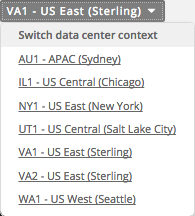
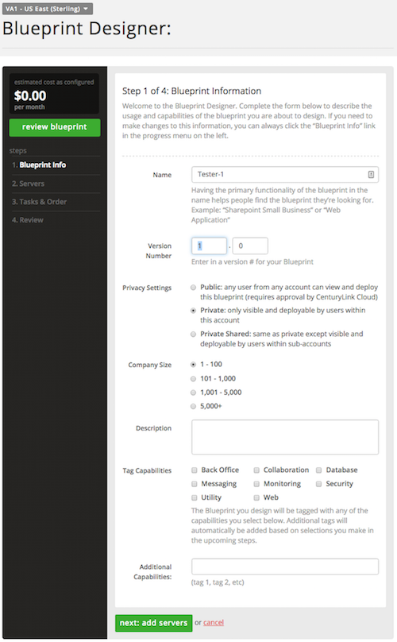
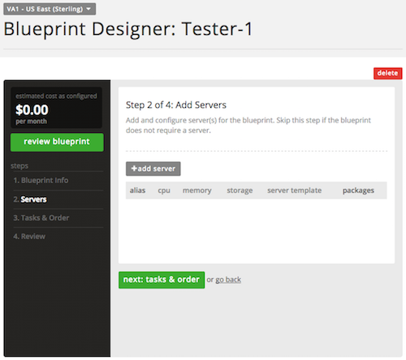
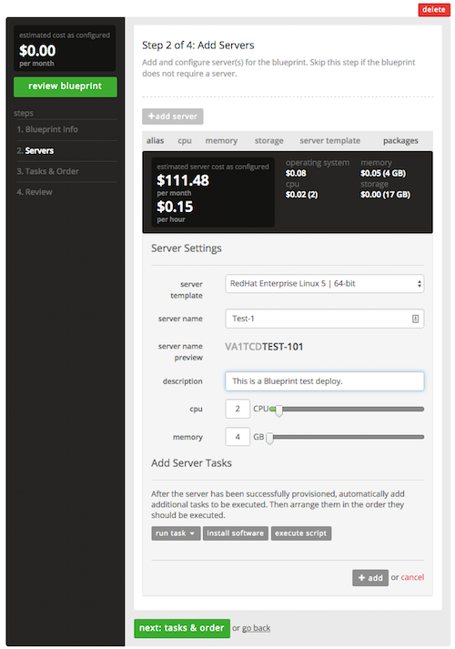
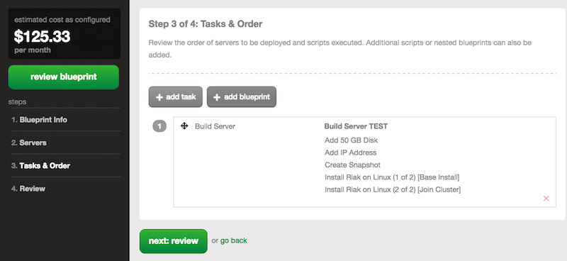
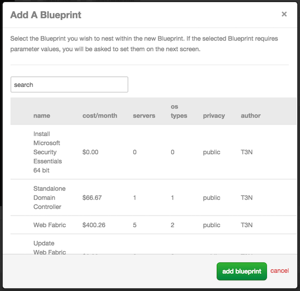
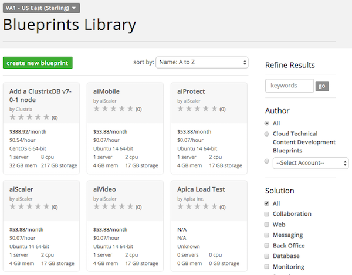

{{{
  "title": "How to build a Blueprint",
  "date": "10-11-2016",
  "author": "Daniel Morton",
  "attachments": [],
  "contentIsHTML": false
}}}

### Description
The purpose of this documentation is to introduce and explain the process and detail the steps on how to construct a Blueprint.

### Steps
1. Log into the Lumen Cloud Control Portal.

2. From the Navigation Menu, select **Orchestration > Design Blueprint**.

3. From the Data Center drop-down, select the region in which you want to deploy the Blueprint.
   

4. In the Blueprint Designer, provide the following information:
   * Name
   * Version Number
   * Privacy Setting
   * Company Size
   * Description of the Blueprint
   * Tag Capabilities

   

5. Click **Next: add server**.

6. Define Servers (optional).
   * This step is optional as a Blueprint may consist solely of configuration against an existing environment.
   * To define the server(s), click **+ add server**.

   

7. From the server template drop-down, then enter information for the following:
   * server name
   * description
   * CPU
   * memory
   
   

8. Click **next: tasks & order**.
   * Assign additional task(s). This include, for example, adding disks, network interfaces, or even public IP mappings.
   * Additional software and scripts can be installed as well; the selection can be from publicly available software packages all the way to private software packages that are unique to the customer.
   * If any of the software packages require other parameters, you are prompted to enter values.

9. After selecting all the software, tasks, and scripts, rearranged them in the required execution order.

10. Add an Existing Blueprint to this Blueprint. (optional)
   * You have the option is available to call other Blueprint inside the one being designed. This feature provides the ability to treat Blueprints as components built in highly customizable way.
   * Click **+add blueprint**.
   

11. Select the Blueprint(s) you want and click **add blueprint**. (optional)
   * This modular design allows for easy re-use and nesting means no duplication definitions to maintain across your service catalog.
   

12. Click **next: review**.
   * This step allows you to review the Blueprint configuration and make any changes before publishing.
   * Click on any of the steps located on the left to make changes.
   

13. Click **submit for publishing**.
   * The publishing mechanism submits the Blueprint for an automated review by the build system.
   * Any inconsistencies are flagged and the publishing processes errors out if exceptions are found.

14. From the Navigation Menu, select **Orchestration > Blueprint Library** to locate published Blueprint.
   * Upon successful publication process, the Blueprint will show up on the Blueprint Library page.
   * By default, all available Blueprints deployed by the user in the specific account are available.
   * Use the Search box on the right to locate your Blueprint.
   
