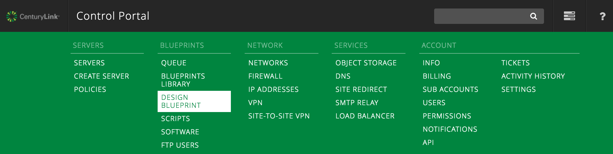
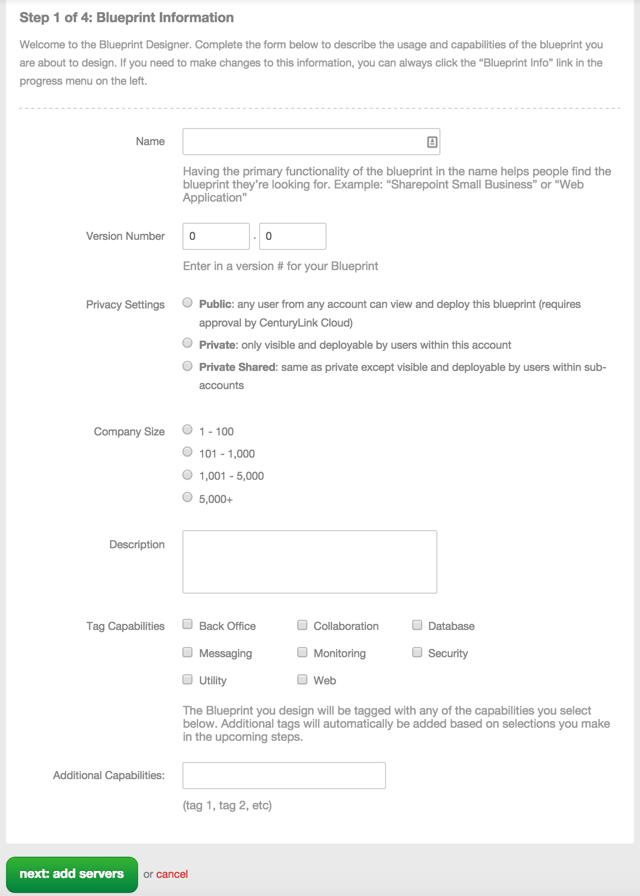
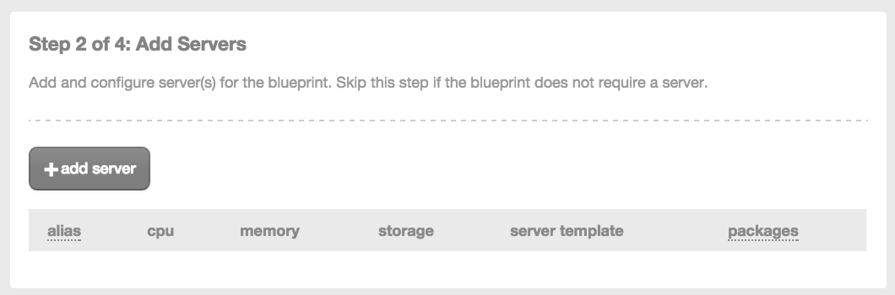
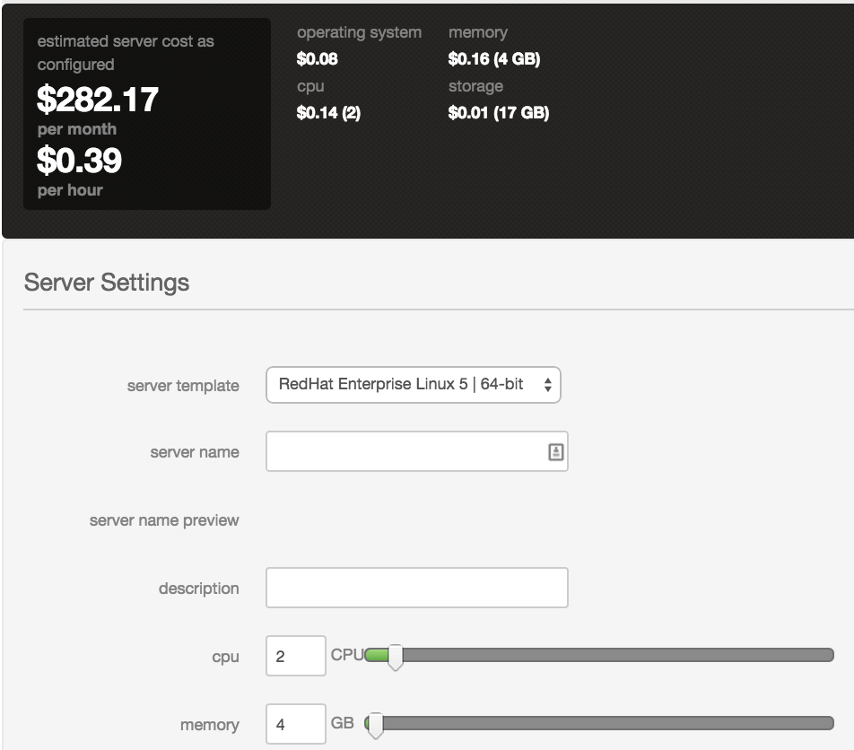
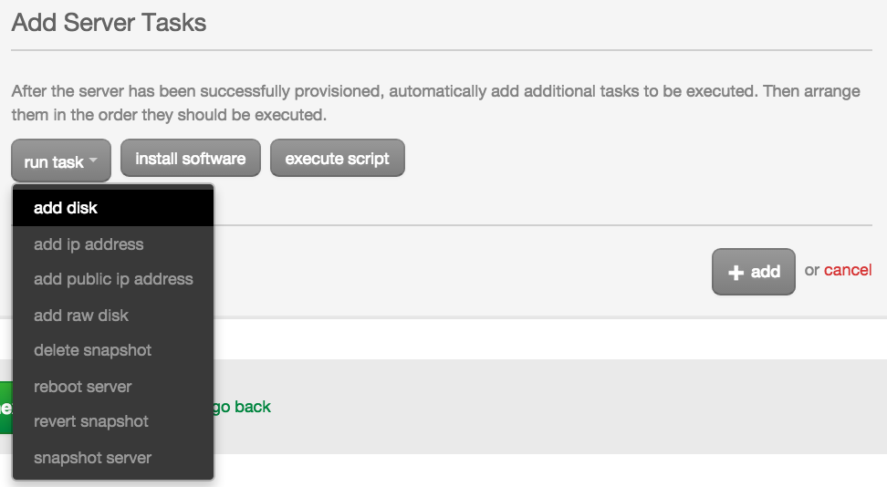
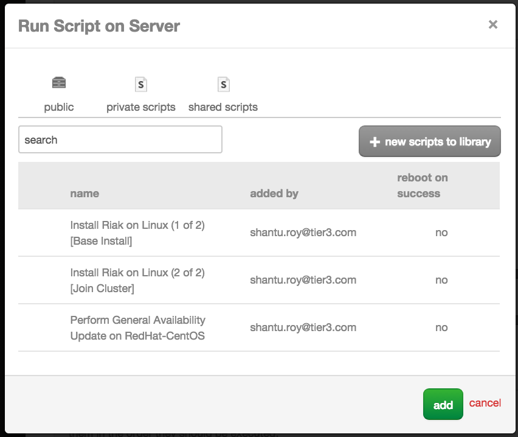
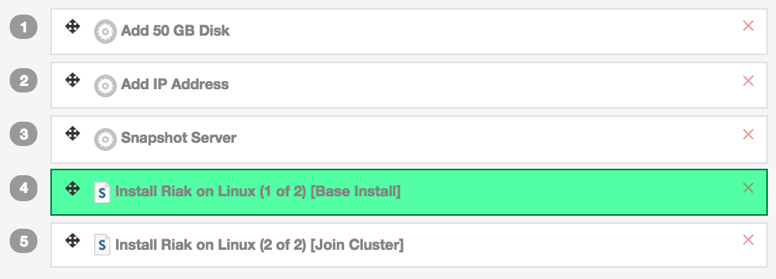
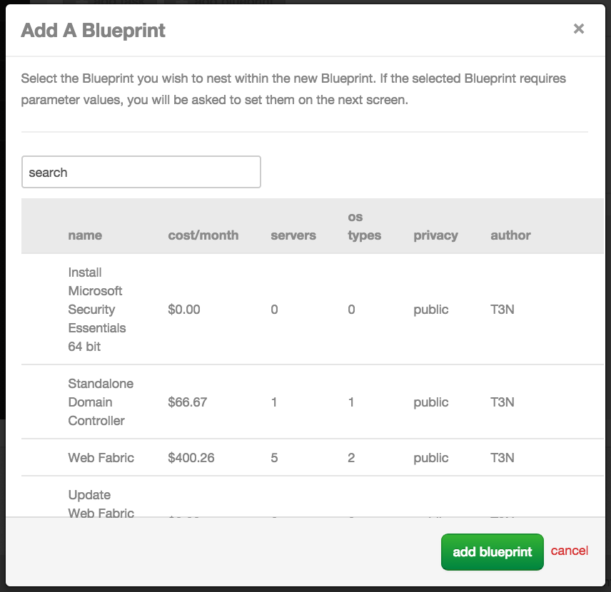
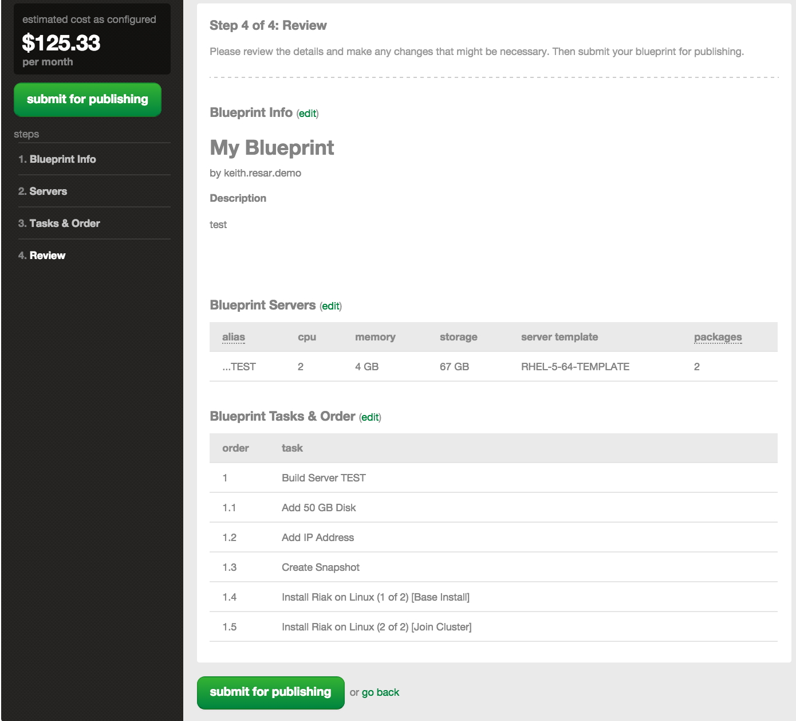
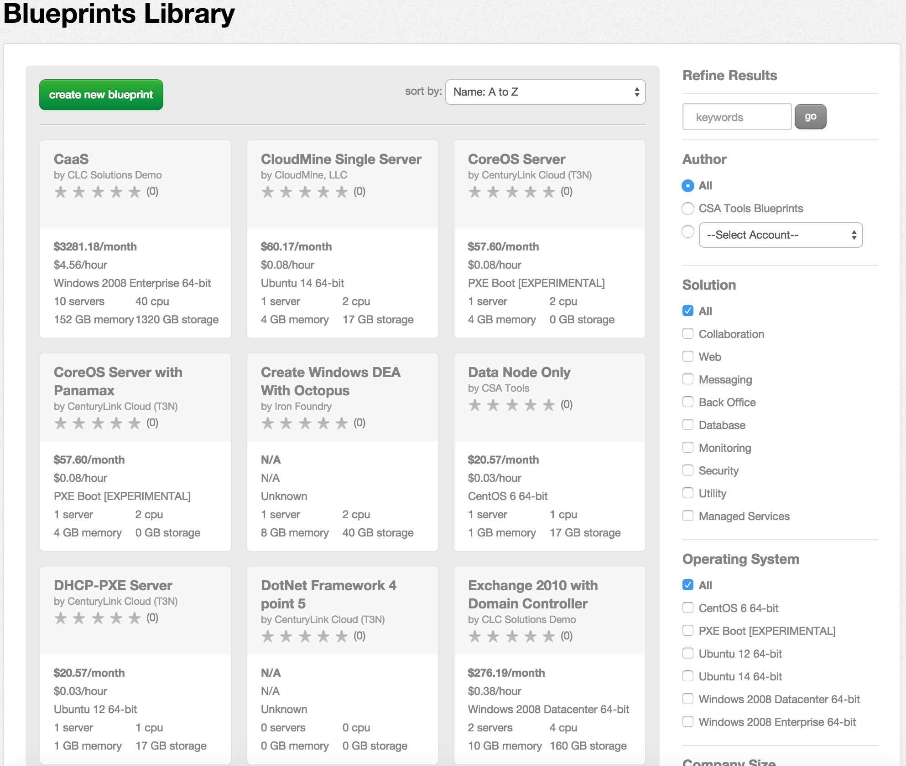

{{{
  "title": "How to build a Blueprint",
  "date": "12-2-2014",
  "author": "Shantu Roy",
  "attachments": [],
  "contentIsHTML": true
}}}

Updated: December 2nd, 2014 by Keith Resar

<h3>Description:</h3>

The purpose of this documentation is to introduce and explain the process and detail the steps on how to construct a blueprint.

<h3>Steps:</h3>

<strong>1. Locate "Design a Blueprint"</strong>

<ul>
  <li>Log into the CenturyLink Cloud Control Portal and from the power menubar select&nbsp;<strong>Design Blueprint</strong>
  </li>
</ul>

<strong></strong>

<strong>2. Define Blueprint Metadata</strong>

<ul>
  <li>Define a name, version number and privacy setting for the blueprint.
     
     
  </li>
  <li>Fill out information about company size, and a description that would help the user of the blueprint quickly understand the purpose of the blueprint. Lastly add in some information about the capabilities of the blueprint. All these items
    help in searching for a blueprint later on.
     
  </li>
  <li>Click "Next" to progress to the next stage of Blueprint configuration.</li>
</ul>

<strong>3. Define Servers </strong>(optional)

In this screen, define the servers that are needed to support the blueprint. Servers do NOT have to be defined as a blueprint could consist solely of configuration against an existing environment.

  <ul>
    <li>Select "Add Server" option.
       
    </li>
    <li>Pick an existing server template, name the server, provide a description and adjust the number of CPUs and memory needed for the server.
       
    </li>
    <li>Lastly any additional task(s) can be assigned. The tasks include and not limited to adding disks, network interfaces or even public ip mappings in addition to rebooting servers.&nbsp;
       
    </li>
    <li>Additional software and scripts can be installed as well; the selection can be from publicly available software packages all the way to private software packages that are unique to the customer. If any of the software packages require any parameters,
      you will be prompted to enter in values.In addition to software packages, scripts can also be run against the server. 
    </li>
    <li>Once all the software, tasks and scripts have been selected, they can be arranged to the required execution order.
       
    </li>
    <li>Click the "Apply" button.</li>
  </ul>
  
  
<strong>4. Add an Existing Blueprint to this Blueprint</strong>
  

  
During this step the option is available to call other blueprint from the one being designed. This feature greatly helps in giving the ability to treat blueprints as components and be able to be put together in a highly customizable way.

  

    <ul>
      <li>On the third step of the Blueprint Designer, choose the "Add Blueprint" button.
         
      </li>
      <li>Select an existing blueprint nest into what you're currently creating. This modular design allows for easy re-use and nesting means no duplication definitions to maintain across your service catalog.
         
      </li>
    </ul>
    
<strong>&nbsp;</strong>
    

    
<strong>5. Publish the Blueprint</strong>
    

    
This step allows you to review the blueprint configuration and make any last minute changes before it is published with the associated privacy attributes. The publishing mechanism submits the blueprint for an automated review by the build system.&nbsp;
      Any inconsistencies are flagged and the publishing processes will error out if exceptions are encountered.

    

    

    

    
<strong>&nbsp;</strong>
    

    
<strong>6. Locate Published Blueprint</strong>
    

    
Upon successful publication process, the blueprint will show up on the main blueprint dashboard. This dashboard by default will show all of blueprints that are available to be deployed by the user in the specific account. Additionally,
      filtration criterion like author, size of company and operating system, can be applied to trim the displayed blueprints. These filterable components are on the right side of the screen.

    

    

  

