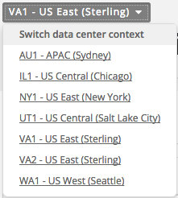
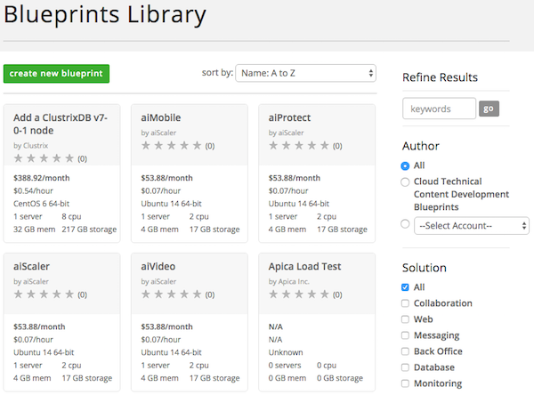
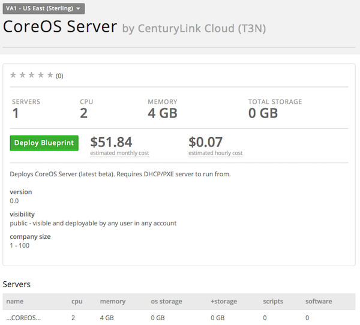
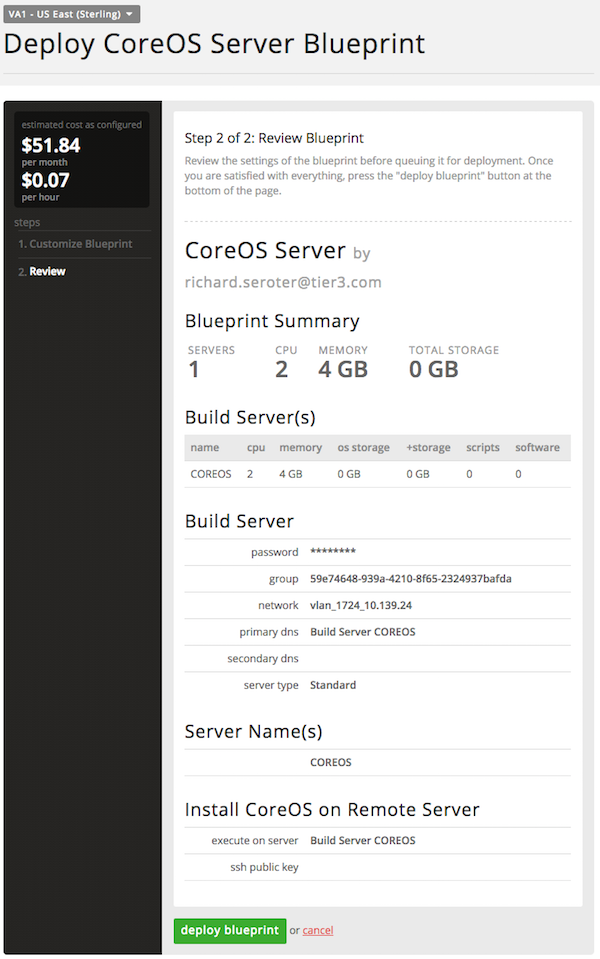
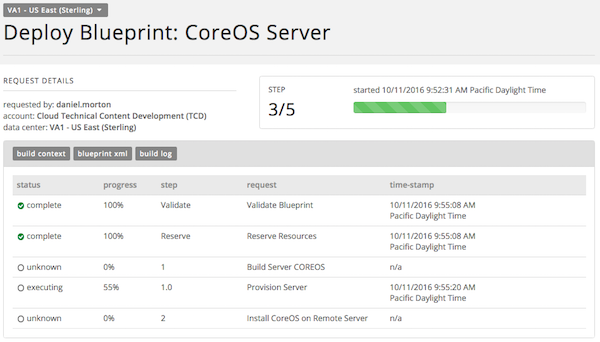

{{{
  "title": "How to execute a Blueprint",
  "date": "7-1-2014",
  "author": "Shantu Roy",
  "attachments": [],
  "contentIsHTML": true
}}}

<h3>&nbsp;Description:</h3>

This KB article describes how you find and execute a published blueprint.

<h3>Steps:</h3>

<strong>1. Find the Blueprint</strong>

<ul>
  <li>Look for the blueprint you want to execute. Using the search criteria on the right or the filters like author, solution, operating system and company size, the displayed list can be narrowed.
     
  </li>
  <li>You can hover over each of these blueprints, and get a quick look at the resources each of the blueprints need and the approximate cost for running the blueprint.
     
  </li>
</ul>

<strong>&nbsp;</strong>

<strong>2. Deploy the Blueprint</strong>

  <ul>
    <li>Click "Deploy Blueprint" on the selected blueprint.
       
    </li>
    <li>You will then be presented with an interface that will gather any runtime and deployment information for this specific blueprint.
       
    </li>
    <li>At this point you are give one last chance to review the information before you hit “Deploy Blueprint”.
       
    </li>
    <li>Lastly, you are presented with a progress page that lists all that tasks being executed, the order they are being executed and the state of each task. You also have access to the logs being generated, which can be useful if there should be any
      problems with the execution.
       
    </li>
  </ul>
