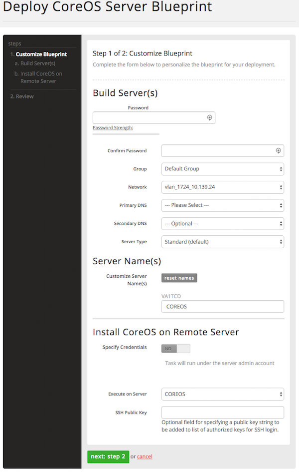

{{{
  "title": "How to execute a Blueprint",
  "date": "10-11-2016",
  "author": "Daniel Morton",
  "attachments": [],
  "contentIsHTML": false
}}}

### Description
This KB article describes how to locate and execute a published Blueprint.

### Prerequisites
* A active account on Lumen Cloud.

### Steps
1. Log into the [Control Portal](https://control.ctl.io).

2. From the Navigation Menu, select **Orchestration > Blueprint Library**.

3. From the Data Center drop-down select the region in which you want to launch the Blueprint.
   

4. Using the search criteria on the right, locate the Blueprint you want to execute.
   

5. Click on the Blueprint.

6. In the Blueprint window, click **Deploy Blueprint**.
   

7. Complete the information on the Customized Blueprint page and click **next: step2**.
   

8. Review the settings. Then, click **deploy blueprint**.
   

9. A progress page lists all that tasks being executed, the order in which they are executed and the state of each.
   * You also have access to the logs generated, which can be useful if there should be any problems with the execution.
   
