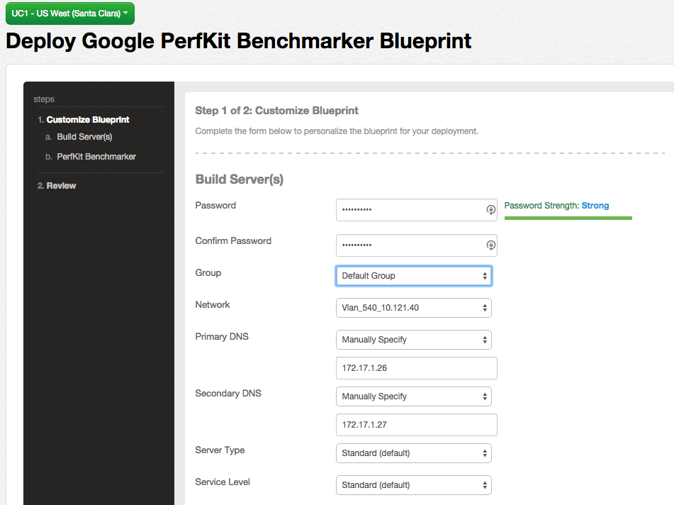
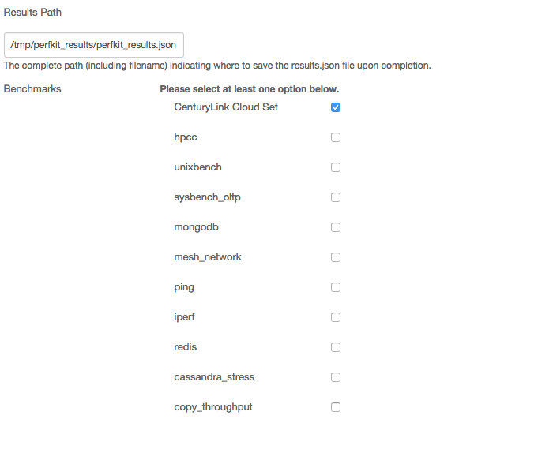

{{{
  "title": "Installing Google PerfKit Benchmarker",
  "date": "03-02-2015",
  "author": "Bryan Friedman",
  "attachments": [],
  "contentIsHTML": false
}}}

### Overview

[PerfKit Benchmarker](https://github.com/GoogleCloudPlatform/PerfKitBenchmarker) is an open source tool for measuring and comparing cloud offerings. It was developed by Google with feedback and contributions from over 30 leading researchers, companies and customers, including CenturyLink Cloud. PerfKit Benchmarker is written in Python and licensed under the Apache ASLv2 license, allowing contributors to either add their own benchmarks or suggest improvements to existing ones.

While PerfKit natively supports some vendor-provided command line tools to measure end-to-end provisioning time for certain other cloud platforms, it is also capable of running benchmarks against any existing remote server resource via SSH. This is how PerfKit Benchmarker runs against CenturyLink Cloud, which supports ten of the benchmarks defined in the PerfKit framework.

### Description

The Google PerfKit Benchmarker blueprint is provided for easily provisioning the required servers and automating the tool's setup. It provisions seven servers (one as a client to install/run on, and six servers required to support all ten benchmarks) and then installs PerfKit Benchmarker on the client. Finally, since it is a potentially long running job, it schedules a run to kick off one minute after the blueprint  completes.

### Steps

1. In the main drop down menu, select "Blueprints Library".

2. Make sure the data center is selected that you wish to provision to.

3. Find the blueprint called "Google PerfKit Benchmarker" and click it.

4. This will open the details of the blueprint. From here, click "deploy blueprint" to begin the process of provisioning the servers and installing the tool.

5. The following page will now be displayed, requiring you to enter in some information about the servers to be deployed:
  - Enter the fields required to build the servers including the password, server group, network, and DNS settings

  

  - Specify the full "Results Path" for where  to save the results.json file upon completion of the benchmarks running.
  - Choose which benchmarks to run. The first option - "CenturyLink Cloud Set" - will run all of the listed options, or you may pick and choose one or more to run. _(For more information about each of these benchmarks, how they are licensed, and what they test, [PerfKit Benchmarker Readme on GitHub](https://github.com/GoogleCloudPlatform/PerfKitBenchmarker/blob/master/README.md))._

  

  Now click the "next: step 2" button at the bottom of the page to move on to the next step.

6. You can now review the selected settings and go back to the previous page (using the links on the left side) if you need to make any changes. If everything looks good, click the "deploy blueprint" button at the bottom of the page to start the blueprint deployment.

7. This will add the blueprint to the queue and take you to the "Request Details" page for the task. Once the task is complete, all servers are built and the benchmark job as defined in the steps above will be scheduled to run in one minute.

### Checking on Status of Running Process

The command to run the benchmarks is scheduled to run on the background of the client server using the `at` command.

To view the status of the process, login to the client server via SSH. Use the `atq` command to see the list of running jobs and job IDs, and the `at -c [JobID]` command to see the details of a specific job, or you can use the `ps -ef | grep pkb.py` command to find the system process ID once it has started.

Stdout is written to a log in directories under `/tmp/perfkitbenchmarker` - one directory per run. The directory names are random, but you can sort descending by date `ls -ltr` to see the latest one. Within that directory, use `tail -f pkb.log` to watch the output as it runs. The final results JSON file will be at the path you specified above.
