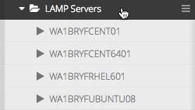
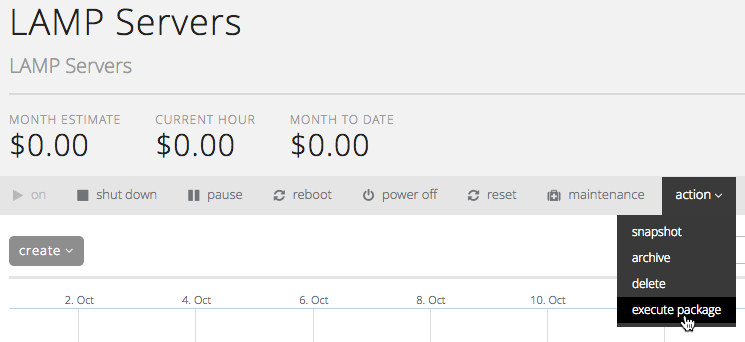
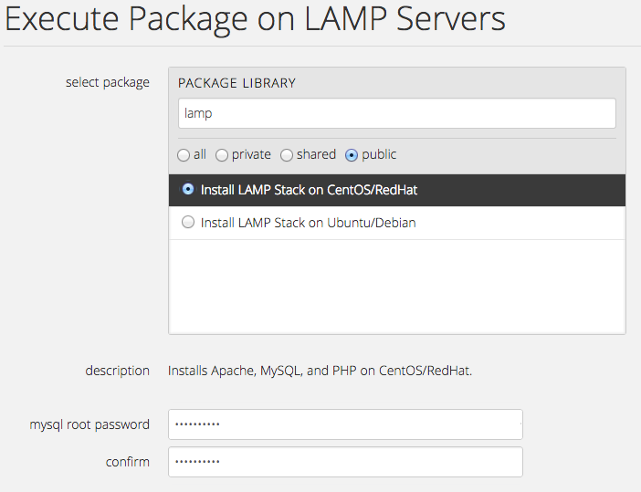
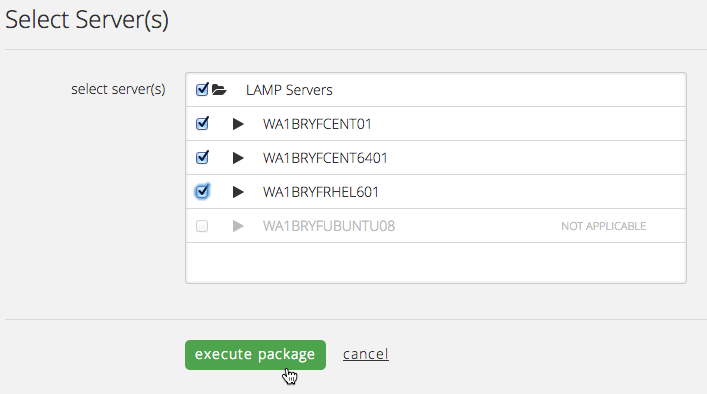
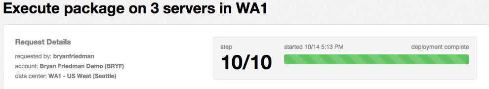

{{{
  "title": "Installing LAMP Stack on CenturyLink Cloud Servers",
  "date": "10-14-2014",
  "author": "Bryan Friedman",
  "attachments": [],
  "contentIsHTML": true
}}}

<h3>Description</h3>

LAMP is a web service solution stack&nbsp;suitable for building dynamic web sites and web applications. It stands for&nbsp;"Linux, Apache, MySQL, PHP" since these are the technologies it typically uses to provide the solution stack.

CenturyLink Cloud does not have a LAMP-specific starting template, but does support a number of Linux distributions as base templates including RedHat, CentOS, and Ubuntu. While LAMP is often spread across multiple tiers (database, application, web),
  if you want to install&nbsp;a <em>complete</em> LAMP stack on a single server,&nbsp;there is a Blueprint script available to do this for you. The following steps outline how to execute a package to install the full LAMP stack on one or more servers.

<h3>Steps</h3>

<strong>1. Navigate to a Group of Servers</strong>

<ul>
  <li>Locate the Group that contains servers that needs a bulk script or software installation and click on it to view the Group Details page. In the example below, the Group is named “LAMP Servers”.&nbsp;
     
  </li>
</ul>

<strong>2. Execute Package from Group actions menu</strong>

<ul>
  <li>Hover over the "actions" menu and choose the “execute package” option.&nbsp;
     
     
     
  </li>
  <li>Select "public" to view only public packages. You can also use the search field to filter on "lamp" and find the package that starts with "Install LAMP Stack on..." Then select the one you need based on the servers you will be installing it on. There
    is a separate package for RedHat/CentOS machines vs. Ubuntu/Debian-based systems. Here, we will use the RedHat/CentOS one, but the Ubuntu/Debian version works the same way. Once selected, you will also be prompted to enter a password for the MySQL
    root user. Enter it twice to confirm, then scroll down.
     
     
     
  </li>
  <li>Next, choose the servers in the Group to install the package on. (Only servers built from the package's supported OS templates will show as selectable.) Once the server(s) have been selected, click "execute package" to begin the installation.
     
  </li>
  <li>The CenturyLink Cloud Control Portal creates a Blueprint and runs the designated package on the selected machines.&nbsp;
     
     
     
  </li>
</ul>

<strong>3. Confirm Successful Package Installation</strong>

<ul>
  <li>Navigate to the server details for one of the servers affected by the package execution. Grab the IP address of the server.</li>
  <li>Start the OpenVPN client and open up a secure connection to the CenturyLink Cloud.</li>
  <li>You can easily confirm a successful Apache installation by visiting the IP address of the server in a browser and seeing the default Apache page. To confirm MySQL installation, SSH into the server and login to mysql using the password you provided during
    the Blueprint deployment.</li>
</ul>
