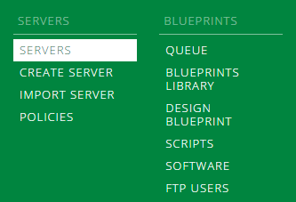
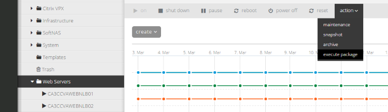
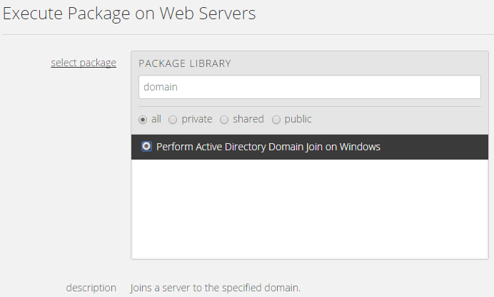
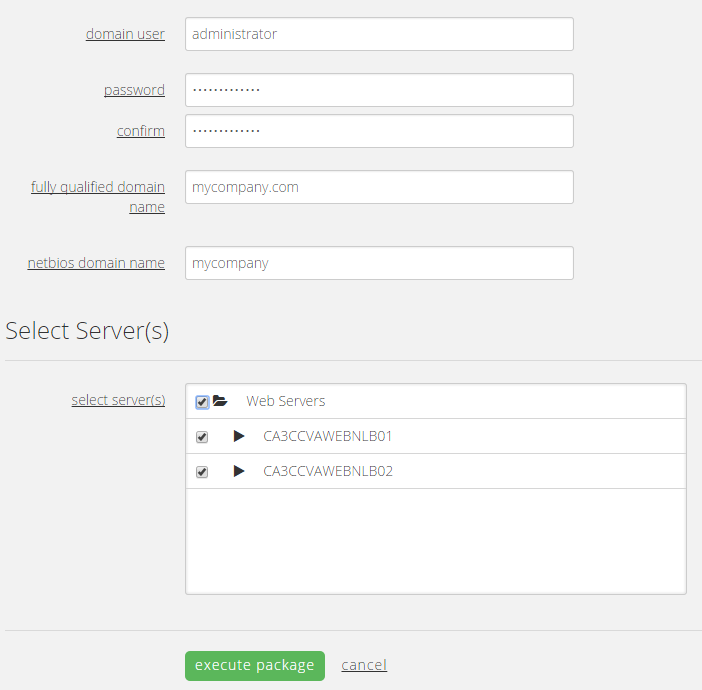
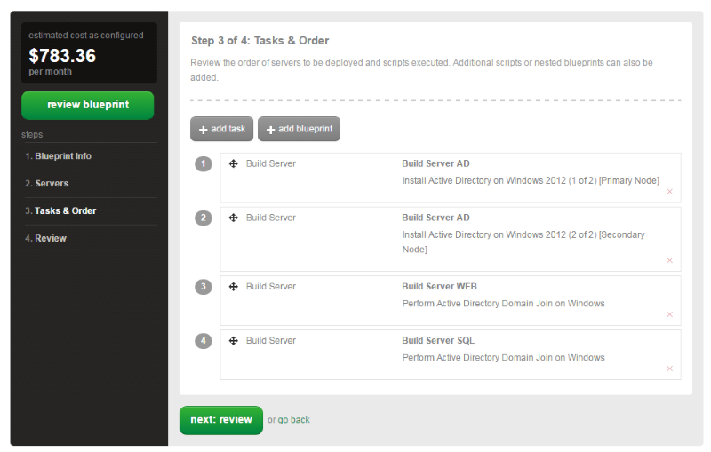
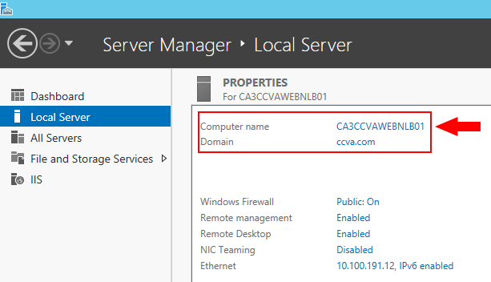
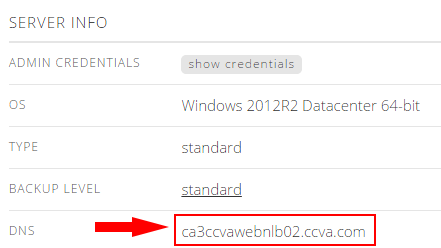

{{{
  "title": "Perform Active Directory Domain Join on Windows",
  "date": "3-17-2015",
  "author": "Chris Little",
  "attachments": [],
  "contentIsHTML": false
}}}

### Overview

By leveraging [CenturyLink Cloud Public Blueprints](centurylink-cloud-public-blueprint-packages.md) customers can automate operational tasks.  In using the **Perform Active Directory Domain Join on Windows** blueprint customers can join Microsoft Windows Servers to a domain in an automated fashion.

### Prerequisites

* A CenturyLink Cloud Account
* Supported Windows Operating System:
    * Windows 2008 R2 Standard 64-bit
    * Windows 2008 R2 Enterprise 64-bit
    * Windows 2008 R2 Datacenter 64-bit
    * Windows 2012 Datacenter 64-bit
    * Windows 2012 R2 Data Center 64-bit
* A Windows 2008 or 2012 Active Directory Domain
* TCP (Firewall) Connectivity between Domain Controller(s) and Target Virtual Machine(s)
* vNIC Primary and Secondary DNS on Target Virtual Machine(s) is set to the Domain Controller(s) IP Addresses.

### EXCEPTIONS

* [Managed Managed Operating System Services Customers](http://www.ctl.io/managed-services/operating-system) should review the [Managed Operating System FAQ.](../Managed Services/managed-operating-system-frequently-asked-questions.md)  In order to join Managed Servers to a dedicated customer domain a user must deploy [Managed Active Directory](../Managed Services/getting-started-with-managed-active-directory.md) in the CenturyLink Cloud.
* The Perform Active Directory Domain Join on Windows Script will not perform an automated reboot of the Windows Virtual Machine.  Customers are encouraged to reboot the VM at their convenience.

### Perform Active Directory Domain Join on Windows using Group Tasks

1. **Navigate to the Servers Menu in Control.**

  

2. **Browse to the Group that houses the VM(s) you want to Join to a domain. Select Action, Execute Package.**

  

3. **Search for '<strong>domain</strong>' and select the <strong>Perform Active Directory Domain Join on Windows</strong> script.**

  

4. **Input the Domain information.**

  - Domain User
  - Domain User Password
  - Fully Qualified Domain Name (FQDN)
  - Netbios Domain Name

  Select the VM(s) in the Group you want to join to a domain. Customers can choose an individual VM or multiple. (Quick Tip: Only supported Guest Operating Systems will be shown)

  

### Perform Active Directory Domain Join on Windows using Blueprints

  Customers who are building environments in the CenturyLink Cloud may wish to use Blueprints to build servers and join them to an Active Directory Domain in an automated fashion. Blueprints provide a tool for customers to build environments for multiple deployments.

  To use this approach follow the [How to Build a Blueprint](how-to-build-a-blueprint.md) knowledge base article and the Perform Active Directory Domain Join on Windows script in conjunction with Windows Virtual Machine builds.

  

### Validation

Validate the Virtual Machine(s) are now joined to the Windows Domain by:

1. **Login via RDP, open Server Manager**

  

2.  **Review the DNS field located in the Server Info area of the Cloud Portal**

  
