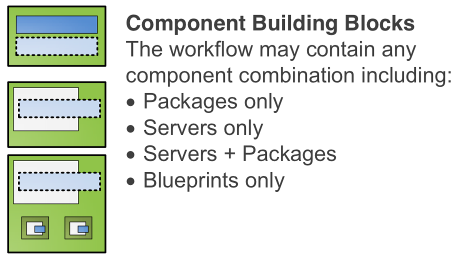

{{{
  "title": "Understanding the Difference Between Templates, Blueprints and Packages",
  "date": "7-6-2015",
  "author": "<a href='https://twitter.com/KeithResar'>@KeithResar</a>",
  "attachments": [],
  "contentIsHTML": false,
  "sticky": true
}}}

This article can be helpful to differentiate between Templates, Blueprints and Packages - all critical elements of the CenturyLink Cloud orchestration system we collectively call the Blueprint Engine.

### Templates

A Template is the basic model from which each Server gets created. The platform has a number of **Global Templates** which are replicated to all Nodes, and in addition customers may [create their own Custom Templates](../Servers/how-to-create-customer-specific-os-templates.md).

[Marketplace Providers](http://www.ctl.io/marketplace/program) can also submit their technology as a **Partner Template** which can be used as the basic model for a virtual appliance deployment.  Creating servers from Partner Templates is in an early beta release but can be invoked by customers using [Service Tasks](http://www.ctl.io/service-tasks).

### Blueprints

A Blueprint is a saved workflow that can be defined and re-played at any time on the platform. During the Blueprint design process, customers do not incur billable costs. Customers are simply creating a workflow plan that orders steps across three categories: (1) cloud provisioning tasks; (2) software package installs; (3) script package execution. Users can add and reorder steps to the workflow as needed. Customers can define incredibly complex environments and invoke them at any time with single-click simplicity. The platform will also estimate the running costs of the Blueprint once deployed.

*Image 2 - Reorder tasks in the Blueprint designer*

Blueprints are the perfect model for SaaS providers bringing on a new customer in a "hosted private" model. Create a sub account, single click deploy your SaaS app Blueprint and the new customer is online and billing.

Blueprints are also ideal fits for creating server environments to support a software development lifecycle stage. From test/dev/QA/Prod, any app stack you are running, make it a blueprint, single click deploy to spin up a new copy of the app stack for testing or QA and tear it down when you’re done or deploy it to production.

*Image 3 - Single click deploy with built in costing model*

### Packages

Packages are invoked software which customizes a Server Template. Packages come in two types: Software Packages and Script Packages, each can be called from within a Blueprint or applied directly to the Server via the Control interfaces such as the Create Server screen or the Group Management screen.

*Image 4 - Script packages can be applied to Blueprints, new server builds or a group of existing servers*

### Summary

  * A Template is the basic model from which each Server gets created.
  * A Blueprint is a saved workflow that can be defined and re-played at any time on the platform.
  * Package is an invoked piece of software, uploaded to the cloud platform, which customizes a Server Template.
