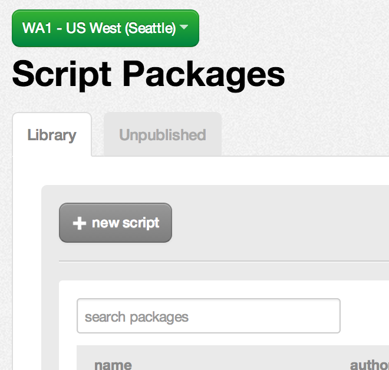

{{{
  "title": "Using Blueprint Script to Call API",
  "date": "10-8-2014",
  "author": "Bryan Friedman",
  "attachments": [
    {
      "url":"../attachments/package.zip",
      "type":"application/zip",
      "file_name":"package.zip"
    }
  ],
  "contentIsHTML": false
}}}

### Description
<p>It can sometimes be helpful to expose metadata about Lumen Cloud servers or other components to the servers themselves, making details around data centers, groups, the server itself, or even other servers available for use on a server. This type of information can potentially be used for such things as balancing clusters or as part of specific configuration files on the server. By combining the flexibility of Blueprints and Scripts with the power of the v2 API, you can easily accomplish something like this. The following use case is one example of how to achieve this sort of functionality. It queries the API for the ID and name of the data center that the current server is in and writes this information to a file on the server.

### Steps
Write a shell script to perform the query and write the file.
1. Before creating any Blueprints or Scripts in the Control Portal, write a shell script that will run on a Linux server. It needs to call the API, get the information needed, and write it out to a file. It will also need five command line parameters to perform these operations:
   ```
   # Take parameters from command line
   USERNAME="$1"   # Username of the control portal user to connect to API as
   PASSWORD="$2"   # Password for this user
   ACCOUNT="$3"    # The account alias to query in the API (Example: BRYF)
   SERVERID="$4"   # The server ID to query in the API (Example: WA1BRYF2NDSRV01)
   FILENAME="$5"   # The complete path and file name to write the information out to
   ```

2. Next, initialize some other variables to use in the calls to the API and the parsing of the JSON that it returns.
   ```
   # Names of value keys to get from JSON responses
   TOKENKEY="bearerToken"
   DCKEY="locationId"

   # Build JSON for authorization request
   AUTHJSON="{\"username\":\"$USERNAME\",\"password\":\"$PASSWORD\"}"

   # Store URLs for API requests
   BASEURL="https://api.tier3.com/v2"
   AUTHURL="$BASEURL/authentication/login"
   GETSRVURL="$BASEURL/servers/$ACCOUNT/$SERVERID"
   ```

3. Additionally, the script will need to parse the JSON string that is returned from the API calls. Here is a very simple example of a function that will find a specific key and return the value in a JSON string. Feel free to use your favorite JSON parsing method that is supported in shell scripts (i.e., python or [jsawk](https://github.com/micha/jsawk). (Though limited, this example sticks with standard Linux commands like `sed`, `awk`, and `grep`, so no additional libraries are required.)
   ```
   # Simple helper function to parse JSON response ($1) and return value for given key ($2)
jsonGetVal() {
    echo $1 | sed 's/[{}]//g' | awk -v k="text" '{n=split($0,a,","); for (i=1; i<=n; i++) print a[i]}' |
       sed 's/\"//g' | grep $2 | awk 'BEGIN { FS = ":" } ; {print $2}'
   }
   ```

4. Then the script makes three sequential calls to the API using `curl` and the parameters and variables initialized above along with the JSON parsing. The first call is to authenticate, the second will get the data center ID, and the third one is for getting the data center name. (For more details on using the API in general, refer to the [API v2 Knowledge Base](https://www.ctl.io/api-docs/v2).
   ```
   # Call to authentication API to get token
   AUTHRESP=`curl -s -H "Content-Type: application/json" -d $AUTHJSON $AUTHURL`
   TOKEN=`jsonGetVal $AUTHRESP $TOKENKEY`

   # Call to server API to get data center id for given server id
   SRVRESP=`curl -s -H "Authorization: Bearer $TOKEN" $GETSRVURL`
   DCID=`jsonGetVal "$SRVRESP" $DCKEY`

   # Call to DC API to get data center name for given ID
   GETDCURL="$BASEURL/datacenters/$ACCOUNT/$DCID"
   DCRESP=`curl -s -H "Authorization: Bearer $TOKEN" $GETDCURL`
   DCNAME=`jsonGetVal "$DCRESP" name`
   ```

5. Finally, write the information out the file as specified by the parameter.
   ```
   # Write information to given file name
   echo -e "$DCID\n$DCNAME" > $FILENAME
   ```

### Create the Script Package
(For details on creating script packages in general, refer to the article [Blueprints Script and Software Package Management](../Blueprints/blueprints-script-and-software-package-management.md).
1. Save the script from Step 1 as `install.sh`.

2. Now, create the package manifest XML with all the information needed to upload the script to the control portal. This file contains the name and description of the package, along with the parameters needed and the command to execute. The five parameters defined above are passed to the command, retrieving three of them from the pre-defined system parameters (server name, user, and account alias) and prompting for the other two (password and filename).
   ```
   <?xml version="1.0" encoding="utf-8"?>
   <Manifest>
      <Metadata>
      <UUID>fb50a8ac-cf77-4bac-97c0-f9f9ca76cf6d</UUID>
      <Name>Write DC Info to File (Linux)</Name>
      <Description>
      Writes file to system with ID and name of data center for the current Linux server.
      </Description>
   </Metadata>
      <Parameters>
      <Parameter Name="Server Name" Type="String" Variable="T3.Server.Name" Prompt="false"/>
      <Parameter Name="Control Username" Type="String" Variable="T3.Identity.User" Prompt="false"/>
      <Parameter Name="Account Alias" Type="String" Variable="T3.Identity.Account" Prompt="false"/>
      <Parameter Name="Current Control User Password" Type="Password" Variable="T3.DCInfo.UserPassword" />
      <Parameter Name="Complete Path and File Name to Write" Type="String" Variable="T3.DCInfo.PathToFile" />
   </Parameters>
   <Execution>
      <Mode>Ssh</Mode>
      <Command>install.sh ${T3.Identity.User} ${T3.DCInfo.UserPassword} ${T3.Identity.Account} ${T3.Server.Name} ${T3.DCInfo.PathToFile}</Command>
      <Persistent>false</Persistent>
   </Execution>
   </Manifest>
   ```

3. Save this file as `package.manifest`.

4. Create a ZIP file that contains the two files just created (`package.manifest` and `install.sh`) at the top level (not nested in a folder). Save this ZIP file as `package.zip`.

### Upload the script to the control portal
(For details on creating script packages in general, refer to the article [Blueprints Script and Software Package Management](../Blueprints/blueprints-script-and-software-package-management.md).
1. Login to control portal and navigate to the Scripts page.
   

2. Click **+ new script**.
   

3. Choose "Browser Upload" and then upload the `package.zip` file.
   

4. Now publish the package by clicking the "publish" button next to the package name in the list of unpublished packages.
   

5. Click **next** on the displayed information page and then select the desired attributes for the package. In this example, select "Scripts", "Linux" (selecting all Linux flavors) and finally "Private". Then, click **Publish**.
   

6. The package is queued for publishing. Once the publish operation is complete, it is a usable script. You can click the "Details Page" link to check the status of the publish.
   

### Execute Script on [Multiple] Server(s) within a Group
(Alternatively, you could create a Blueprint and use this Script as the last task of the build procedure.)
1. From the group page, select **execute package** from the actions menu.

2. Select the Script you uploaded in the previous steps. It should be listed under "private scripts" as seen here:
   

3. Now enter the values for the parameters that were defined as the prompts indicate. First, your Control Portal password, and then the path to write the file to. This example will use the path `/tmp/dc-info.txt`.
   

4. Finally, select the servers to execute the script on and click **execute package**.
   

5. You will then be redirected to the Queue page to see the status of the running task. When it is completed, log on to one of the servers to confirm the file exists and has the data as expected.
