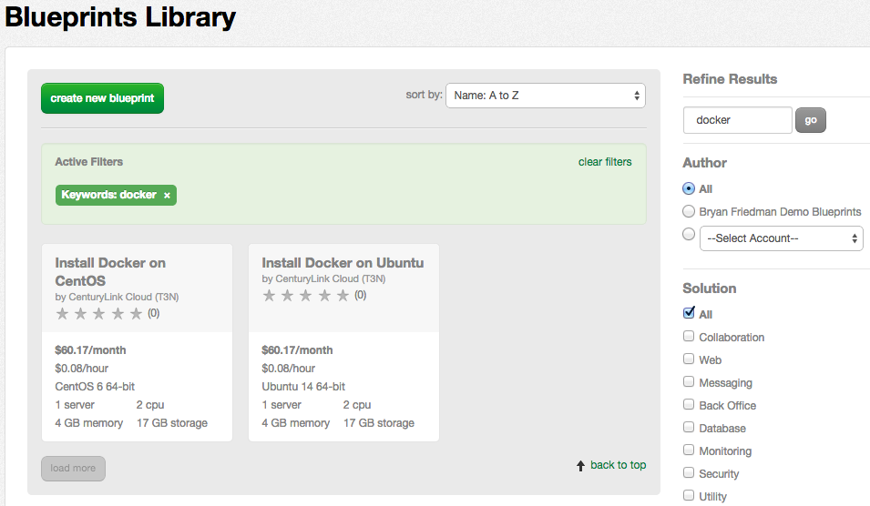
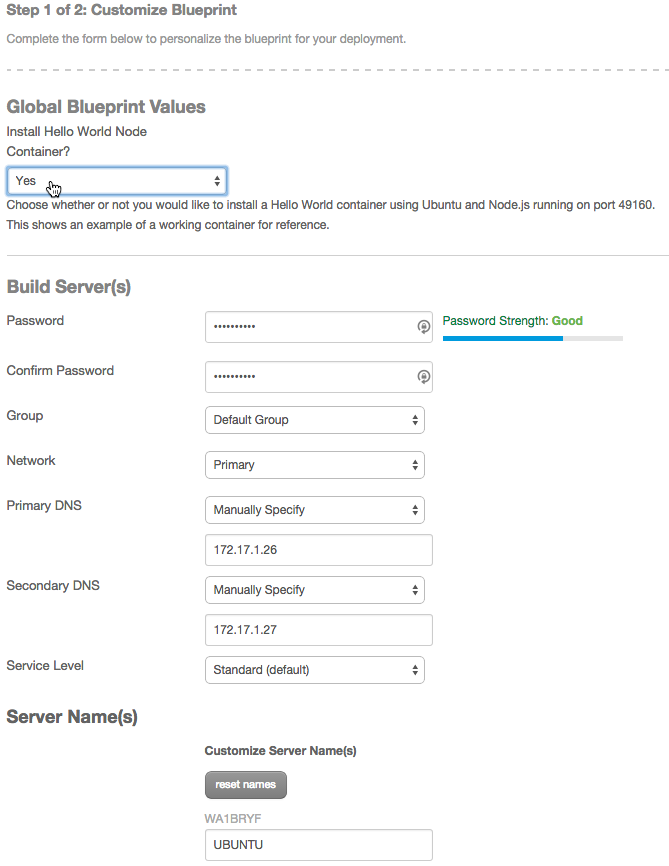
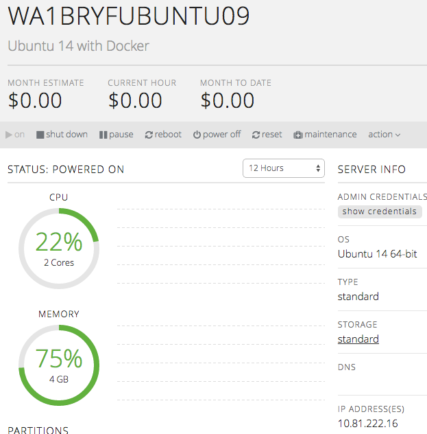
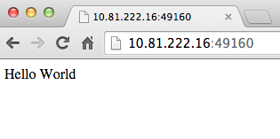

{{{
  "title": "Using Docker on CenturyLink Cloud Servers",
  "date": "4-15-2015",
  "author": "Bryan Friedman",
  "attachments": [],
  "contentIsHTML": false
}}}

### Description
[Docker](//www.docker.com) is open-source software for Linux that is used to deploy of applications inside software containers by providing an additional layer of abstraction of operating system–level virtualization. CenturyLink Cloud supports Docker on two traditional Linux distributions as well as on the newer, lightweight [CoreOS](//www.coreos.com) that is used specifically for deploying applications in Docker containers.  CenturyLink Cloud also supports [Panamax](//www.panamax.io), a web-based tool that makes it easy to deploy complex Docker applications through a drag-and-drop interface.  (Read about [installing CoreOS or Panamax on CenturyLink Cloud.](../Servers/building-coreos-server-cluster-on-the-centurylink-cloud.md))

### Steps
The quickest way to get a single Linux server up and running with Docker is to use one of the provided Blueprints, either "Install Docker on CentOS" or "Install Docker on Ubuntu". Clicking on either of these blueprints and then clicking "deploy blueprint" will provision a server and install Docker for you. This process is outlined below. Alternatively, you could also provision your own Ubuntu 14 or CentOS 6 server and follow the steps for [executing a package on a server](../Servers/using-group-tasks-to-install-software-and-run-scripts-on-groups.md), selecting the "Install Docker on Ubuntu" or "Install Docker on CentOS" package depending on your server type.

The steps provided below will work with either Ubuntu 14 or CentOS 6 versions of Linux. The example below shows Ubuntu 14, but the process is the same for CentOS 6. (Just replace the package or Blueprint name with "CentOS" instead of "Ubuntu".)

1. In the Control Portal, navigate to the Blueprints Library and search for "docker" to find the two available Blueprints.

    

2. Click on "Install Docker on Ubuntu", then click "deploy blueprint" to begin the installation.
3. Now you will be presented with a page to input parameter values to specify details of the installation. Enter the required values for the server build (password, group, network, DNS, service level, and name). For the "Install Hello World Node Container" option, you may leave the default as "No" which will install Docker on the server but will not include any containers. If you select "Yes", the package will also install a sample container running a Node.js "Hello World" application on port 49160 as an example container.

    

4. Click the "next: step 2" button, then "deploy blueprint" after reviewing the values. This should kick off a deployment job in your queue. Once the job has completed, the server will be created.

    

5. You should see the new server under the group you chose when deploying the blueprint. Here, we use our VPN connection and IP address to confirm the example container application is deployed.

    

    
