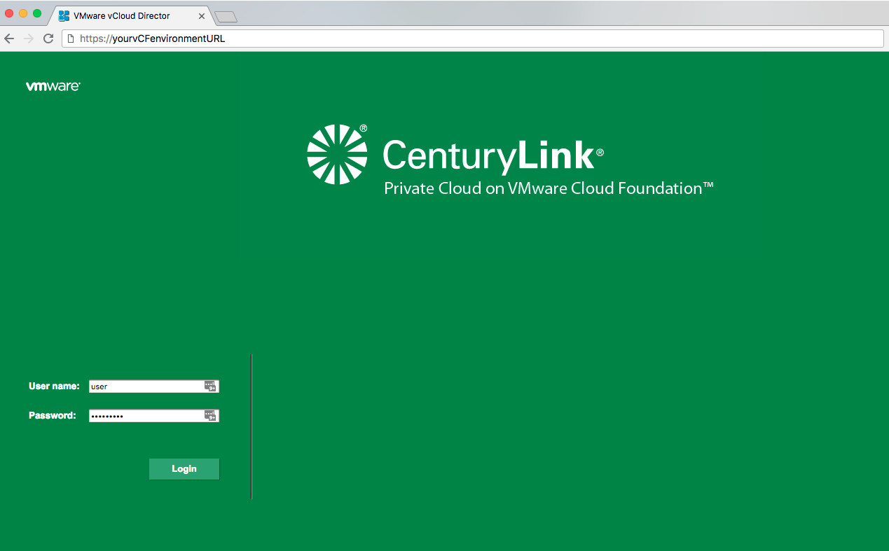
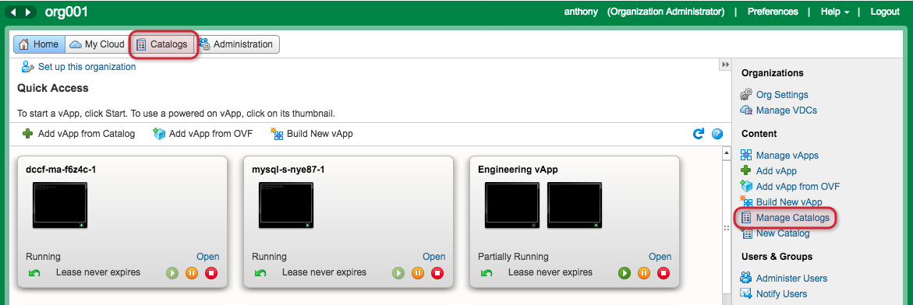
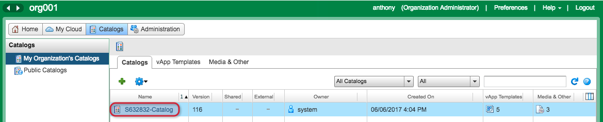
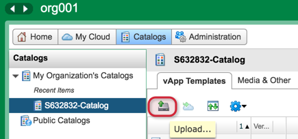
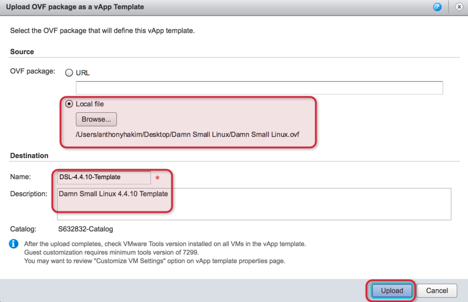
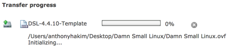
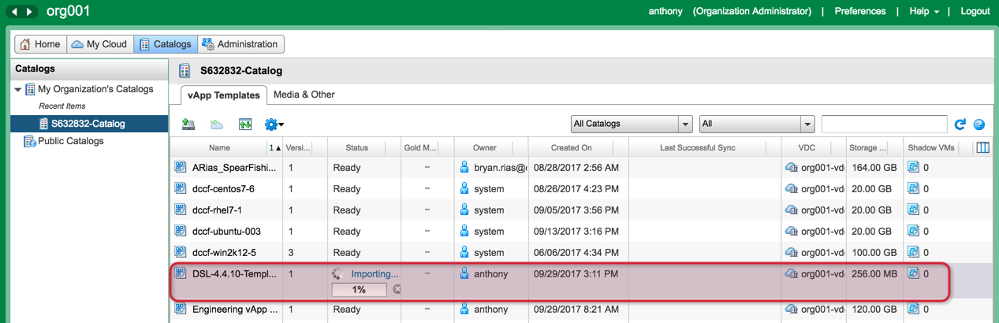
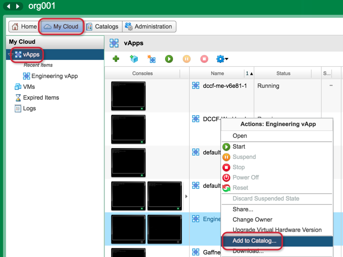
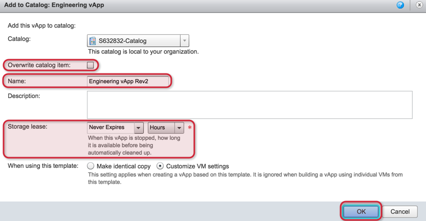

{{{
  "title": "Adding to your Catalog (Flex UI)",
  "date": "5-17-2018",
  "author": "Anthony Hakim",
  "attachments": [],
  "related-products" : [],
  "contentIsHTML": false,
  "sticky": false
}}}

### Description
In this KB article, we demonstrate how to add an Open Virtualization Format (OVF) Template to your Catalog in CenturyLink Private Cloud on VMware Cloud Foundation™. We also have step-by-step instructions on adding an Existing vApp to your Catalog. In this case, an existing vApp could consist of one or more VMs.

A catalog is a container for vApp templates and media files in an organization. Organization administrators and catalog authors within CenturyLink Private Cloud on VMware Cloud Foundation can create catalogs in an organization. Catalog contents can be shared with other users within CenturyLink Private Cloud on VMware Cloud Foundation.

CenturyLink Private Cloud on VMware Cloud Foundation contains organization (private) catalogs, and access to its public catalog. Organization catalogs include vApp templates and media files that you can share with other users in the organization.

### Steps to add an OVF Template
* Login to your CenturyLink Private Cloud on VMware Cloud Foundation environment.

  

* Once logged in, you can either click on __Catalogs__ at the top of the page, or click on __Manage Catalogs__ in the shortcuts pane on the right side of the page.

  

* In the __My Organization's Catalogs__ page, double-click your Catalog - in this case, __S632832-Catalog__.

  

* In the __vApp Templates__ window, click on the __Upload icon__ (leftmost icon as depicted below).

  

* In the __Upload OVF package as a vApp Template__ window, either enter the __URL__ to the OVF, or __Browse...__ to the __Local file__, then enter the __Name__ and optional Description, then click __Upload__.

  

* A window with the __Transfer progress__ will appear, then once complete, the vApp Template will begin importing.

  

  

* Once the vApp Template is successfully imported, it can be used to deploy VMs inside of CenturyLink Private Cloud on VMware Cloud Foundation.

### Steps to add an Existing vApp to your Catalog
In this example, we will work with the Engineering vApp to create a new vApp Template. If the vApp is running, it is added to the catalog as a vApp template with all of its VMs in a suspended state.

* Click on __My Cloud__ and then in the left pane, click __vApps__. Right-click a vApp and select __Add to Catalog...__

  

* Select __Overwrite catalog item__ if you want the new catalog item to overwrite any existing vApp Template that has the same name. Type a __Name__ and optional Description for the vApp template. Specify a __Storage lease__ - the default storage lease is configured by your organization administrator.

  Specify how the template should be created:
  - __Make Identical Copy:__ vApps that are created from this vApp template inherit the guest operating system settings specified in the template. If you select this option and guest customization is enabled, the guest operating system is personalized. IP addresses of the NICs in the template are reserved.
  - __Customize VM Settings:__ Guest operating system is personalized regardless of the vApp template settings when the template is instantiated. IP addresses of the NICs in the template are released.

* Click __OK__ to finish.

  

  The vApp is saved as a vApp template and appears in the specified catalog.
