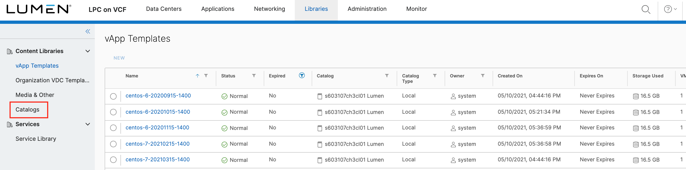
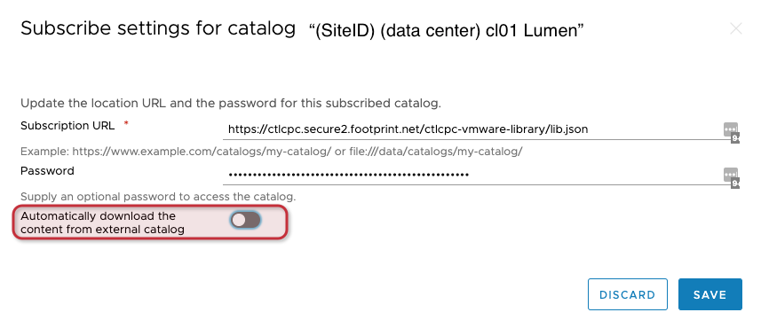
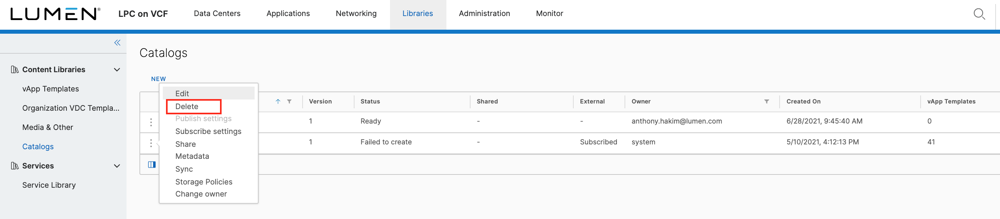
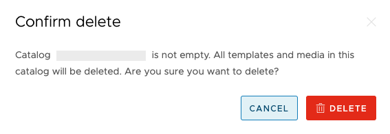

{{{
  "title": "Default Catalog and How to Opt Out",
  "date": "5-22-2019",
  "author": "Anthony Hakim",
  "attachments": [],
  "related-products" : [],
  "contentIsHTML": false,
  "sticky": false
}}}

### Description
In this KB article, we explore the Default Catalog, named __CTL-Golden-Images__, as well as the contents (vApp Templates) of your Default Catalog in CenturyLink Private Cloud on VMware Cloud Foundation. We also have step-by-step instructions on how to opt out if you prefer to provide your own vApp Templates to your Catalog.

### Default Catalog
CenturyLink Private Cloud on VMware Cloud Foundation is built with a Default Catalog (CTL-Golden-Images), which uses a subscription model. All of the contents of the upstream Publisher are automatically downloaded into the Default Catalog.

### Default vApp Templates in the Catalog
Since your Default Catalog is a subscriber to the CTL Master Catalog Service, the contents will vary as new vApp Templates get added, and older vApp Templates are retired. Currently this model is all or nothing, meaning because it is a subscriber, you get all of the contents of the upstream catalog. If you delete any of the vApp Templates in your Default Catalog, they will simply get re-added the next time your catalog synchronizes. If you'd like to Opt Out, then follow the steps in the Steps to Opt Out section below.

### Steps to Opt Out
There are two options for Opting out for the Default Catalog (CTL-Golden-Images).

The first option is to stop the automatic synchronization of the catalog. The contents of the subscribed catalog will remain intact, but will not be updated to reflect any changes, whether they are new templates, updates to existing templates or templates that are removed from the catalog.

The second option is to delete the catalog. __The catalog and contents of the catalog will be deleted__. You have the option to move the vApp Templates to another catalog before you proceed with Option 2.

#### Option 1
* Login to your CenturyLink Private Cloud on VMware Cloud Foundation environment.

  

* Once logged in, click on the __Main Menu__ (also known as the Hamburger Menu) at the top of the page, then click __Libraries__.

  

* In the __Libraries__ page, under __Content Libraries__, click __Catalogs__.

  

* Locate __CTL-Golden-Images__ on the right side, then click on the dotted menu to the left, then __Subscribe settings__.

  

* In the Subscribe settings for catalog "CLT-Golden-Images" page, toggle the setting for __Automatically download the content from external catalog__ to off, then click Save.

  

#### Option 2
* Login to your CenturyLink Private Cloud on VMware Cloud Foundation environment.

  

* Once logged in, click on the __Main Menu__ (also known as the Hamburger Menu) at the top of the page, then click __Libraries__.

  

* In the __Libraries__ page, under __Content Libraries__, click __Catalogs__.

  

* Locate __CTL-Golden-Images__ on the right side, then click on the dotted menu to the left, then __Delete__.

  

* In the __Confirm delete__ page, click __DELETE__.

  
