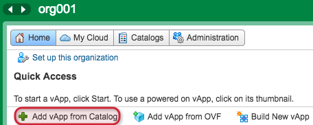
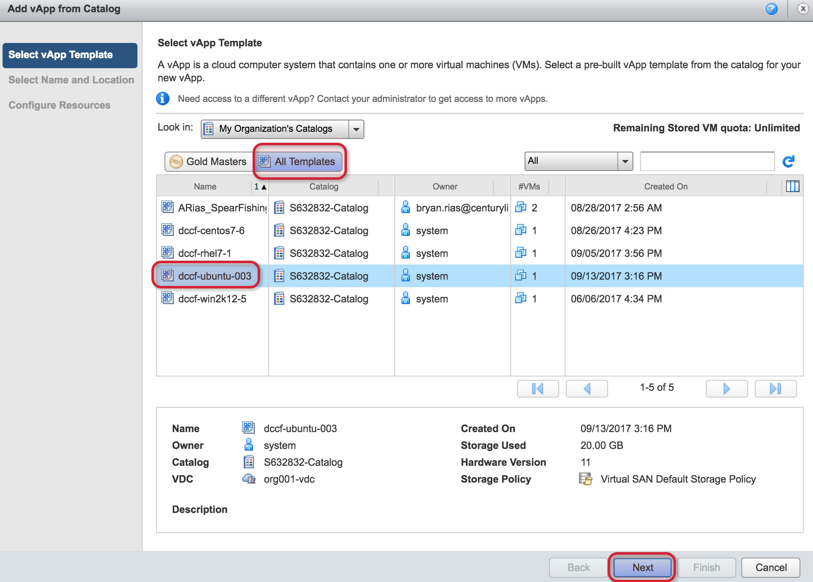
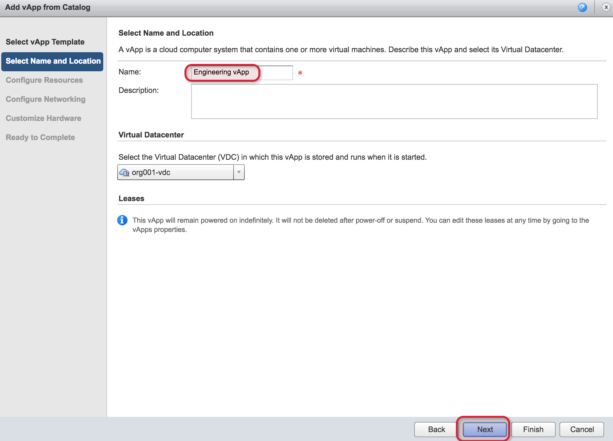
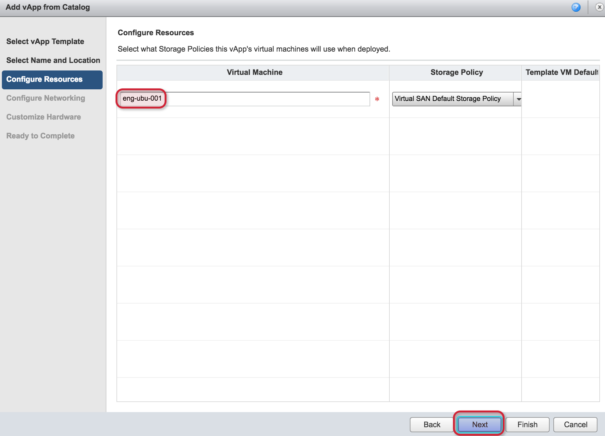
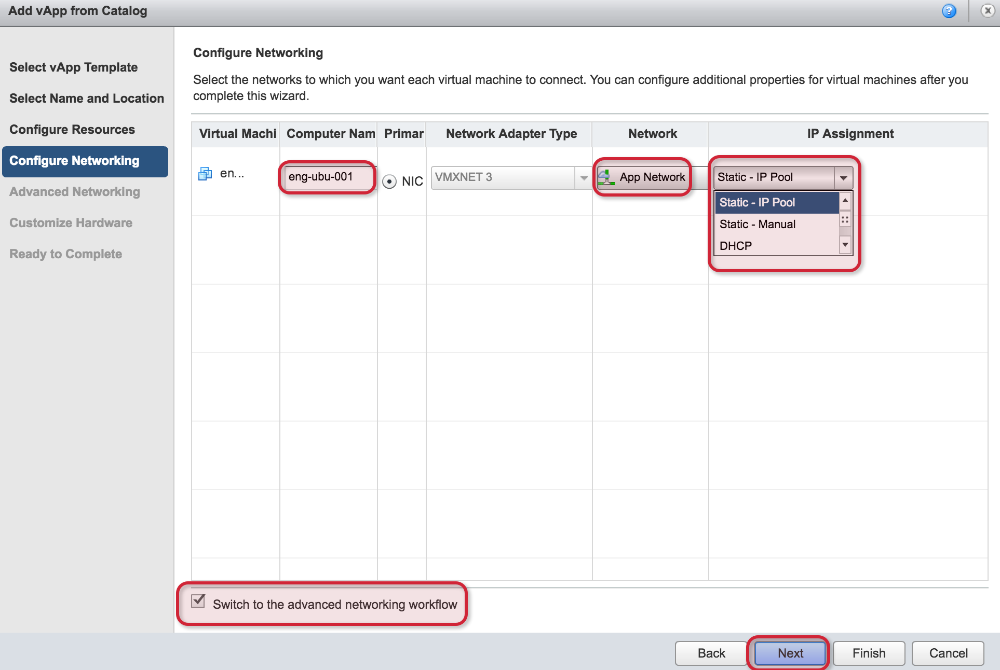
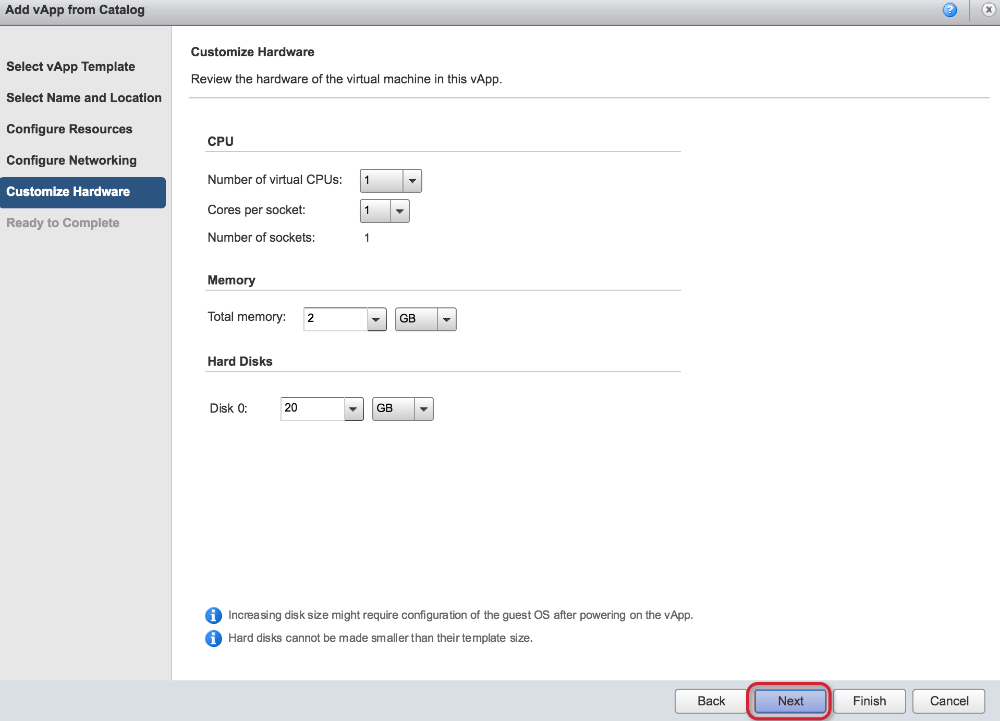
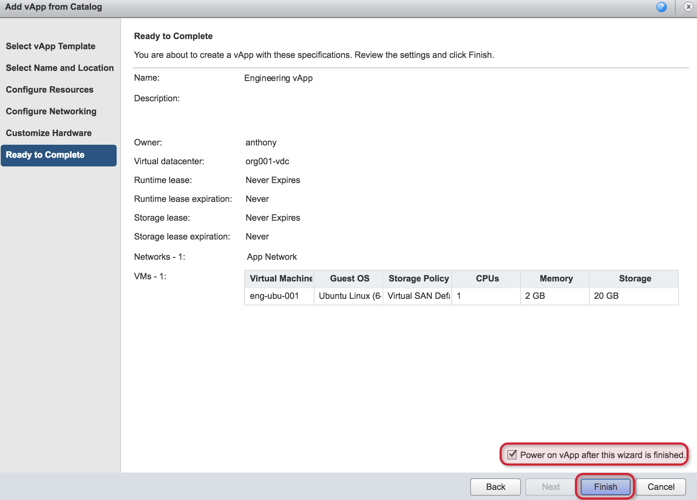

{{{
  "title": "Creating a Server (Flex UI)",
  "date": "5-17-2018",
  "author": "Anthony Hakim",
  "attachments": [],
  "related-products" : [],
  "contentIsHTML": false,
  "sticky": false
}}}

### Description
In this KB article, we demonstrate how to provision a new virtual server in CenturyLink Private Cloud on VMware Cloud Foundation™.

Once you've gone through this KB article and created a new virtual server, you can follow these guides to learn how to [Configure SSL VPN-Plus](../Security/configuring-sslvpn-plus.md) and [How to Securely Connect](../Security/how-to-securely-connect.md) to your CenturyLink Private Cloud on VMware Cloud Foundation environment.

Note: This KB assumes you have followed the KB article on [Adding to your Catalog](../General/add-to-catalog.md) in CenturyLink Private Cloud on VMware Cloud Foundation.

### Steps
* Login to your CenturyLink Private Cloud on VMware Cloud Foundation environment.

  

* Once logged in, you will see the __Quick Access__ page. The easiest way to create a virtual server is to click __Add vApp from Catalog__.

  

* In the Add vApp from Catalog page, click __All Templates__ to show all templates. Select the template you wish to deploy, then click __Next__.

  

* Enter a name for the new vApp you are creating and click __Next__ &mdash; in the context of vCloud Director, a vApp is simply a container for the objects you create.

  

* Enter a name for your Virtual Machine &mdash; this is the friendly name that will be displayed inside of vCloud Director.

  

* Enter your __Computer Name__ &mdash; in this example, I have used the same name as the Virtual Machine name. Select the network you wish to place your new virtual server on - you also have the ability to add a network if you need to create a new one. If you want to choose an IP Assignment option, you will need to check the __Switch to the advanced networking workflow__ box. Select the IP Assignment that you want to use for your server &mdash; Static IP Pool and DHCP are the more commonly used options. Click __Next__.

  

* Now you have the option to granularly select __CPU, Memory, and Hard Disks__. Make your selections and click __Next__.

  

* The final page provides a summary of your selections. You also have the option to __Power on vApp after this wizard is finished__ to save you from having to do that once the vApp is built. Click __Finish__.

  
