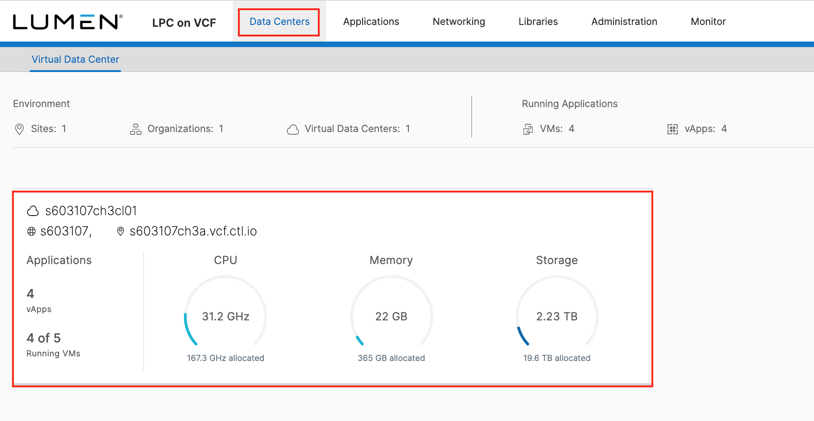
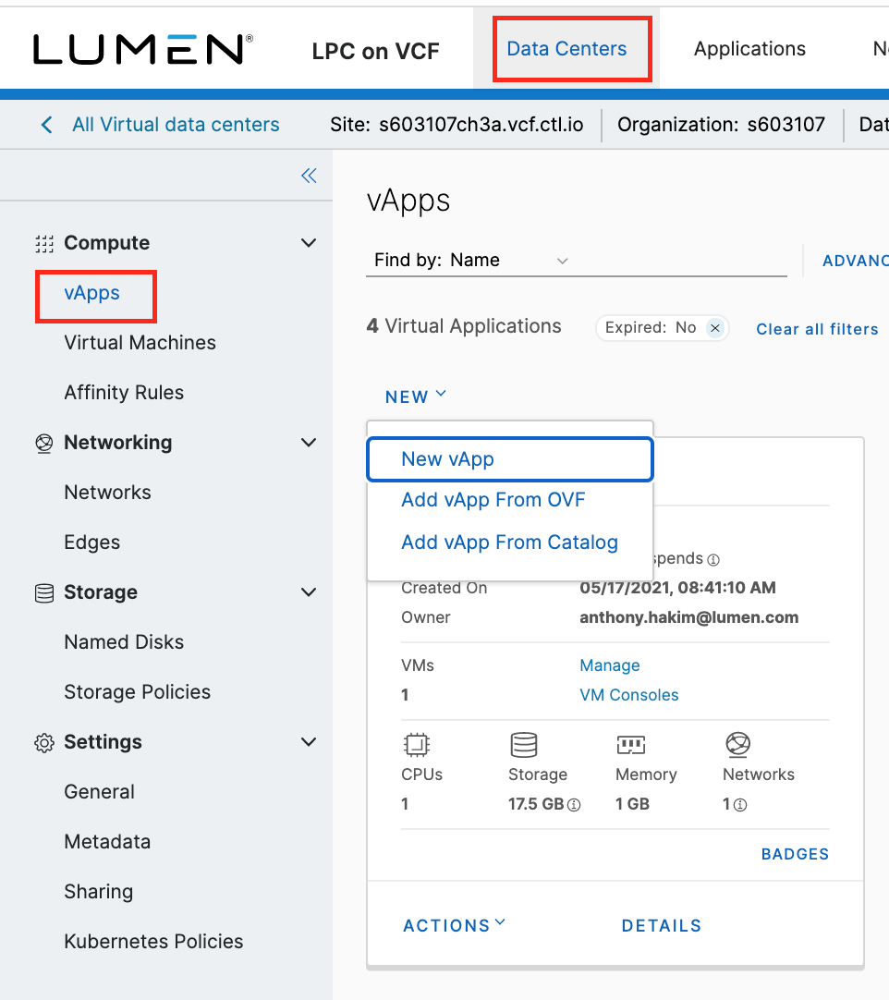
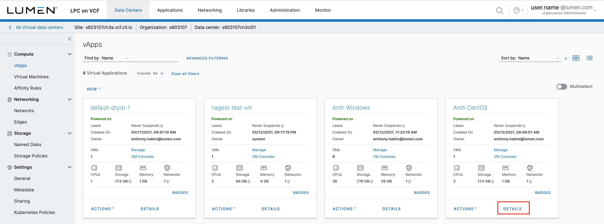
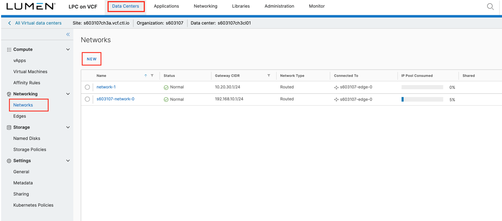
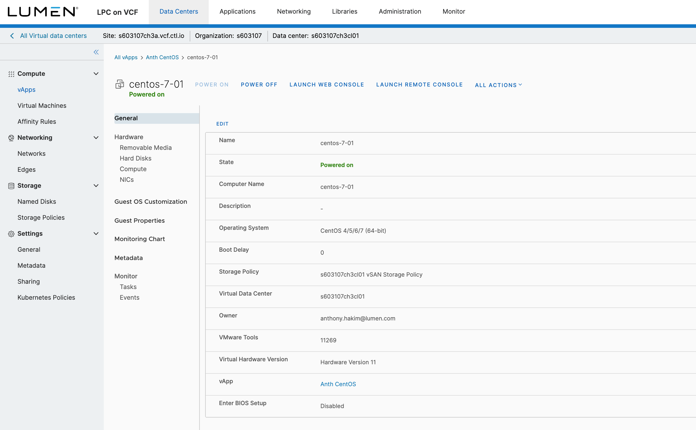
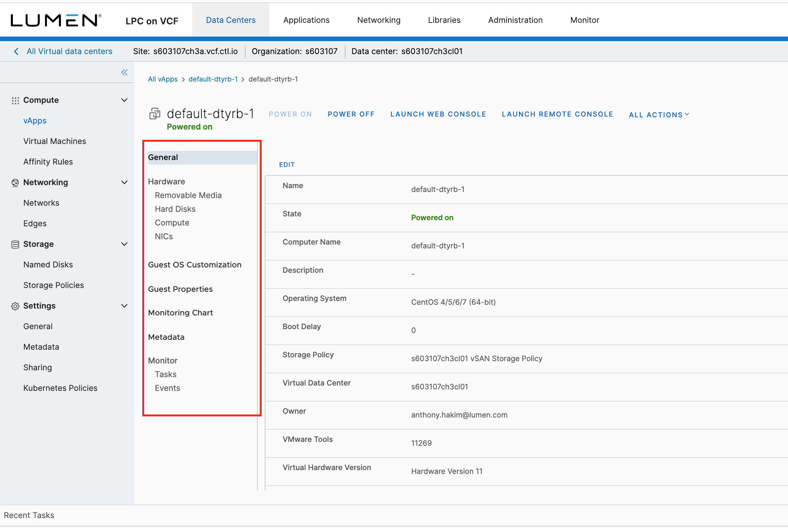
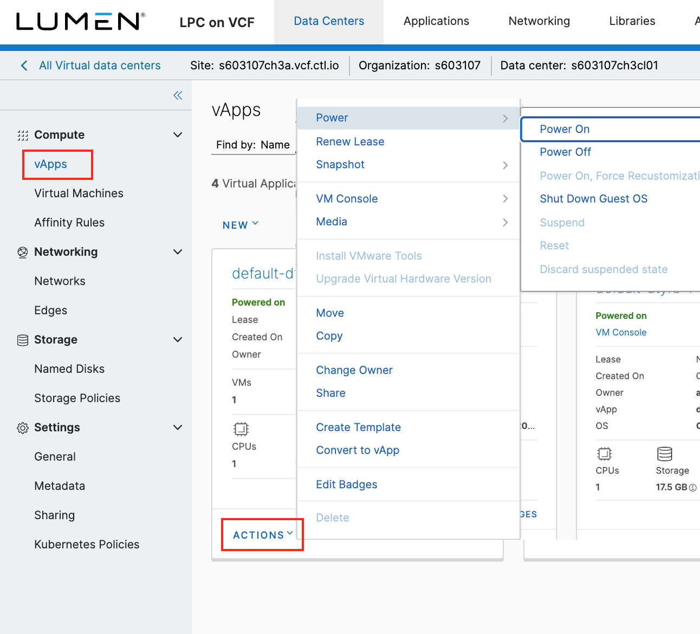

{{{
  "title": "Creating a Server",
  "date": "5-6-2019",
  "author": "Hannah Melvin",
  "attachments": [],
  "related-products" : [],
  "contentIsHTML": false,
  "sticky": false
}}}

### Description
In this KB article, we demonstrate how to provision a new virtual server in CenturyLink Private Cloud on VMware Cloud Foundation™.

Once you've gone through this KB article and created a new virtual server, you can follow these guides to learn how to [Configure SSL VPN-Plus](../Security/configuring-sslvpn-plus.md) and [How to Securely Connect](../Security/how-to-securely-connect.md) to your CenturyLink Private Cloud on VMware Cloud Foundation environment.

Note: This KB assumes you have followed the KB article on [Adding to your Catalog](../Catalog/add-to-catalog.md) in CenturyLink Private Cloud on VMware Cloud Foundation.

### Steps
* Login to your CenturyLink Private Cloud on VMware Cloud Foundation environment.

  

* Once logged in, select __Datacenters__ from the menu at the top of the screen. Then select the datacenter for the server.

  

* You will then land on a page showing all your VMs. In the left side panel, select __vApps__ below __Compute__.

  

* Click __New vAPP__ a the top of the screen. A popup window will appear. Enter a name for the new vApp you are creating &mdash; in the context of vCloud Director, a vApp is simply a container for the objects you create. Once you enter a Name, click __Add Virtual Machine__.

  

* In the New VM popup window, enter a name for your Virtual Machine &mdash; this is the friendly name that will be displayed inside of vCloud Director. Enter your __Computer Name__ &mdash; the Computer Name will default to the same as the Name but can be edited as needed. For __Type__ of VM, select New or From Template. If choosing __From Template__, the Compute details can be updated in later steps. Click __OK__.

  

* On the New vApp window, you can add additional Virtual Machines to your vApp, or you can click __Create__.

  

* After clicking __Create__ you will be navigated back to the vApps screen. If you would like to update details within your vApp or VM and to add a Network, locate your vApp and click __Details__.

  

* Click the __Networks__ tab to configure a network. Then click __New__.

  

* Select the Network Type. If choosing __OrgVDC Network__ select the network and click __Add__. If choosing __vApp Network__ complete the fields that appear, then click __Add__.

  

* If you would like to update the Compute details on your VM, select the Details tab, then click the __Name__ of your VM. You will then be able to edit General fields, Hardware, Guest OS Customization, and CPU, Memory, and Metadata in the __Advanced__ section. Click __Save__ when finished.

  

  

* Navigate back to your vApps page by clicking __vApps__ in the sidebar on the left of the navigation at the top of the screen.

  

* To power on your vApp, click __Actions__, then __Power On__.

  
