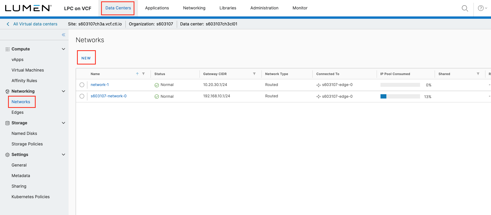
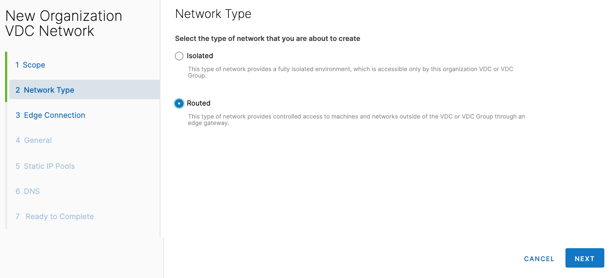
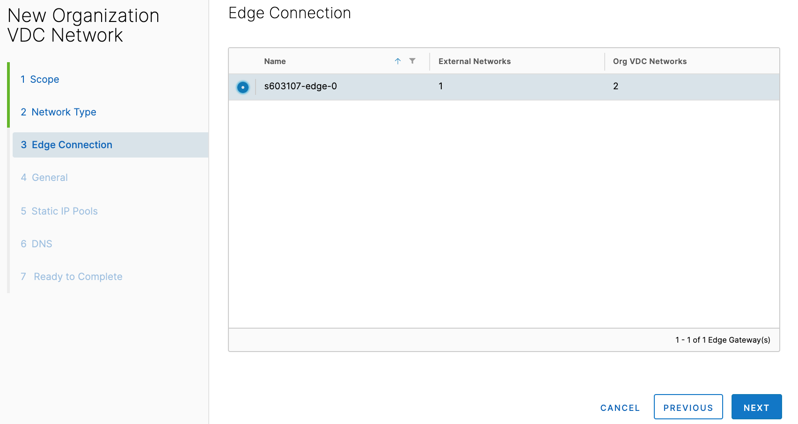
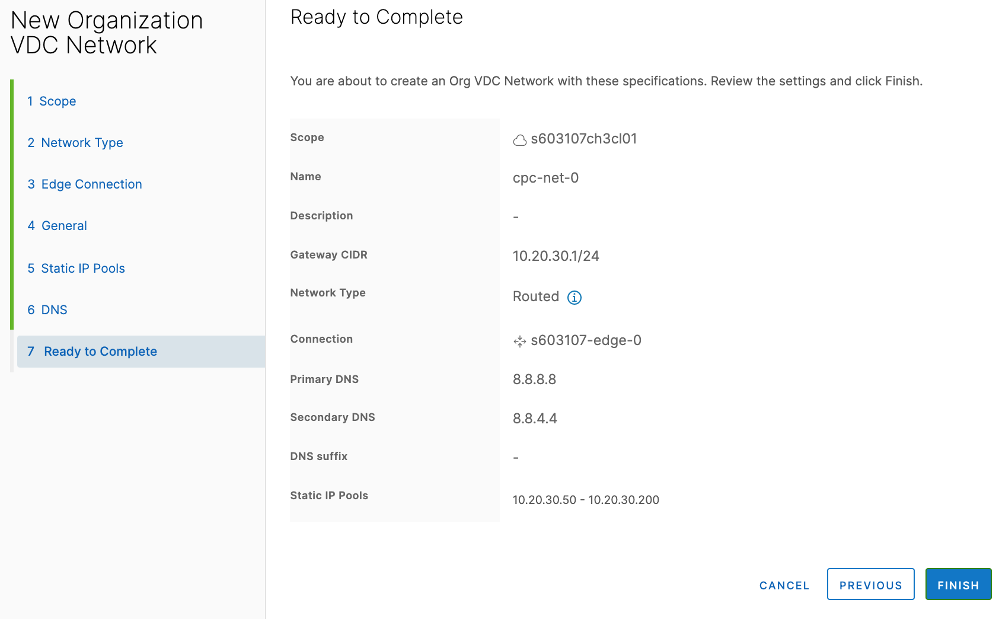
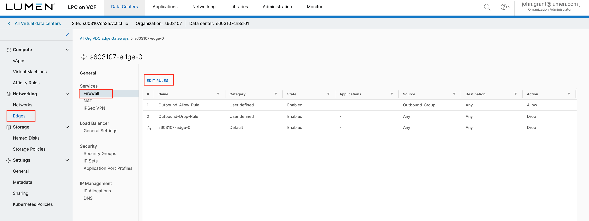
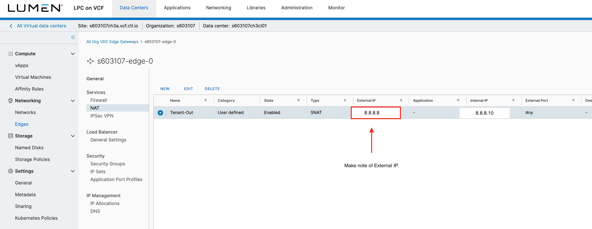

{{{
  "title": "Create Internet Accessible Network",
  "date": "9-17-2019",
  "author": "Anthony Hakim",
  "attachments": [],
  "related-products" : [],
  "contentIsHTML": false,
  "sticky": false
}}}

### Description
In this KB article, we walk through how to create a new software-defined network in CenturyLink Private Cloud on VMware Cloud Foundation (CPC on vCF). In this particular use case, we would like to allow this network to have Outbound Internet.

### Steps

#### Create the Network
* Log In to your CPC on vCF environment.

* Click __Datacenters__ from the menu dropdown. Select your Datacenter. Select __Networks__ in the left side-panel. On the Networks page, click __NEW__

  

* In the New Organization VDC Network page:

  1. Network Type: Select Routed and click NEXT

    

  2. General:
  * Name: Enter your network name
  * Gateway CIDR: (i.e. 10.20.30.1/24)
  * Description: Optional
  * Shared: Default setting
  * Click NEXT

    

  3. Edge Connection:
  * Select your Edge
  * Interface Type: Select Distributed
  * Guest VLAN Allowed: Keep default selection
  * Click NEXT

    

  4. Static IP Pools:
  * Enter an IP range (i.e. 10.20.30.50-10.20.30.200)
  * Click ADD
  * Click NEXT

    

  5. DNS
  * Primary DNS: (i.e. 8.8.8.8)
  * Secondary DNS: (i.e. 8.8.4.4)
  * DNS suffix: As needed
  * Click NEXT

    

  6. Ready to Complete
  * Review your selections and click FINISH

    

##### Create the Firewall Rule to allow Internet Access for the Network

* In vCloud Director, under Networking, click Edges, select your Edge (siteID-edge-0) and click CONFIGURE SERVICES

  

* In the Edge Gateway - siteID-edge-0 page, ensure Firewall is selected, then click + to add a New Rule

  

Enter the following for the New Rule:

* Name: Outbound 10.20.30.0 network
* Type: User (by default)
* Source: Click IP, enter 10.20.30.0/24 and click KEEP

  

* Destination: Any (by default) - varies by requirements
* Service: Any (by default) - varies by requirements
* Action: Accept
* Enable logging: Unchecked (by default) - varies by requirements
* Click Save changes

  

##### Create a Source NAT Rule to allow Internet Access for the Network

* In the Edge Gateway - siteID-edge-0 page, click NAT, then click + SNAT RULE (under NAT 44 Rules)

  __Note:__ You will need to make a note of the Public IP that is listed under Translated in order to create this SNAT rule.

  

Enter the following for the New Rule:

* Applied On: Public-1
* Original Source IP/Range: 10.20.30.0/24
* Translated Source IP/Range: This is the Public IP you recorded from the note above
* Click KEEP

  
