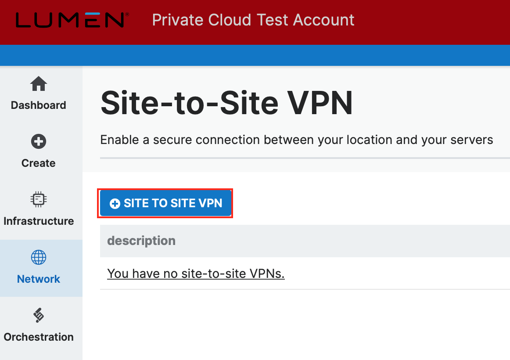
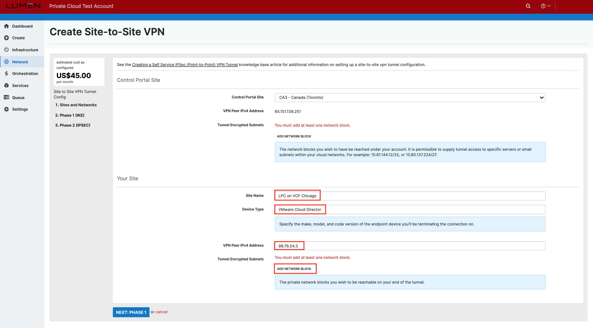
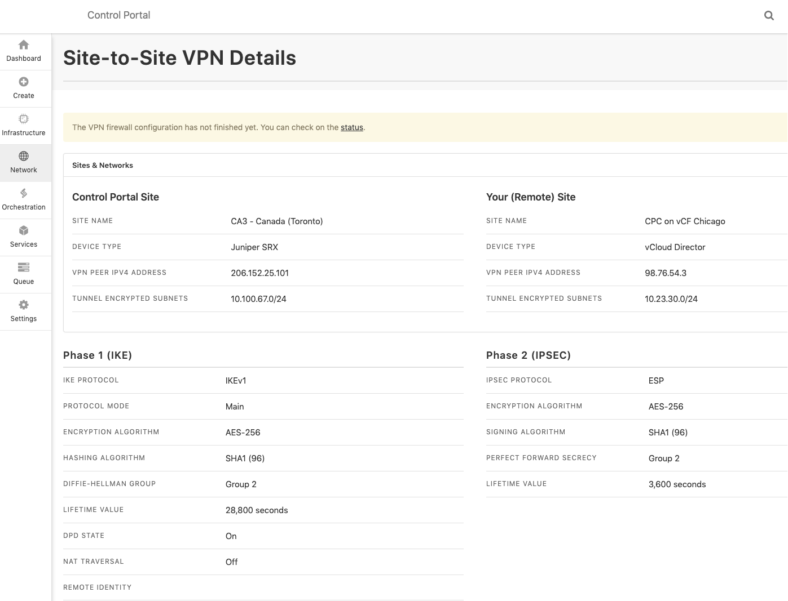

{{{
  "title": "Configuring Site-to-Site (IPsec VPN Sites) VPN",
  "date": "11-12-2019",
  "author": "Anthony Hakim",
  "attachments": [],
  "related-products" : [],
  "contentIsHTML": false,
  "sticky": false
}}}

### Description
This KB article steps through the process to stand up a Site-to-Site VPN between CenturyLink Private Cloud on VMware Cloud Foundation™ (CPC on vCF) and CenturyLink Cloud (CLC).

### Prerequisites
* CPC on vCF account
* CLC account
* Local Endpoint (Public IP for IPsec VPN on the CPC on vCF side)
* Local Subnets in CIDR format (local networks to be accessible to IPsec VPN on the CPC on vCF side)
* Peer Endpoint (Public IP for IPsec VPN on the CLC side)
* Peer subnets in CIDR format (local networks to be accessible to IPsec VPN on the CLC side)

### Steps
Login to your CenturyLink Private Cloud on VMware Cloud Foundation environment.

  

Once logged in, click __Edges__ in the menu on the left side of the screen, select the Edge Gateway, then click __Configure Services__. A popup will appear.

  

In the new Edge Gateway Services popup, click on the __VPN__ tab, select __IPsec VPN Sites__, then click the __+__ button to add a new configuration.

  

In the __Edit IPsec VPN__ page:
 - __Enabled:__ (Checked)
 - __Enable perfect forward secrecy (PFS):__ (Checked)
 - __Name:__ (Preferred name)
 - __Local Id:__ (Preferred name)
 - __Local Endpoint:__ (Public IP for IPsec VPN on the CPC on vCF side)
 - __Local Subnets:__ (Local networks to be accessible to IPsec VPN on the CPC on vCF side)
 - __Peer Id:__ (preferred name)
 - __Peer Endpoint:__ (Public IP for IPsec VPN on the CLC side)
 - __Peer Subnets:__ (Local networks to be accessible to IPsec VPN on the CLC side)
 - __Encryption Algorithm:__ AES256
 - __Authentication:__ PSK
 - __Change Shared Key:__ (Default)
 - __Pre-Shared Key:__ (Your Pre-Shared Key)
 - __Display Shared Key:__ (Default)
 - __Diffie-Hellman Group:__ DH2
 - __Extension:__ (Default)
 - __Digest Algorithm:__ Sha1
 - __IKE Option:__ IKEv1
 - __IKE Responder Only:__ (Default)
 - __Session Type:__ Policy Based Session

Click __KEEP__

  

In the __IPsec VPN Configuration__ page, click __Save changes__.

  

In the __IPsec VPN Configuration__ page, click the __Activation Status__ tab, then click the slider to enable the __IPsec VPN Service Status__. Click __Save changes__.

  

Login to your CenturyLink Cloud environment.

  

In the left pane, click __Network__, then select __Site-To-Site VPN__.

  

In the __Site-to-Site VPN__ page, click on the __+ site to site vpn__ button.

  

In the __Create Site-to-Site VPN__ page, select your __Control Portal Site__, then click on the __add network block__ button.

  

In the __Select Destination Network or Subnet__ page, select your __network, subnet size__ and __starting ip address__, then click __add network block__.

  

In __Create Site-to-Site VPN__ page, in the __Your Site__ section, enter your __Site Name, Device Type and VPN Peer IPv4 Address__, then click on the __add network block__ button.

  

Upon clicking the __add network block__ button above, a new field appears named __Tunnel Encrypted Subnets__. Enter your local network subnet block (on the CPC on vCF side). Click __next: phase 1__.

  

In the __Phase 1 (IKE)__ page, enter as follows:
  - __IKE Protocol:__ IKEv1
  - __Protocol Mode:__ Main
  - __Encryption Algorithm:__ AES-256
  - __Hashing Algorithm:__ SHA1 (96)
  - __Pre-Shared Key:__ Same pre-shared key you used previously
  - __Diffie-Hellman Group:__ Group 2
  - __Lifetime Value:__ 8 hours
  - __DPD State:__ On
  - __NAT-T State:__ Default

Click __next: phase 2__

  

In the __Phase 2 (IPSEC)__ page, enter as follows:
  - __IPSEC Protocol:__ ESP
  - __Encryption Algorithm:__ AES-256
  - __Hashing Algorithm:__ SHA1 (96)
  - __PFS Enabled:__ On, Group 2
  - __Lifetime Value:__ 1 hour

Click __finish__

  

Once completed, you will be presented with the summary page.

  
