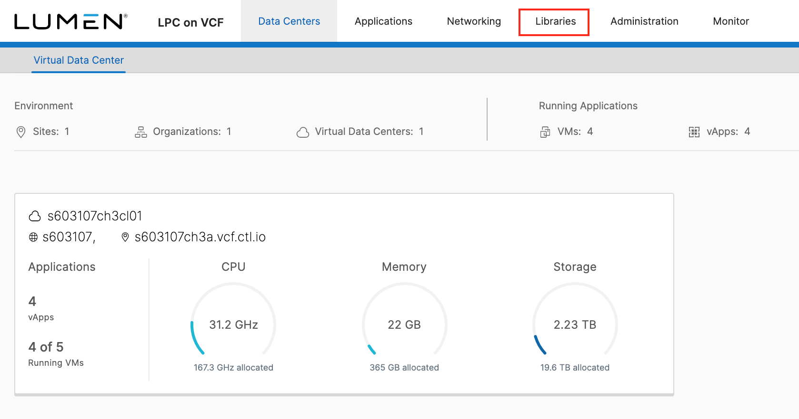
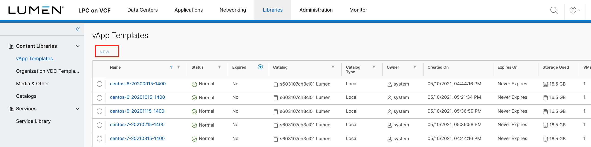
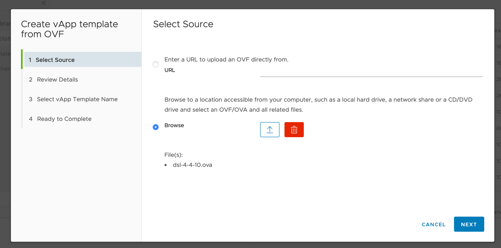
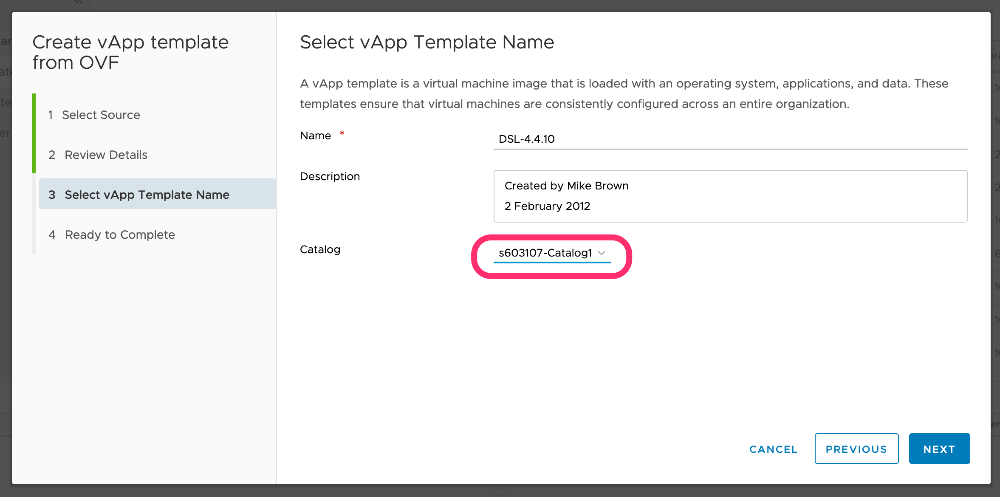
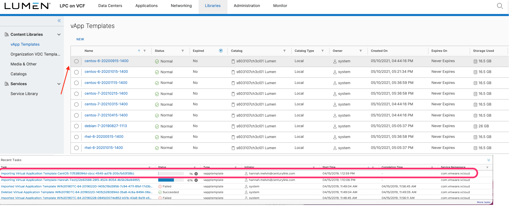
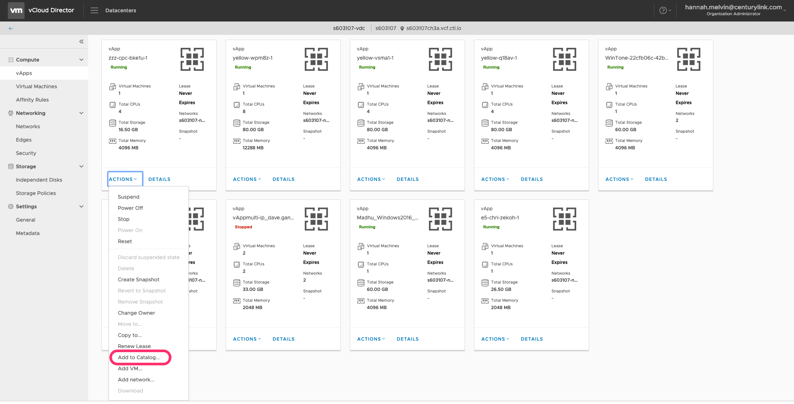
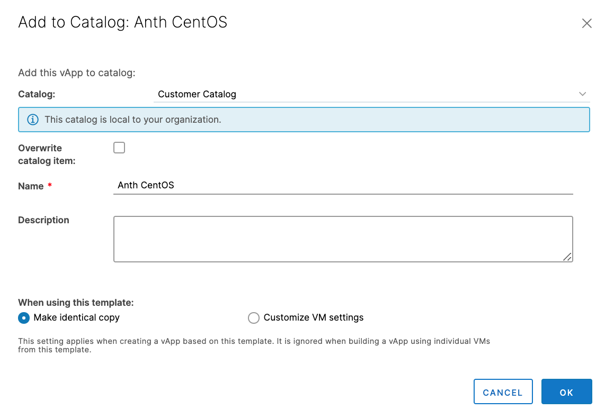

{{{
  "title": "Adding to your Catalog",
  "date": "5-8-2019",
  "author": "Hannah Melvin",
  "attachments": [],
  "related-products" : [],
  "contentIsHTML": false,
  "sticky": false
}}}

### Description
In this KB article, we demonstrate how to add an Open Virtualization Format (OVF) Template to your Catalog in CenturyLink Private Cloud on VMware Cloud Foundation™. We also have step-by-step instructions on adding an Existing vApp to your Catalog. In this case, an existing vApp could consist of one or more VMs.

A catalog is a container for vApp templates and media files in an organization. Organization administrators and catalog authors within CenturyLink Private Cloud on VMware Cloud Foundation can create catalogs in an organization. Catalog contents can be shared with other users within CenturyLink Private Cloud on VMware Cloud Foundation.

CenturyLink Private Cloud on VMware Cloud Foundation contains organization (private) catalogs, and access to its public catalog. Organization catalogs include vApp templates and media files that you can share with other users in the organization.

### Steps to add an OVF Template
* Login to your CenturyLink Private Cloud on VMware Cloud Foundation environment.

  

* Once logged in, click on the menu icon at the top of the screen. Select __Libraries__ in the dropdown menu.

  

* In the __Libraries__ page, click __Add__ at the top of the vApp Templates screen.

  

* In the __Create vApp Template from OVF__ window, either enter the __URL__ to the OVF, or __Browse...__ to the __Local file__, then click __Next__.

  

* Review the details, then click __Next__. On the next screen (Select vApp Template Name) enter the __Name__ and optional Description, then select the catalog from the __Catalog__ dropdown.

  

* The template will be shown in the template list and the progress of the upload will be shown in the __Recent Tasks__ pane at the bottom of the screen.

  

* Once the vApp Template is successfully imported, it can be used to deploy VMs inside of CenturyLink Private Cloud on VMware Cloud Foundation.

### Steps to add an Existing vApp to your Catalog
In this example, we will work with the Engineering vApp to create a new vApp Template. If the vApp is running, it is added to the catalog as a vApp template with all of its VMs in a suspended state.

* Click on __Datacenters__ from menu, and then in the left pane, click __vApps__. Click the __Actions__ dropdwon on the vApp and select __Add to Catalog...__

  

* Select the catalog to add the vApp to in the __Catalog__ dropdown. Select __Overwrite catalog item__ if you want the new catalog item to overwrite any existing vApp Template that has the same name. Type a __Name__ and optional Description for the vApp template.

  Specify how the template should be created:
  - __Make Identical Copy:__ vApps that are created from this vApp template inherit the guest operating system settings specified in the template. If you select this option and guest customization is enabled, the guest operating system is personalized. IP addresses of the NICs in the template are reserved.
  - __Customize VM Settings:__ Guest operating system is personalized regardless of the vApp template settings when the template is instantiated. IP addresses of the NICs in the template are released.

* Click __OK__ to finish.

  

  The vApp is saved as a vApp template and appears in the specified catalog.
