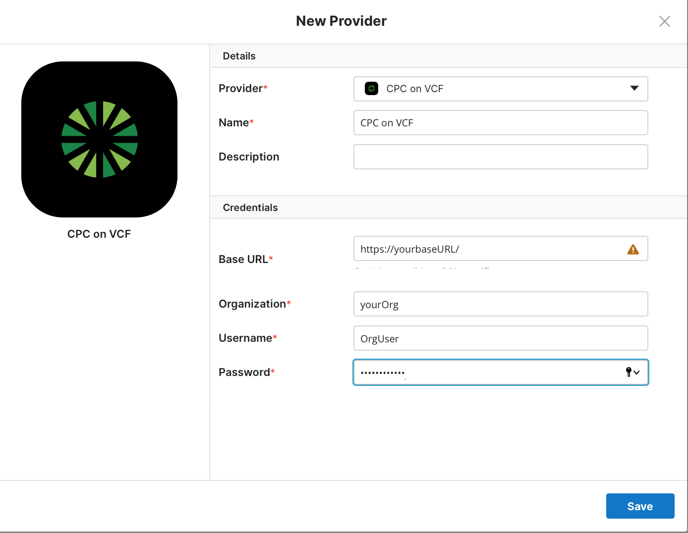

{{{
  "title": "Configuring a Provider for CAM",
  "date": "9-18-2018",
  "author": "Anthony Hakim",
  "attachments": [],
  "related-products" : [],
  "contentIsHTML": false,
  "sticky": false
}}}

### Description
In this KB article, we walk through how to enable a Cloud Application Manager Provider for CenturyLink Private Cloud on VMware Cloud Foundation™.

### Prerequisites
* You must have a Cloud Application Manager Account
* Your base URL, and user credentials for CenturyLink Private Cloud on VMware Cloud Foundation

### Steps

* Go to https://www.ctl.io/cloud-application-manager/ and Log In to your account. In the __Cloud Application Manager__ page, click on __Providers__ on the left side.

* Click __New__ and select __CenturyLink Private Cloud on VMware Cloud Foundation__ from the __Provider__ drop down list.

* Fill in the details:
  * Name: Enter a name for the Provider.
  * Description: (Optional).
  * Enable Managed Services: Enable if you want Managed OS and Applications.
  * URL: Your Base URL (example - https://S123456ch3a.vcf.ctl.io).
  * Organization: Your Organization (displayed in the top left corner when logged in to CenturyLink Private Cloud on VMware Cloud Foundation). Please note this is case sensitive. 
  * Username: CenturyLink Private Cloud on VMware Cloud Foundation user account.
  * Password: Password for above account.

* Click __Save__.  

* The Provider will synchronize. Once completed, you can begin using Cloud Application Manager with CenturyLink Private Cloud on VMware Cloud Foundation.

