{{{
  "title": "Configuring SSL VPN-Plus",
  "date": "4-29-2019",
  "author": "Hannah Melvin",
  "attachments": [],
  "related-products" : [],
  "contentIsHTML": false,
  "sticky": false
}}}

### Description
You have this new CenturyLink Private Cloud on VMware Cloud Foundation™ environment, but how do you securely connect to your servers? Some customers have the option of using a site-to-site VPN tunnel, MPLS, CNS, etc. If your company doesn't have these options available, follow the steps below to configure SSL VPN-Plus with the suggested settings, so that you can provide secure access to your environment.

Once you are done with this configuration, take a look at [How to Securely Connect](how-to-securely-connect.md) for the client portion of this.

### Steps
* Login to your CenturyLink Private Cloud on VMware Cloud Foundation environment.

  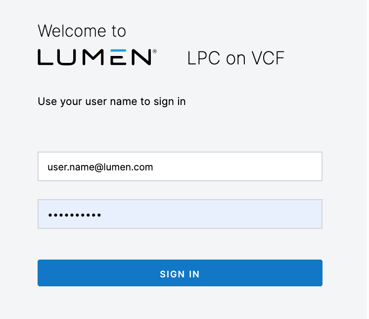

* Once logged in, click __Datacenters__ in the menu at the top. Then select the Datacenter to open.

  

* Click __Edges__ in the menu on the left side of the screen.

  

* Select the Edge Gateway, then click __Configure Services__. A popup will appear.

  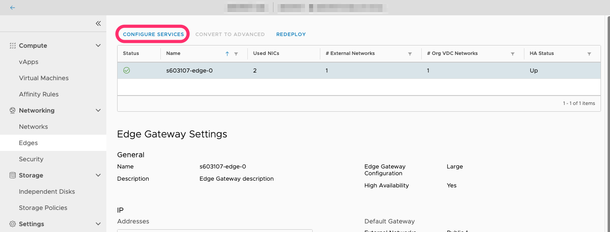

* In the new Edge Gateway Services popup, click on the SSL VPN-Plus tab.

  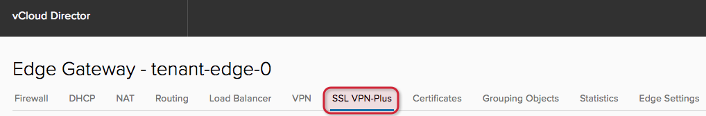

* In the __General Settings__ tab, enable __Prevent multiple logon using same username__. All other settings are left as default.

  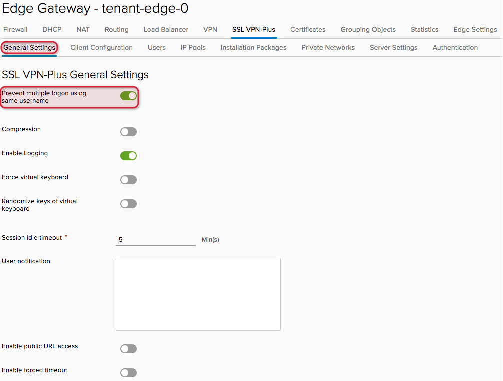

* In the __Client Configuration__ tab, all settings are left as default.

  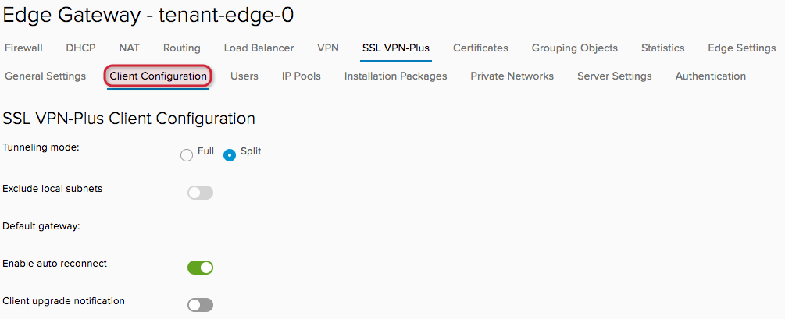

* In the __Users__ tab, create SSL VPN-Plus user accounts so that they can connect to download the SSL VPN-Plus client, and then in turn, connect to the SSL VPN. Create accounts by clicking the __+__ and entering the relevant information. It is recommended that no shared accounts are created &mdash; this aligns with the setting in the General Settings tab as mentioned above.

  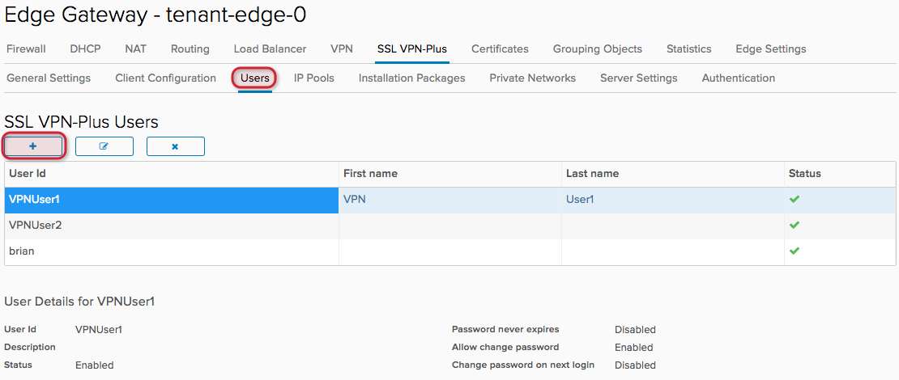

* The __IP Pools__ tab allows you to create pools of IP addresses that will be assigned to the VPN clients that connect to the SSL VPN-Plus service. It is recommended that you add an IP Pool using addresses that don't exist in any network within your CenturyLink Private Cloud on VMware Cloud Foundation environment. Create IP Pools by clicking the __+__ and entering the IP Range, Gateway and Netmask, at a minimum. You must also ensure the Status of the IP Pool is enabled.

  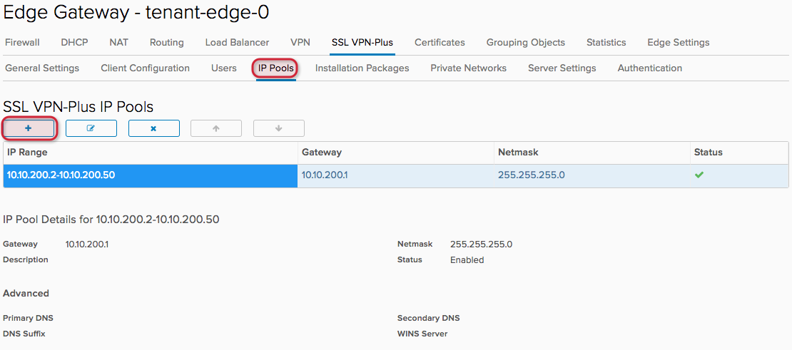

* In the __Installation Packages__ tab, click the __+__ to create a new SSL VPN-Plus client installation package. We recommend that you create one package for all OS types (Windows, Linux, Mac). The Gateway address is an IPv4 address that has been assigned as a Sub-Allocated IP Pool in the Edge Gateway Properties. This must be an IP address that is not used by anything else within your CenturyLink Private Cloud on VMware Cloud Foundation environment.

  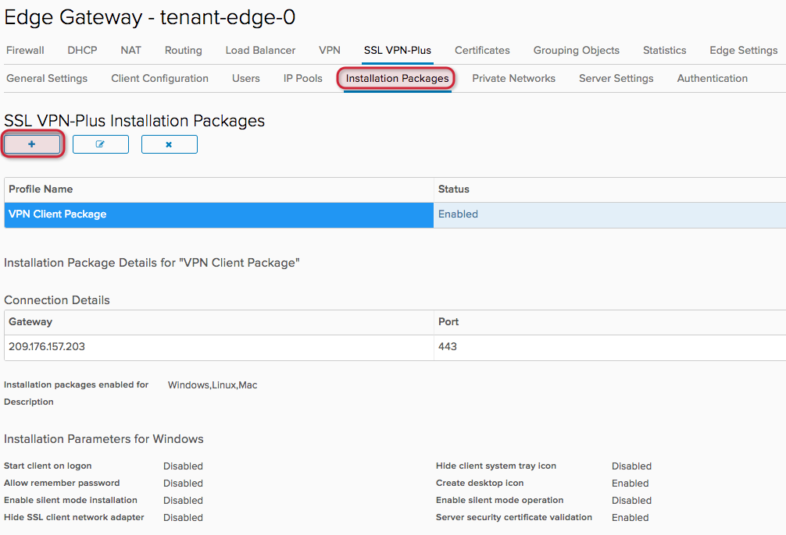

* In the __Private Networks__ tab, add the existing networks that have been defined, so that VPN clients can access the resources on those networks.

  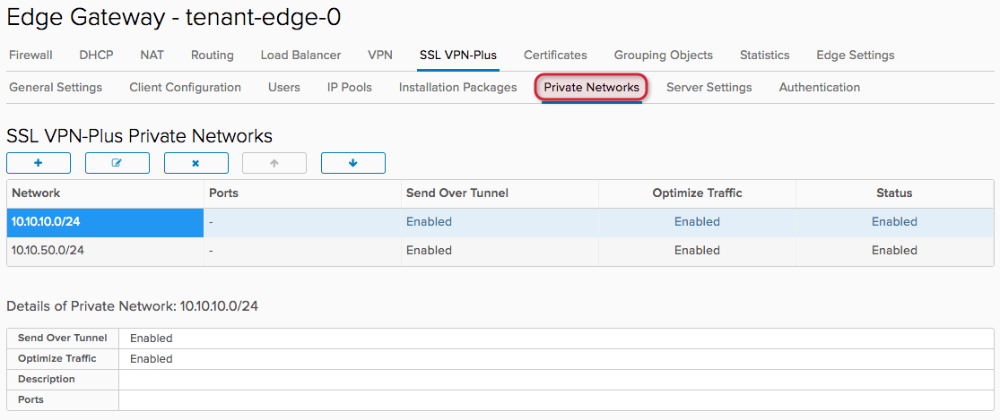

* In the __Server Settings__ tab, select the IPv4 address you assigned as the Gateway in the Installation Package, and enter the port number. You must also ensure Enabled has been selected.

  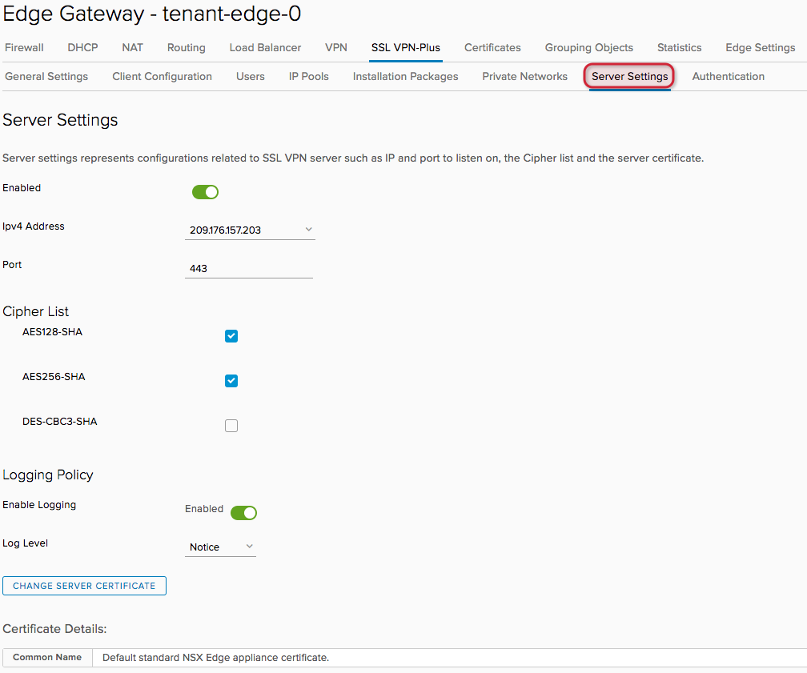

* In the __Authentication__ tab, all settings are left as default.

  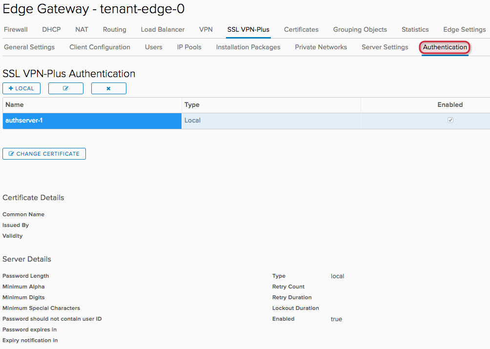
