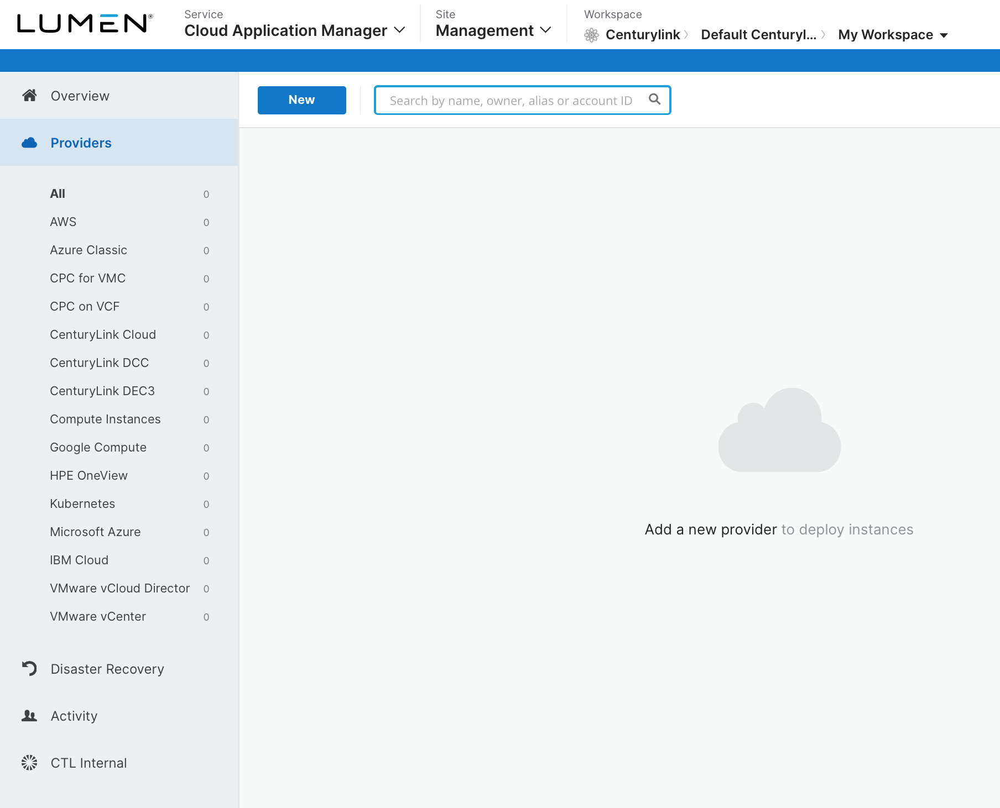

{{{
  "title": "Micro-segmentation with Distributed Firewall - Same Network",
  "date": "12-13-2018",
  "author": "Anthony Hakim",
  "attachments": [],
  "related-products" : [],
  "contentIsHTML": false,
  "sticky": false
}}}

### Description
In this KB article, we walk through how to enable Distributed Firewall for CenturyLink Private Cloud on VMware Cloud Foundation.

### Prerequisites
* Your base URL, and user credentials for CenturyLink Private Cloud on VMware Cloud Foundation
*

### Steps

1. Go to https://www.ctl.io/cloud-application-manager/ and Log In to your account. In the __Cloud Application Manager__ page, click on __Providers__ on the left side.

2. Click __New__ and select __CenturyLink Private Cloud on VMware Cloud Foundation__ from the __Provider__ drop down list.

3. Fill in the details:
  * Name: Enter a name for the Provider.
  * Description: (Optional).
  * Enable Managed Services: Enable if you want Managed OS and Applications.
  * URL: Your Base URL (example - https://S123456ch3a.vcf.ctl.io).
  * Organization: Your Organization (displayed in the top left corner when logged in to CenturyLink Private Cloud on VMware Cloud Foundation).
  * Username: CenturyLink Private Cloud on VMware Cloud Foundation user account.
  * Password: Password for above account.

4. Click __Save__.  

5. The Provider will synchronize. Once completed, you can begin using Cloud Application Manager with CenturyLink Private Cloud on VMware Cloud Foundation.

For additional information on using Cloud Application Manager, please refer to the [Knowledge Base](../Cloud Application Manager/Getting Started/#1).
