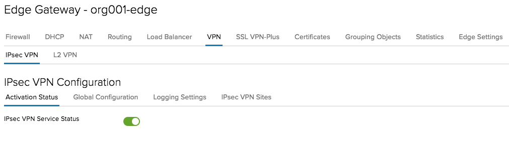

{{{
  "title": "Enable IPSec VPN on Edge Gateway Services",
  "date": "9-11-2018",
  "author": "Anthony Hakim",
  "attachments": [],
  "related-products" : [],
  "contentIsHTML": false,
  "sticky": false
}}}

### Description
In this KB article, we walk through how to enable an IPSec VPN on Edge Gateway Services within the vCloud Director (vCD) Web Console environment for CenturyLink Private Cloud on VMware Cloud Foundation™.

### Prerequisites
You must configure at least one IPSec VPN site on the NSX Edge before enabling the IPSec VPN service.

* Login to your CenturyLink Private Cloud on VMware Cloud Foundation environment with an Org Admin Account

  

* Once logged in, click __Administration__ at the top.

  

* Double-click your Org VDC to open.

  

* In the __org001-vdc__ page, click on the __Edge Gateways__ tab, then right-click your __org001-edge__, then select __Properties...__

  

* Select the Configure IP Settings tab, and take note of the (Public) IP Address for the Edge Gateway.

  

* Right-click your __org001-edge__, then select __Edge Gateway Services...__ A new tab will open.

  

* Select the VPN tab, then __IPSec VPN Sites__, Click __+__ sign to add IPsec VPN Sites (this is a prerequisite to enable IPsec VPN Services).

  

*	Add IPsec VPN:
  * Enabled: Click slider to enable
  * Enable perfect forward secrecy (PFS): default
  * Name: Name your IPSec VPN
  * Local Id: Your Local Id
  * Local Endpoint: IP address of Edge Gateway
  * Local Subnets: Your Local Subnets
  * Peer Id: Your Peer Id
  * Peer Endpoint: IP address of Peer
	* Peer Subnets: Your Peer Subnets
  * Encryption Algorithm: Must match with peer
  * Authentication: Must match with peer
  * Change Shared Key:
  * Pre-Shared Key: Shared Key
  * Display Shared Key:
  * Diffie-Hellman Group: Must match with peer
  * Extension:

  

*	Click Keep
*	In the __IPSec VPN Configuration__ page, select the __Activation Status__ tab, and enable __IPsec VPN Service Status__

  

*	Configure the Peer/Remote Site.
