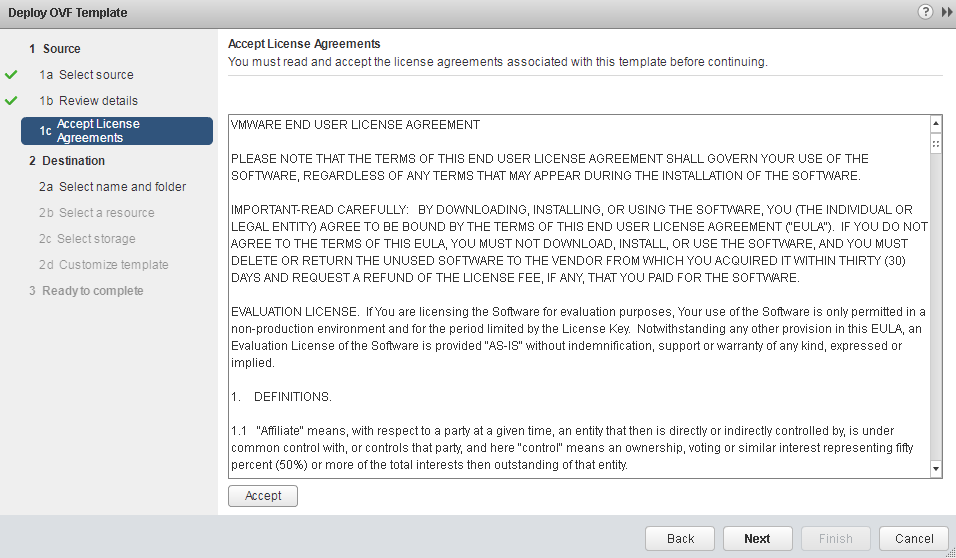

{{{
  "title": "Preparing Your Environment for Migration into CenturyLink Private Cloud on VMware Cloud Foundation",
  "date": "4-25-2018",
  "author": "Anthony Hakim",
  "attachments": [],
  "related-products" : [],
  "contentIsHTML": false,
  "sticky": false
}}}

### Description
In this KB article, we outline the process involved in preparing your VMware (source) environment in readiness for migration into CenturyLink Private Cloud on VMware Cloud Foundation.

This process involves multiple components that you must install and configure in a specific order.

### Prerequisites
* VMware ESXi 5.5 and newer.
* The following NAT and Firewall rules.

You can configure NAT and Firewall rules, either prior to, or after installation, but you must have the required Management IP's, Translated Public IP and necessary port information prior to installation.

During the deployment of the various appliances, it is necessary to input the public (NAT) IP address along with the port (PAT) which will be used in the NAT/PAT configuration.

**Important Note:** You will also need to obtain the public IPs for the Service Provider Extender and vCloud Director for your CenturyLink Private Cloud on VMware Cloud Foundation environment. Refer to the following example for what you need.

**Example:**  
Tenant Replicator: {{Translated Public IP}}:443

The following examples have 2 Management IPs and 1 Public IP for the Tenant (Customer) and 2 Public IPs on the Service Provider (CenturyLink Private Cloud on VMware Cloud Foundation) side:

| Tenant Function | Service Provider Function | IP Address |
| :-----: | :-----: | :-----: |
| Extender1 |  - | 10.12.19.12 |
| Extender2 | - | 10.12.19.19 |
| Public IP | - | 40.2.1.137 |
| - | Extender IP | 206.1.2.34 |
| - | vCloud Director IP | 206.1.2.44 |

Your Extender and vCloud Director IP Addresses will be provided once your CenturyLink Private Cloud on VMware Cloud Foundation environment is built out.

#### NAT Requirements - Tenant (source)
The following NAT rules are required on the Tenant (source) side of the connection:

| NAT Type |	Interface | Original IP |	Original Port	| Translated IP |	Translated Port |	Role |
| --------- | --------- | --------- | --------- | --------- | --------- | --------- |
| DNAT |	Public Uplink |	40.2.1.137 |	443	| 10.12.19.12 |	8043	| Replicator - Tenant Side |
| SNAT	| Public Uplink |	10.12.19.19 |	any |	40.2.1.137 |	any |	Extender - Tenant Side |
| SNAT	| Public Uplink |	10.12.19.12 |	any	| 40.2.1.137 |	any |	Replicator - Tenant Side |

#### Firewall Requirements - Tenant (source)
| Name |	Type | Source |	Destination |	Service |	Action |
| --------- | --------- | --------- | --------- | --------- | --------- |
| VCDX-Rule-001 |	User |	10.12.19.12 10.12.19.19 40.2.1.137 | 206.1.2.34 | 443/8043/8044/44045 |	Accept |
| VCDX-Rule-002 |	User |	10.12.19.19	| 206.1.2.44 |	443 |	Accept |
| VCDX-Rule-003 |	User |	206.1.2.34 |	40.2.1.137 |	443/8043/8044/44045 |	Accept |

### Installation Process
* [Download the vCloud Director Extender OVA file](https://my.vmware.com/group/vmware/details?downloadGroup=CX100&productId=693#product_downloads)
* Log in to the vSphere Web Client, using the FQDN, as an administrator
* In the vSphere Web Client, right-click on the vCenter Server, and select Deploy OVF Template...

  

  Note: You can also use the File menu to select Deploy OVF Template...

* On the Select template page, click Browse..., select the downloaded vCloud Extender OVA file
* Click Next

  

* On the Review details page, review your selections
* Click Next

  

* On the Accept license agreement page, click Accept
* Click Next

  

* On the Select name and folder page, enter the VM Name, select the Datacenter
* Click Next

  

* On the Select a resource page, make the appropriate selection
* Click Next

  

* On the Select storage page, choose the following:
  * Select virtual disk format: Thin provision
  * VM storage policy: Select your appropriate storage policy
* Select your appropriate datastore
* Click Next

  

* On the Setup networks page, choose the following:
  * Select your appropriate destination network
  * (IP Allocation Settings) IP protocol: IPv4
* Click Next

  

* On the Customize template page, choose the following (Application):
  * Deployment Type: cx-connector
  * Enable SSH: Checked
  * Initial root password: Set and confirm a password
  * NTP Server: Enter the IP address of your NTP server

    

* On the Customize template page, choose the following (Networking Properties):
  * Default Gateway: Enter the IP address of your default gateway
  * Domain Name: Enter your domain name
  * Domain Name Servers: Enter the IP address(es) of your DNS server(s)
  * Domain Search Path: Enter your domain search path
  * Network 1 IP Address: Enter the IP address for this interface
  * Network 1 Netmask: Enter the network mask address for this interface
* Click Next

      

* Review your settings
* Select Power on after deployment
* Click Finish

  

### VCD Extender Configuration
After completing the Installation Process, you will need to perform the following steps to configure vCD Extender to enable it for migration.

**Prerequisites**
Verify that the vCloud Director Extender On-Premise Appliance VM is powered on.

**Process**
* In a Web browser, open the OnPrem Setup UI at `https://<Your-vCD-Extender-OnPrem-Appliance-IP>/ui/mgmt`
* Log in as administrator

  **Note:** Use the password that you set during the vCloud Director Extender On-Premise Appliance installation.

  

* Click Setup Wizard

  **Note:** Run the Setup wizard for your first-time configuration to install Replicator

  

* On the On-Prem vCenter page, enter the following:
  * Name: Enter the on-premise vCenter Server Name
  * IP Address or URL: Enter the IP address or URL of the vCenter Server
  * Lookup Service URL (optional): Enter the Lookup Service URL

    **Important:** If you are using an external Platform Services Controller (PSC), enter the address to the external Lookup service in the suggested syntax. If you are using an embedded PSC, you can skip this step.
  * Username: administrator@vsphere.local
  * Password: Enter the administrator password
  * Click Next

    

    

* On the Register Plugin with vCenter Server page, register with a valid version number

  **Note:** This process registers vCloud Director Extender as a plug-in to the on-premise vCenter Server.
* Click Next

  

  

* On the Replicator page, enter the following:
  * Name: Enter a name for the replicator
  * Folder/Datacenter: Enter the target Folder/Datacenter Name

    **Note:** You must provide the full multilevel schema path.
  * Hosts Or Cluster: Enter the target Hosts or Cluster Name
  * Datastore: Enter the target Datastore Name
  * Network: Enter the target Network Name
  * Do not select the DHCP check box
  * IP Address: Enter your desired IP Address
  * Gateway Address: Enter your Gateway Address
  * DNS: Enter your DNS
  * Netmask: Enter your Netmask
  * Click Next

    

    

  * After the Replicator is created, click Next

    

* On the Activate Replicator page, enter the following:
  * Root Password: Set and confirm a password
  * Management vCenter Lookup Service URL: Enter the Lookup Service URL
  * Management vCenter SSO User: administrator@vsphere.local

    **Note:** The user you enter must be an administrator or part of the administrators group.
  * Management vCenter SSO Password: Enter the administrator password
  * Public Endpoint URL (optional): Enter the Public Endpoint URL and Port

    

  * After the Replicator is Activated, click next

    

* To complete the setup wizard, click Next and Finish
  **Note:** In the Management vCenter tab, the on-premise vCenter Server details appear. In the Replicators tab, you can see the details for the deployed Replicator appliance.

  

### Connect to a Provider Cloud (CenturyLink Private Cloud on VMware Cloud Foundation)
Before you can initiate migration jobs with vCloud Director Extender, you must set up a connection to a Provider Cloud

**Prerequisites**
If you haven't configured the pre-requisite NAT firewall rules as indicated at the top of this knowledge base article, please complete before proceeding with the next step.

**Procedure**
* In the vSphere Web Client, navigate to Home > Inventories > vCloud Director Extender.

  **Note:** You will need to logout of the vSphere Web Client to see the vCloud Director Extender plug-in in the vCenter UI.
* In the Provider Clouds tab, click Add a Provider Cloud.
* Enter a Provider Cloud Name.
* Enter a Provider Cloud URL.
* Enter a vCD Extender Cloud Service URL and port.
* Enter vCD Org Admin user name and password.
* (Optional) You can test the connection to the Provider Cloud by clicking Test.
* Click Add.
  Certificates information pop-up window appears.
* Review the hosts certificates information and click Trust Certificates.

**=== Stuff below is from Kumar's notes - need to verify ===**

* Logout from the vCenter and login back to see the vCloud Dircetor Extender plugin in the vCenter UI

* From vCloud Director Extender plugin icon Click on Provider Cloud
* Select 'New Provider Cloud' and wizard will prompt to enter Centurylink provided vcloud director org url (https://s<site_ID><DC_ID>a.dccf.ctl.io/cloud/org/<Site_ID>), credentails and vCD extender Cloud Service url <https://<Site_ID><DC_ID>ext.dccf.ctl.io:443 alongwith port information. Click ADD
* Select trust the certificate warning.
* You can choose to test before adding to validate the connectivity.
* Once the networking and URLs are configured correctly you will see the new provider cloud registered under the ‘Provider Clouds’ tab with a status of ‘Running’, you will also see any accessible virtual datacenters (vDC) to which you have access:
* After the provider cloud is properly registered, you can submit a migration request using the ‘Migrations’ tab in the CX interface

### Workload Migration
* Log in to the vSphere Web Client as an administrator
* Navigate to the Home tab
* Click the vCloud Director Extender plug-in
* Click on 'Migration tab'
* Click New Migration
* Specify the type of migration
* Select the data center, from which you want to migrate virtual machines
* From the drop down menu, select the virtual machines you want to migrate and click Nex
* Select a target cloud destination for the virtual machines by providing the requested information
Select Target Cloud | Provide the registered target vCloud Director. Select vDC | Provide the registered vDC. Select storage profile | Provide a storage profile name. Select network | Provide a network name. vApp layout Select a layout option | Each VM stays individually. or Group all VMs into a single vApp.
* Schedule the time and date for the migration
* Click Start to run the migration
