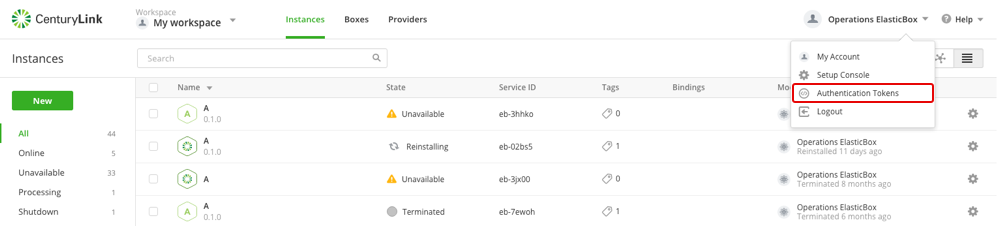
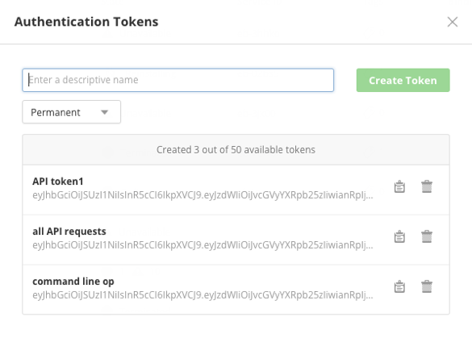

{{{ "title": "API Overview and Access",
"date": "09-01-2016",
"author": "",
"attachments": [],
"contentIsHTML": false
}}}

### Overview

Cloud Application Manager provides an API to programmatically configure and deploy complex box configurations to public, private cloud providers, or your own infrastructure.

The Cloud Application Manager API is especially useful for these scenarios:

* To automate and integrate Cloud Application Manager features within larger build, deployment frameworks like Jenkins continuous development and integration.

* To integrate Cloud Application Manager features within external applications and interfaces. For example, you can provide detailed reporting on box, workspace, and provider usage.

* To automate deployment actions in custom applications where your application can call Cloud Application Manager features on demand.

You can embed API requests within your existing Python, Ruby, Java, C, C++, Go, and other such code using common API actions such as GET, POST, DELETE, and PUT.

### Headers

All request headers must have three elements: Content-Type, ElasticBox-Token, and ElasticBox-Release.

### Content-Type

The REST API supports HTTP requests and responses in JSON format. All your request headers must identify the JSON content type.

### ElasticBox-Token

The token based on a user’s account authorizes access to data in Cloud Application Manager. Typically, you want the user to have broad access to Cloud Application Manager data like a user with administrator privileges. API requests from external applications should be made as this user. API responses return data based on this user’s access level in Cloud Application Manager.
Tokens assure a secure way to connect to Cloud Application Manager without compromising credentials while you make API requests over the web. Tokens work for any type of authentication whether that’s username, password, Google, GitHub, or LDAP. We authorize token access using basic authentication.
Follow these steps to get a token from your Cloud Application Manager account.

### Steps

1. Sign in to the Cloud Application Manager website.

2. From the user drop-down menu on the right, click **Authentication Tokens**.

    

3. Enter a descriptive name for the token and click **Create Token**.

    

4. Use the clipboard icon to copy the token to then pass it in your API request headers.

### More on Tokens

* You can create and use up to 50 tokens.
* Tokens never expire. To invalidate an API call, simply delete the token that’s used.
* When making API calls to the [Providers resource](./api-providers.md), additional provider token limits may apply. To learn about these limits, check your provider documentation.

### ElasticBox-Release

As part of the request headers, specify the latest version of the Cloud Application Manager release, which is 4.0.

### Example

Headers for a sample request look like this.

```
Headers:

Content-Type: application/json
ElasticBox-Token: 46-cbd2-4273-85b8-e2bba8ed265a
ElasticBox-Release: 4.0
```

### Contacting Cloud Application Manager Support

We’re sorry you’re having an issue in [Cloud Application Manager](https://www.ctl.io/cloud-application-manager/). Please review the [troubleshooting tips](../Troubleshooting/troubleshooting-tips.md), or contact [Cloud Application Manager support](mailto:cloudsupport@centurylink.com) with details and screenshots where possible.

For issues related to API calls, send the request body along with details related to the issue.

In the case of a box error, share the box in the workspace that your organization and Cloud Application Manager can access and attach the logs.
* Linux: SSH and locate the log at /var/log/elasticbox/elasticbox-agent.log
* Windows: RDP into the instance to locate the log at ProgramDataElasticBoxLogselasticbox-agent.log
