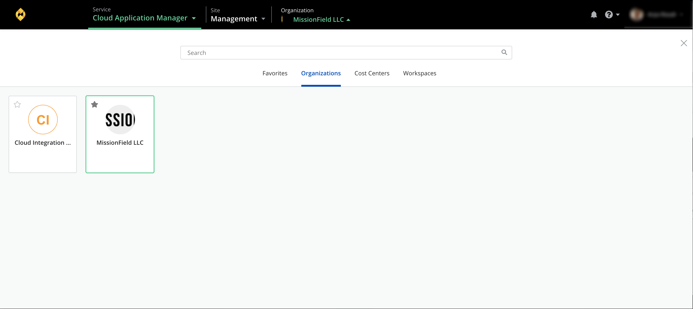
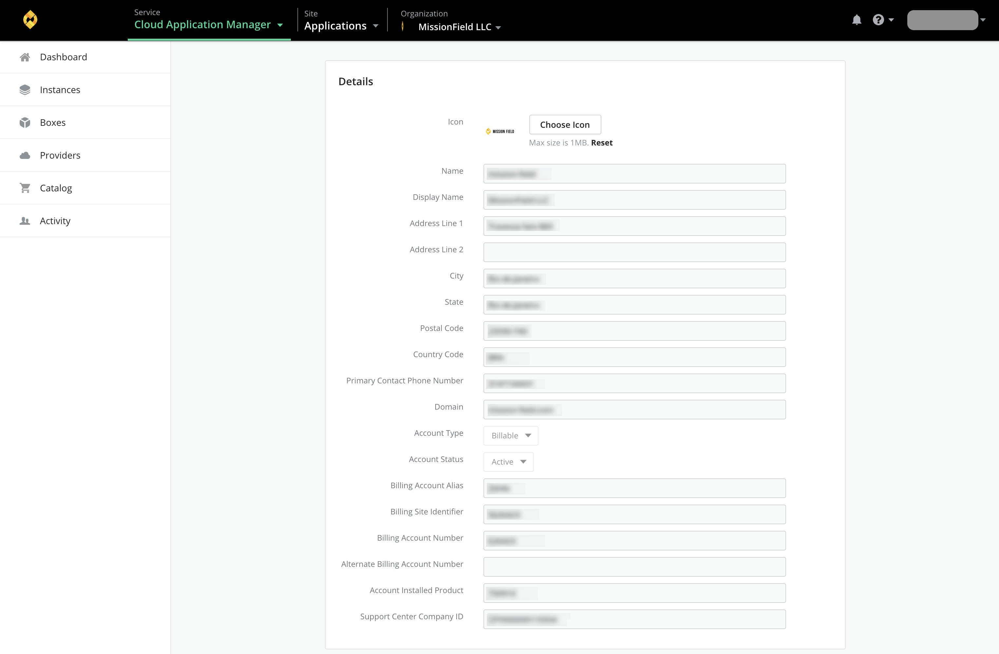
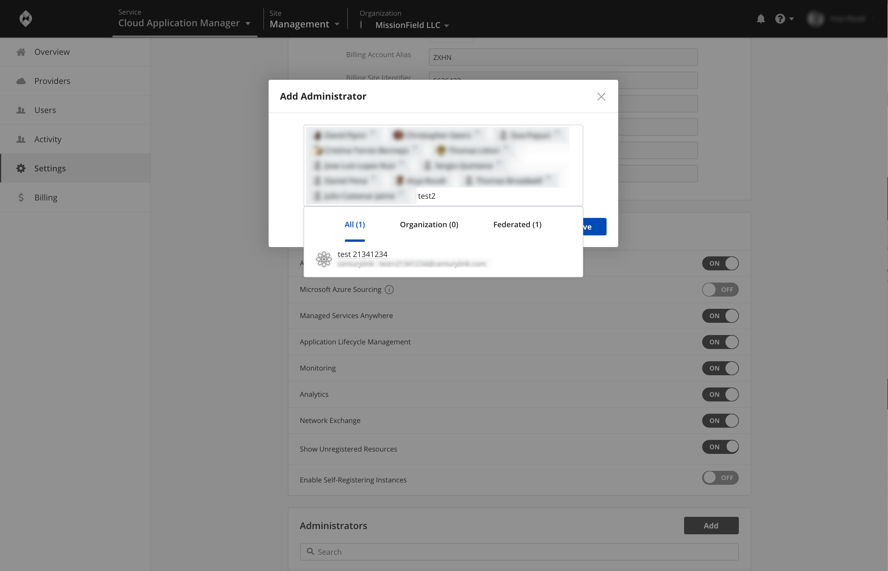

{{{
"title": "Give Admin Access to Cloud Application Manager",
"date": "10-30-2018",
"keywords":["cam", "cam manage organization", "admin access", "manage admin access", "organization setting"],
"author": "Arya Roudi",
"attachments": [],
"contentIsHTML": false
}}}

**In this article:**

* [Overview](#overview)
* [Audience](#audience)
* [Prerequisites](#prerequisites)
* [To Give Admin Access](#to-give-admin-access)
* [Getting General Support](#getting-general-support)

### Overview

When you sign up for the Cloud Application Manager Enterprise Edition, you get a default administrator account that lets you globally manage settings for all Cloud Application Manager users in your organization. Besides the default account, you can give any Cloud Application Manager user administrator access through the admin console under Organization > Administrators.

### Audience

All users with Cloud Application Manager organization administrator access.

### Prerequisites

* Access to Cloud Application Manager, Management site.
* The user must be an Administrator of the organization in Cloud Application Manager.
* The user should be at the organization level scope to access the Settings option in the left side menu, or through the pencil button in the organization element in the context switcher.

### To Give Admin Access
1. Log in to Cloud Application Manager as the default administrator.
2. Access to the context switcher drop-down located in the top navigation menu, open it and click on **Organizations**.
   

3. Once you are in the Organization scope, you will have access to the **Settings** tab in the principal navigation menu.
   

4. Under Administrators section, click **Add** and type the user’s name in the search field and select to save them.
   

To revoke administrator privileges for a user, click X against their name under **Administrators**.

Administrators can manage several org-wide settings that include [user authentication](user-authentication.md), the [Cloud Application Manager appliance](../Appliance/appliance-overview.md), [provider access](provider-access.md), [admin boxes](../Automating Deployments/deploymentpolicy-box.md), [webhooks](webhooks.md), and [instance tags](resource-tags.md). To get a good idea of things you can do, see [Overview](admin-overview.md).

### Contacting Cloud Application Manager Support

We’re sorry you’re having an issue in [Cloud Application Manager](https://www.ctl.io/cloud-application-manager/). Please review the [troubleshooting tips](../Troubleshooting/troubleshooting-tips.md), or contact [Cloud Application Manager support](mailto:incident@CenturyLink.com) with details and screenshots where possible.

For issues related to API calls, send the request body along with details related to the issue.

In the case of a box error, share the box in the workspace that your organization and Cloud Application Manager can access and attach the logs.
* Linux: SSH and locate the log at /var/log/elasticbox/elasticbox-agent.log
* Windows: RDP into the instance to locate the log at ProgramDataElasticBoxLogselasticbox-agent.log
