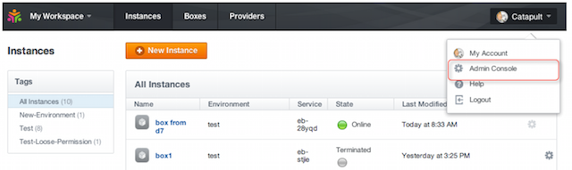
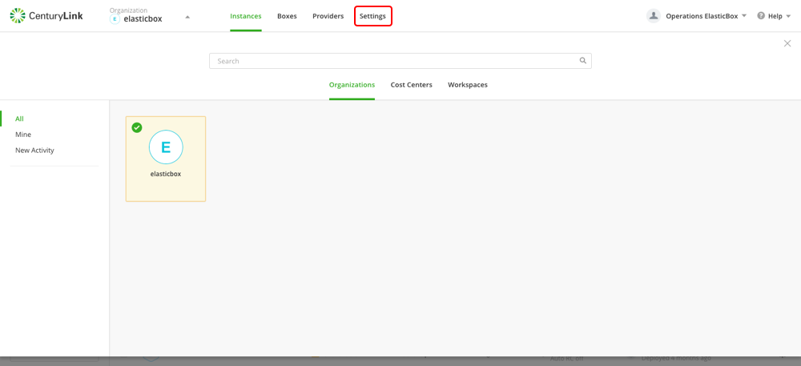
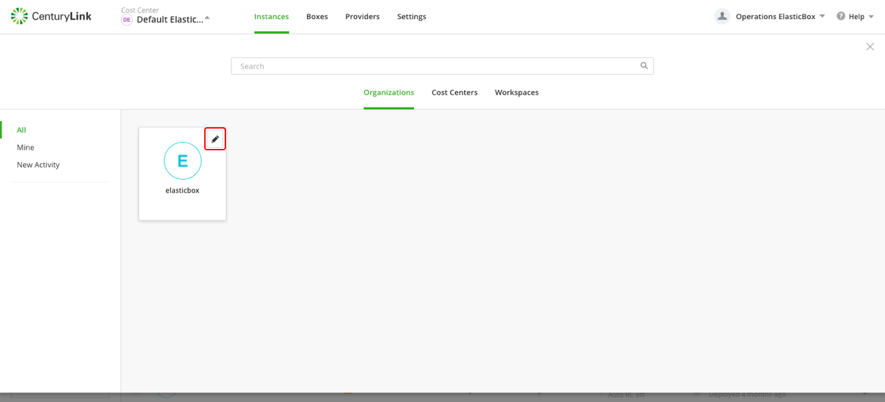
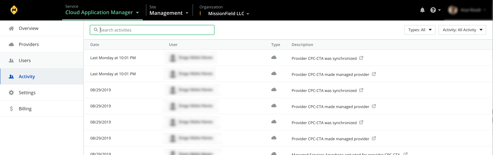
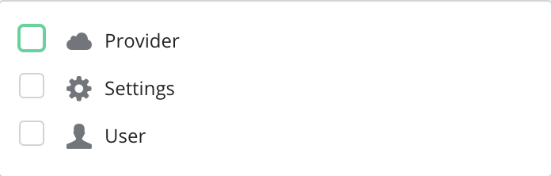
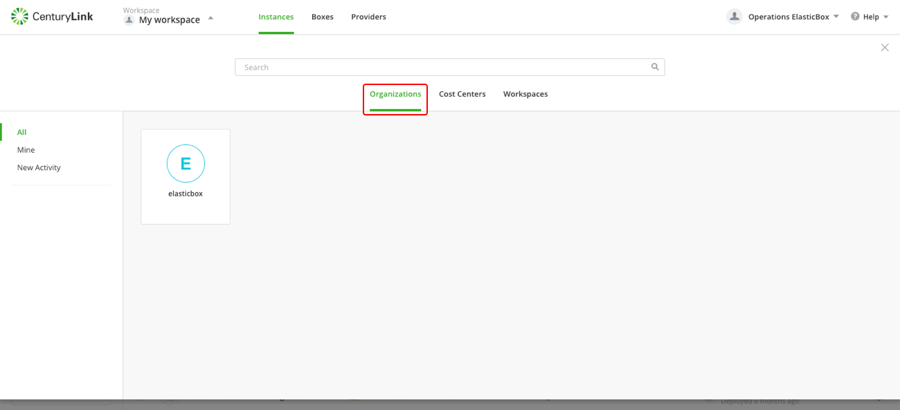

{{{
"title": "Management site overview",
"date": "09-01-2019",
"author": "Arya Roudi, Julio Castanar",
"keywords": ["cam administration", "management", "overview", "cam", "cam organization", "settings", "manage users", "manage providers", "management activity", "billing"],
"sticky": true,
"attachments": [],
"contentIsHTML": false
}}}

**In this article:**

* [Overview](#overview)
* [Audience](#audience)
* [Prerequisites](#prerequisites)
* [Overview page](#overview-page)
* [Providers](#providers)
* [Users](#users)
* [Activity](#activity)
* [Settings](#settings)
* [Billing](#billing)
* [Contacting Cloud Application Manager Support](#contacting-cloud-application-manager-support)

### Overview

Cloud Application Manager **Management site** is where you can perform administrative tasks.  

* In the overview page you will find your available products for your organization. 
* Providers page let you manage your cloud providers' accounts.
* Users page allows you to manage your organization users.
* Activity page displays the management actions being performed in your organization and by whom. 
* Settings is the page where you manage and control configuration settings for your organization.  
* Billing page provides details about your organization charges.

### Audience

All users with Cloud Application Manager organization administrator access.

### Prerequisites

* The user must be an Administrator of the organization in Cloud Application Manager.
* The user should be at the organization level scope to access the Settings 
* Access to Cloud Application Manager, [Management site](https://account.cam.ctl.io/#) options in the left side menu.

### Overview page

When you access the Cloud Application Manager through Management Site, you will land in the Overview page where you can find your available products.

In the overview pane you can access to each of the sites by clicking the icon cards. In above figure you can see: 
* [Applications](../Getting Started/getting-started-login-quick-tour.md), 
* [Analytics](https://www.ctl.io/knowledge-base/cloud-application-manager/analytics/#1), 
* [Monitoring](https://www.ctl.io/knowledge-base/cloud-application-manager/monitoring/#1), 
* [Network Exchange](https://www.ctl.io/knowledge-base/network/#1) 

### Providers

Providers contents can be reached from both, Management site and Application site.  
Providers page contains all providers your Organization can manage and how are they configured.  

* Connect to a provider to orchestrate deployments. Click **New** to add AWS, Azure, CenturyLink Cloud, vSphere, Google Cloud, OpenStack, CloudStack, etc...
* Locate a provider through search or by type.
* Sync or delete provider accounts using the gear icon actions.

See [Providers](../Core Concepts/providers.md) documentation to get knowledge about every available provider and its features.

### Users

Here you can add, edit, delete, reset password, activate or deactivate users in your Organization

Start learning how to [create Cloud Application Manager users](../Getting Started/getting-started-create-user.md)

### Activity

Activity contains logs for all management events in your Organization.  

* Allows you to see (based on your scope and permissions) all of the relevant activity that has occurred in the platform, the type of event and the user that performed the event.
* Filter through activity by type of event or switch between all activity or current scope.

    * **Provider**, this option filters the result and shows only the provider's activity.
    * **Settings**, this option filters the result and shows only the activities that are related to settings.
    * **User**, this option filters the result and shows only the user management activity.
      
        > **note that you can combine these filters with each other on your own will.**
        
* Search by user name or action to narrow the results, or click on certain actions to navigate to the affected resource.

### Settings

You can configure all parameters regarding your organization in the **Settings** page of Management site.

When you [log in](../Getting Started/getting-started-login-quick-tour.md) to Cloud Application Manager as an administrator you will land at the management site in the organization scope, where you can find the Settings page in the left side menu.

  

The Settings is where you set up your organization for everyone to use. This includes things like enabling sign-in options, turning on access to cloud providers, tagging instances users launch, integrating to custom IPAM or CMDB solutions using webhooks or a ServiceNow configured connection, and configuring admin users.

These settings depend on what kind of services your Organization deploys in Cloud Application Manager.

Many of these settings are document in the [Administering Your Organization](https://www.ctl.io/knowledge-base/cloud-application-manager/administering-your-organization/#1) section of the Knowledge Base documentation.

#### Shortcut to access Settings from context switcher

1. Access to the context switcher drop-down, located at the top navigation bar. 
2. Click on **Organizations** tab.

   

3. Click on the **edit/pencil button**, located in the top right of the organization card. 

### Billing

Billing contents are only reachable from Management site left side navigation menu and administrator users.  
Billing allows you to access Cloud Application Manager billing section to review billing details in your Organization.  

Billing section plots three options:

* **Dashboard** where several bar graphs show billed amount with different filters.
* **Usage History** where you can see a list with the previous months billing summary.
* **Pricing** displays the price list of the different Cloud Application Manager products and services.

See [Billing](../Billing/billing-menu.md) documentation to get knowledge about billing features.

### Contacting Cloud Application Manager Support

We’re sorry you’re having an issue in [Cloud Application Manager](https://www.ctl.io/cloud-application-manager/). Please review the [troubleshooting tips](../Troubleshooting/troubleshooting-tips.md), or contact [Cloud Application Manager support](mailto:incident@CenturyLink.com) with details and screenshots where possible.

For issues related to API calls, send the request body along with details related to the issue.

In the case of a box error, share the box in the workspace that your organization and Cloud Application Manager can access and attach the logs.

* Linux: SSH and locate the log at /var/log/elasticbox/elasticbox-agent.log
* Windows: RDP into the instance to locate the log at \ProgramData\ElasticBox\Logs\elasticbox-agent.log
