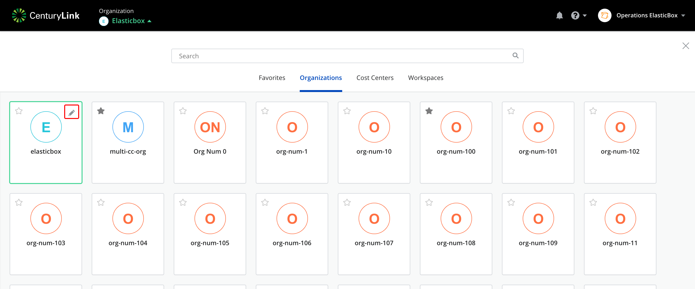
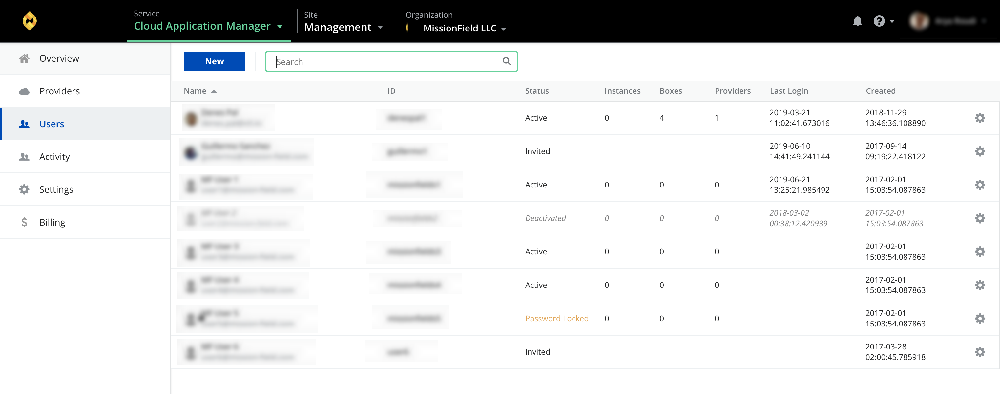

{{{
"title": "Overview",
"date": "10-30-2018",
"author": "Arya Roudi",
"keywords": ["cam administration", "overview", "cam", "cam workspace"],
"attachments": [],
"contentIsHTML": false
}}}

**In this article:**

* [Overview](#overview)
* [Audience](#audience)
* [Prerequisites](#prerequisites)
* [Steps](#steps)
* [Contacting Cloud Application Manager Support](#contacting-cloud-application-manager-support)

### Overview

As an administrator for Cloud Application Manager, you get special privileges. You can access to Cloud Application Manager like any other regular user. On top of that, you get an overview of everything users do in your organization. You get to set it up for them to use and control all assets they create in Cloud Application Manager.
The Settings is the interface where you manage and control Settings for your organization.

### Audience

All users with Cloud Application Manager organization administrator access.

### Prerequisites

* Access to Cloud Application Manager, Management site.
* The user must be an Administrator of the organization in Cloud Application Manager.
* The user should be at the organization level scope to access the Settings option in the left side menu, or through the pencil button in the organization element in the context switcher.

### Steps

1. After you log in to Cloud Application Manager.
2. Access to the context switcher menu, located in the top left navigation bar.

   

3. Click on **Organizations** tab.

   

From here, you can get to Settings in two different ways:

* Clicking on the **edit/pencil button**, located in the top right of the organization card.

  

* Once you select the Organization scope, you will have access to the **Settings** tab in the principal navigation menu.

  

The Settings allows you to set up organization wide configurations.

The Settings is where you set up your organization for everyone to use. This includes things like enabling sign-in options, turning on access to cloud providers, tagging instances users launch, integrating to custom IPAM or CMDB solutions using webhooks or a ServiceNow configured connection, and configuring admin boxes.

### Contacting Cloud Application Manager Support

We’re sorry you’re having an issue in [Cloud Application Manager](https://www.ctl.io/cloud-application-manager/). Please review the [troubleshooting tips](../Troubleshooting/troubleshooting-tips.md), or contact [Cloud Application Manager support](mailto:incident@CenturyLink.com) with details and screenshots where possible.

For issues related to API calls, send the request body along with details related to the issue.

In the case of a box error, share the box in the workspace that your organization and Cloud Application Manager can access and attach the logs.
* Linux: SSH and locate the log at /var/log/elasticbox/elasticbox-agent.log
* Windows: RDP into the instance to locate the log at ProgramDataElasticBoxLogselasticbox-agent.log
