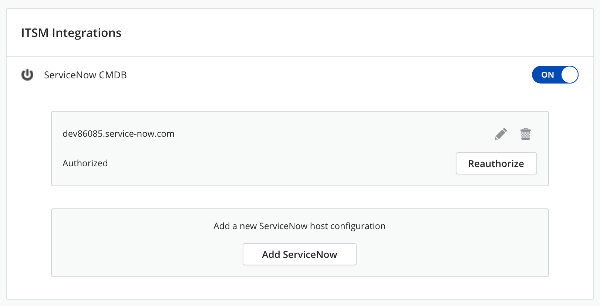
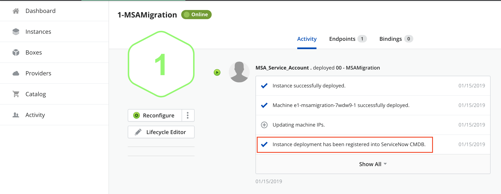
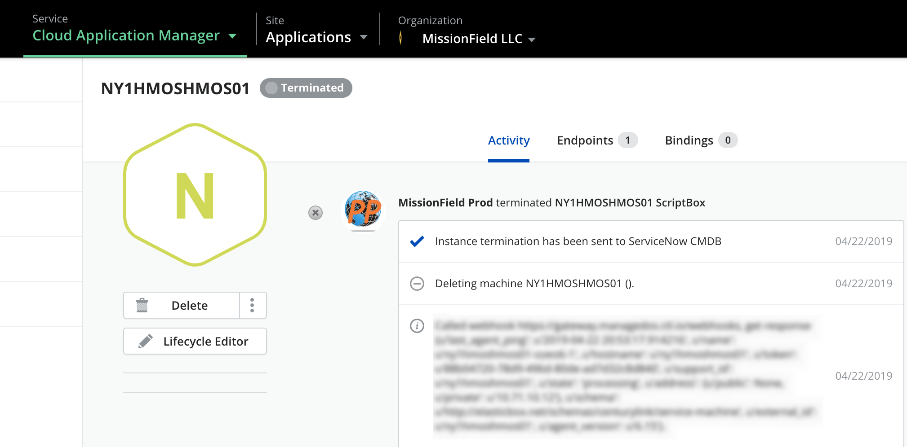

{{{
"title": "ITSM Integrations",
"date": "08-17-2018",
"author": "Guillermo Sanchez",
"keywords": ["administration", "itsm", "servicenow"],
"attachments": [],
"contentIsHTML": false
}}}

### ITSM Integrations

**In this article:**

* [Overview](#overview)
* [Audience](#audience)
* [Prerequisites](#prerequisites)
* [Configuration Steps](#configuration-steps)
* [Behavior](#behavior)
* [Getting General Support](#getting-general-support)

### Overview

In the organization settings page there is a section to configure ITSM (IT Service Management) integrations, where you can enable and configure the ServiceNow integration. ServiceNow can be configured as configuration management database (CMDB), so whenever an instance is deployed, it will be registered into ServiceNow CMDB, and whenever is terminated it will be removed from ServiceNow CMDB as well. This allows you to have a synchronized view of your CAM deployments into  ServiceNow CMDB module.

### Audience

All users with Cloud Application Manager organization administrator access.

### Prerequisites

* Access to Cloud Application Manager, Management site.
* The user must be an Administrator of the organization in Cloud Application Manager.

* The user should be at the organization level scope to access the Settings option in the left side menu, or through the pencil button in the organization element in the context switcher.

### Configuration Steps

1. Navigate to the ITSM Integrations section in the Organization settings page and enable ServiceNow CMDB toggle:
   

2. Click on the **Add ServiceNow** button:
   

3. Fill in the form with the required fields:
   

    Once you specify the ServiceNow host, you should copy the Redirect URL and click on the **Create an application registry for CAM** link which will open the ServiceNow server configuration in a new tab or window where you will configure the ServiceNow application registration for Cloud Application Manager (CAM) and fill in the following:
    * Click on the lock next to Redirect URL to unlock the field and paste there the value you copied from CAM form earlier.
    * Specify a meaningfull name for your ServiceNow application registration for CAM
    * Copy the Client ID that has been automatically generated and go back to CAM to paste it in the corresponding field
    * Specify the same Client Secret in both configuration pages (CAM and ServiceNow).
    * In ServiceNow application registration page you can change the **Refresh Token Lifespan** value to "-1" to define that it will never expire.
    * Going back to Cloud Application Manager New ServiceNow Configuration form, click on **Save**
  

4. Once you have saved your configuration, you need to Authorize access for Cloud Application Manager to be able to talk to your ServiceNow instance by clicking the **Authorize** button:
  
  When clicking on the **Authorize** button a ServiceNow screen will appear where you can **Allow** Cloud Application Manager to connect to your ServiceNow account.

5. Once you have authorize the connection, you will see **Authorized** in your configuration, and you will have the option to **Reauthorize** in case you need to do so, or when your token expires:
  

### Behavior

Once ServiceNot CMDB integration has been configured, the following behavior will occur when deploying any instance through Cloud Application Manager.

#### When deploying a new instance

When a new instance is deployed in Cloud Application Manager, the following fields will be sent to ServiceNow CMDB in one new cmdb_ci entity:

* “name”: name of the instance in CAM
* short_description”: type of service
* “attributes”: provider type, provider managed_os, provider description, provider name and service type.
* “comments”: Instance name and instance Id
* “correlation_id”: Instance Id

The instance activity log will show that the instance deployment was registered into ServiceNow CMDB:

#### When terminating an instance

When an instance is terminated, its corresponding ServiceNow entity is deleted from ServiceNow CMDB.

The instance activity log will show that the instance termination has been informed to ServiceNow CMDB for it to be unregistered:

### Getting General Support

Customers can contact the CenturyLink Global Operations Support center (support desk) directly for getting help with Cloud Application Manager as well as any other supported product that they’ve subscribed to.  Below are three ways to get help.

**Contact:**

1. **Phone:** 888-638-6771

2. **Email:** incident@centurylink.com

3. **Create Ticket in Cloud Application Manager:** Directly within the platform, users can “Create Ticket” by clicking on the “?” symbol in upper right corner near the users log-in profile icon.  This takes users directly to the Managed Servicers Portal where they can open, track and review status of issues that have been raised with the support desk.  Additionally, this is how a TAM can be engaged as well.

**Instructions:**

1. Provide your name
2. CAM account name
3. A brief description of your request or issue for case recording purposes

The support desk will escalate the information to the Primary TAM and transfer the call if desired.
