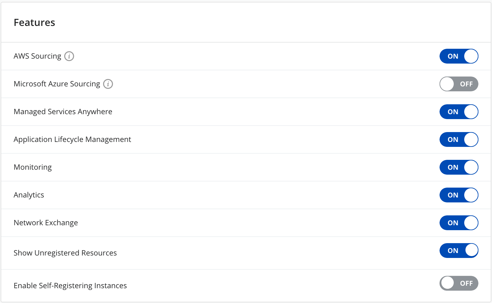
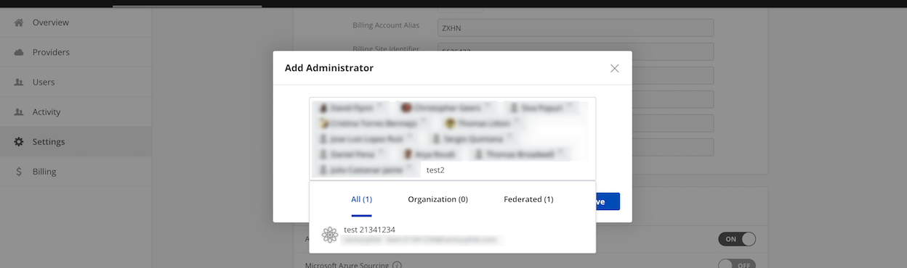
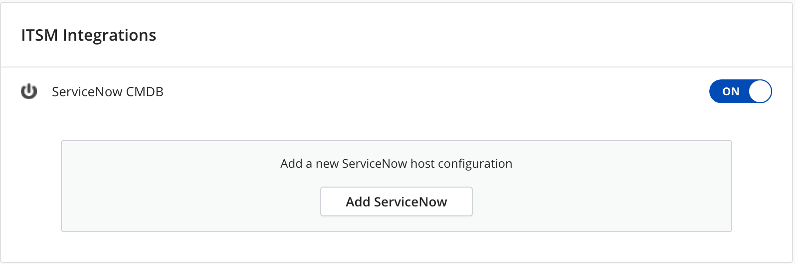

{{{
"title": "Manage Cloud Application Manager Assets",
"date": "05-22-2019",
"author": "Arya Roudi and Sergio Quintana",
"keywords": ["cam", "cloud application manager", "details", "features", "administrator", "settings", "organization", "clouds", "itsm", "tags", "webhooks", "authentication", "theme"],
"attachments": [],
"contentIsHTML": false
}}}

**In this article:**

* [Overview](#overview)
* [Audience](#audience)
* [Prerequisites](#prerequisites)
* [Manage Details](#manage-details)
* [Manage Features](#manage-features)
* [Manage Administrators](#manage-administrators)
* [Manage Clouds](#manage-clouds)
* [Manage Tags](#manage-tags)
* [Manage Webhooks](#manage-webhooks)
* [Manage ITSM Integrations](#manage-itsm-integrations)
* [Manage Authentication](#manage-authentication)
* [Manage Theme](#manage-theme)
* [Contacting Cloud Application Manager Support](#contacting-cloud-application-manager-support)

### Overview

This article makes a brief preview of the assets management section that Cloud Application Manager provides for any user with administrator privileges.

### Audience

All users with Cloud Application Manager organization administrator access.

### Prerequisites

* Access to Cloud Application Manager, [Management site](https://account.cam.ctl.io/#/settings).
  
* The user must be an Administrator of the organization in Cloud Application Manager.
  
* The user should be at the organization level scope to access the **Settings** option on the left side menu. Accessing that option is also possible through the pencil button of an organization element in the Context Switcher.

### Manage Details

In the admin console settings, **Details** section shows a list of items which describe the organization such as its icon, name, address, domain, account type, account status, billing settings, etc. These items are not editable (except the icon).

### Manage Features

To see more info about the options in this section you can refer to these pages:

* [AWS Sourcing](https://www.ctl.io/knowledge-base/cloud-application-manager/cloud-optimization/partner-cloud-integration)
* [Microsoft Azure Sourcing](https://www.ctl.io/knowledge-base/cloud-application-manager/cloud-optimization/partner-cloud-integration/)
* [Managed Services Anywhere](https://www.ctl.io/cloud-application-manager/managed-services-anywhere)
* [Application Lifecycle Management](https://www.ctl.io/cloud-application-manager/application-lifecycle-management)
* [Monitoring](https://www.ctl.io/knowledge-base/cloud-application-manager/monitoring/cammonitoringui)
* [Analytics](https://www.ctl.io/knowledge-base/cloud-application-manager/analytics)
* [Network Exchange](https://www.ctl.io/knowledge-base/network/network-exchange-getting-started-guide)
* Show Unregistered Resources: By enabling this option, you'll be able to see the unregistered instances under the CAM/ALM Instances menu.

### Manage Administrators

Under **Administrators**, you can see a list of all administrators of the organization, as well as a search box for looking for a concrete user if there are at least ten administrators. For more details, visit [Give admin access to Cloud Application Manager](admin-access.md)

### Manage Clouds

All clouds available in the organization are listed under **Clouds** section. Visit [Enable Access to Cloud Providers](provider-access.md) for more information.

### Manage Tags

Take a look at all tags in the organization under **Tags** in the admin console. More information in [Tag Instances](resource-tags.md).

### Manage Webhooks

View all webhooks available in the organization under **Webhooks**. In order to add a new webhook, click **Add** and fill in the URL.

### Manage ITSM Integrations

This section allows to configure ITSM (IT Service Management) integrations, where you can enable and configure the ServiceNow integration. There is more information about this [here](itsm-integrations.md).

### Manage Authentication

In Cloud Application Manager Enterprise Edition, users can sign in using any of the single sign-on authentication options you enable in the admin console. [Enable User Authentication](user-authentication.md)

### Manage Theme

Organization settings page lets users also customize the logo and the accent color used in Cloud Applpication Manager under the **Theme** section.

### Contacting Cloud Application Manager Support

Customers can contact the CenturyLink Global Operations Support center (support desk) directly for getting help with Cloud Application Manager as well as any other supported product that they’ve subscribed to.  Below are three ways to get help.

**Contact:**

1. **Phone:** 888-638-6771

2. **Email:** incident@centurylink.com

3. **Create Ticket in Cloud Application Manager:** Directly within the platform, users can “Create Ticket” by clicking on the “?” symbol in upper right corner near the users log-in profile icon.  This takes users directly to the Managed Servicers Portal where they can open, track and review status of issues that have been raised with the support desk.  Additionally, this is how a TAM can be engaged as well.

**Instructions:**

1. Provide your name
2. CAM account name
3. A brief description of your request or issue for case recording purposes

The support desk will escalate the information to the Primary TAM and transfer the call if desired.
