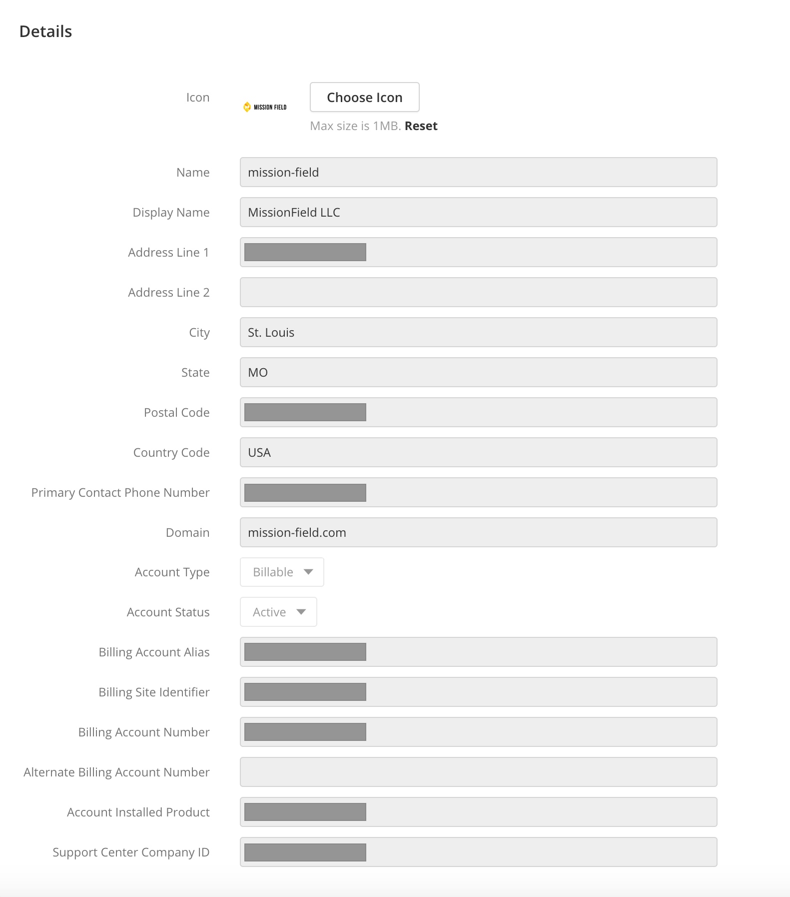
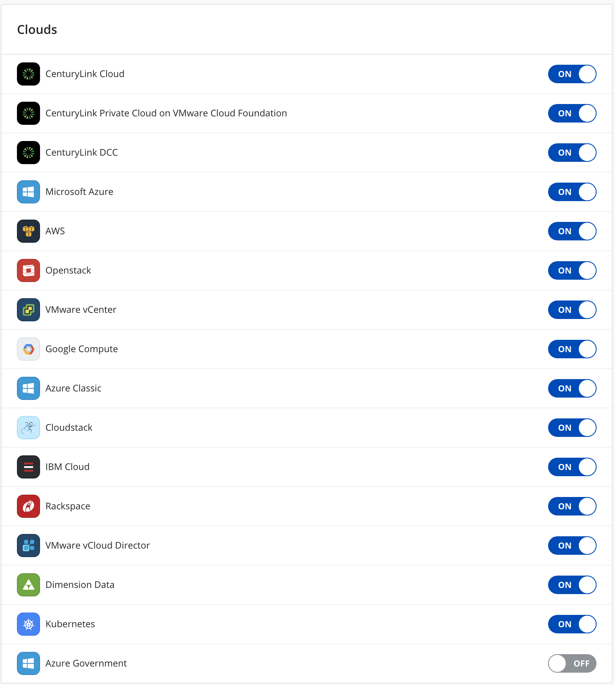
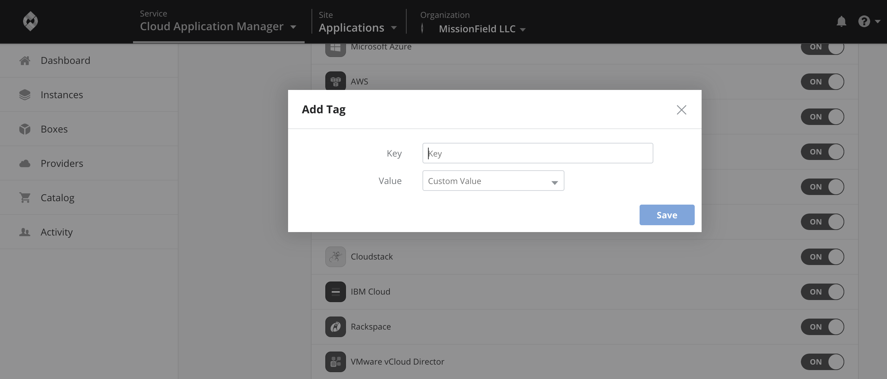

{{{
"title": "Manage Cloud Application Manager Assets",
"date": "09-01-2016",
"keywords": ["details", "settings", "organization", "clouds",
"tags", "webhooks", "authentication", "theme", "setting"],
"author": "",
"attachments": [],
"contentIsHTML": false
}}}

### Manage Cloud Application Manager Assets
**In this article:**

* [Overview](#overview)
* [Audience](#audience)
* [Prerequisites](#prerequisites)
* [Manage Details](#manage-details)
* [Manage Administrators](#manage-administrators)
* [Manage Clouds](#manage-clouds)
* [Manage Tags](#manage-tags)
* [Manage Webhooks](#manage-webhooks)
* [Manage Authentication](#manage-authentication)
* [Manage Theme](#manage-theme)

### Overview

This article makes a brief preview of the assets management section that Cloud Application Manager provides for any user with administrator privileges.

### Audience

All users with Cloud Application Manager organization administrator access.

### Prerequisites

* Access to Cloud Application Manager, Management site.

* The user must be an Administrator of the organization in Cloud Application Manager.

* The user should be at the organization level scope to access the Settings option in the left side menu.

### Manage Details

In the admin console settings, **Details** shows a list of items which describe the organization, as the icon, name, domain, account type, account status, etc. This items are not editable.
To see more info about the options in this section you can refer to these pages:

* [AWS Sourcing](https://www.ctl.io/knowledge-base/cloud-application-manager/cloud-optimization/partner-cloud-integration)
* [Microsoft Azure Sourcing](https://www.ctl.io/knowledge-base/cloud-application-manager/cloud-optimization/partner-cloud-integration/)
* [Managed Services Anywhere](https://www.ctl.io/cloud-application-manager/managed-services-anywhere)
* [Application Lifecycle Management](https://www.ctl.io/cloud-application-manager/application-lifecycle-management)
* [Monitoring](https://www.ctl.io/knowledge-base/cloud-application-manager/monitoring/cammonitoringui)
* [Analytics](https://www.ctl.io/knowledge-base/cloud-application-manager/analytics)
* [Network Exchange](https://www.ctl.io/knowledge-base/network/network-exchange-getting-started-guide)
* Show Unregistered Resources: By enabling this option in the Settings, you'll be able to see the unregistered instances under the CAM/ALM Instances menu.

### Manage Administrators

Under **Administrators**, you can see a list of all administrators of the organization. For more details, visit [Give admin access to Cloud Application Manager](admin-access.md)

### Manage Clouds

All clouds available in the organization are listed under **Clouds** section. Visit [Enable Access to Cloud Providers](provider-access.md).

### Manage Tags

Take a look at all tags in the organization under **Tags** in the admin console. More information in [Tag Instances](resource-tags.md)

### Manage Webhooks

View all webhooks available in the organization under **Webhooks**. In order to add a new webhook, click **Add** and write the URL.

### Manage Authentication

In Cloud Application Manager enterprise organizations, users can sign in using any of the single sign-on authentication options you enable in the admin console. [Enable User Authentication](user-authentication.md)

### Manage Theme

The organization has the ability of customize the logo and the colors under **Theme** section.

### Contacting Cloud Application Manager Support

We’re sorry you’re having an issue in [Cloud Application Manager](https://www.ctl.io/cloud-application-manager/). Please review the [troubleshooting tips](../Troubleshooting/troubleshooting-tips.md), or contact [Cloud Application Manager support](mailto:incident@CenturyLink.com) with details and screenshots where possible.

For issues related to API calls, send the request body along with details related to the issue.

In the case of a box error, share the box in the workspace that your organization and Cloud Application Manager can access and attach the logs.
* Linux: SSH and locate the log at /var/log/elasticbox/elasticbox-agent.log
* Windows: RDP into the instance to locate the log at ProgramDataElasticBoxLogselasticbox-agent.log
