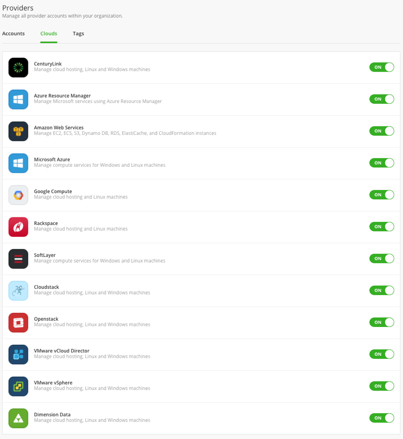

{{{
"title": "Enable Access to Cloud Providers",
"date": "10-30-2018",
"author": "Arya Roudi",
"keywords":["provider access", "cam setting", "manage provider access"],
"attachments": [],
"contentIsHTML": false
}}}

**In this article:**

* [Overview](#overview)
* [Audience](#audience)
* [Prerequisites](#prerequisites)
* [Enable Provider Access](#enable-provider-access)
* [Contacting Cloud Application Manager Support](#contacting-cloud-application-manager-support)

### Overview

By default, all public and private cloud providers are enabled for Cloud Application Manager users. As an Cloud Application Manager administrator, you can enable or disable providers for the entire organization in the [admin console](admin-overview.md). You can turn off a particular provider if you don’t want people to deploy to it.

### Audience

All users with Cloud Application Manager organization administrator access.

### Prerequisites

* Access to Cloud Application Manager, [Management site](https://account.cam.ctl.io/#/settings).
* The user must be an Administrator of the organization in Cloud Application Manager.
* The user should be at the organization level scope to access the Settings option in the left side menu, or through the pencil button in the organization element in the context switcher.

### Enable Provider Access
Enabling provider access does not automatically register providers for use but determines which ones users can connect and deploy to.

In the admin console, you can control access under **Clouds**.

### Contacting Cloud Application Manager Support

We’re sorry you’re having an issue in [Cloud Application Manager](https://www.ctl.io/cloud-application-manager/). Please review the [troubleshooting tips](../Troubleshooting/troubleshooting-tips.md), or contact [Cloud Application Manager support](mailto:incident@CenturyLink.com) with details and screenshots where possible.

For issues related to API calls, send the request body along with details related to the issue.

In the case of a box error, share the box in the workspace that your organization and Cloud Application Manager can access and attach the logs.
* Linux: SSH and locate the log at /var/log/elasticbox/elasticbox-agent.log
* Windows: RDP into the instance to locate the log at ProgramDataElasticBoxLogselasticbox-agent.log
