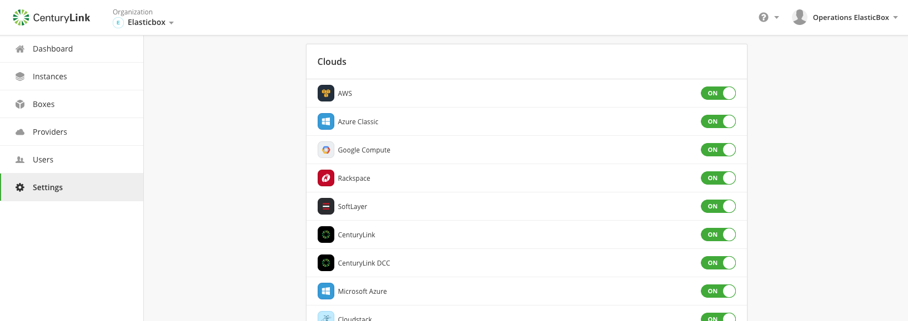

{{{
"title": "Enable Access to Cloud Providers",
"date": "05-22-2019",
"author": "Arya Roudi and Sergio Quintana",
"keywords":["cam", "cloud application manager", "provider", "provider access", "cam settings", "settings", "manage provider access", "clouds"],
"attachments": [],
"contentIsHTML": false
}}}

**In this article:**

* [Overview](#overview)
* [Audience](#audience)
* [Prerequisites](#prerequisites)
* [Enable Provider Access](#enable-provider-access)
* [Contacting Cloud Application Manager Support](#contacting-cloud-application-manager-support)

### Overview

By default, all public and private cloud providers are enabled for Cloud Application Manager users. As a Cloud Application Manager administrator, you can enable or disable providers for the entire organization in the [admin console](admin-overview.md), so turning off a particular provider is possible if you don’t want people to deploy to it.

### Audience

All users with Cloud Application Manager organization administrator access.

### Prerequisites

* Access to Cloud Application Manager, [Management site](https://account.cam.ctl.io/#/settings).
  
* The user must be an Administrator of the organization in Cloud Application Manager.
  
* The user should be at the organization level scope to access the **Settings** option on the left side menu. Accessing that option is also possible through the pencil button of an organization element in the Context Switcher.

### Enable Provider Access

Enabling provider access does not automatically register providers for use but determines which ones users can connect and deploy to.

In the admin console, you can control access under **Clouds**.

### Contacting Cloud Application Manager Support

Customers can contact the Lumen Global Operations Support center (support desk) directly for getting help with Cloud Application Manager as well as any other supported product that they’ve subscribed to.  Below are three ways to get help.

**Contact:**

1. **Phone:** 888-638-6771

2. **Email:** incident@centurylink.com

3. **Create Ticket in Cloud Application Manager:** Directly within the platform, users can “Create Ticket” by clicking on the “?” symbol in upper right corner near the users log-in profile icon.  This takes users directly to the Managed Servicers Portal where they can open, track and review status of issues that have been raised with the support desk.  Additionally, this is how a TAM can be engaged as well.

**Instructions:**

1. Provide your name
2. CAM account name
3. A brief description of your request or issue for case recording purposes

The support desk will escalate the information to the Primary TAM and transfer the call if desired.
