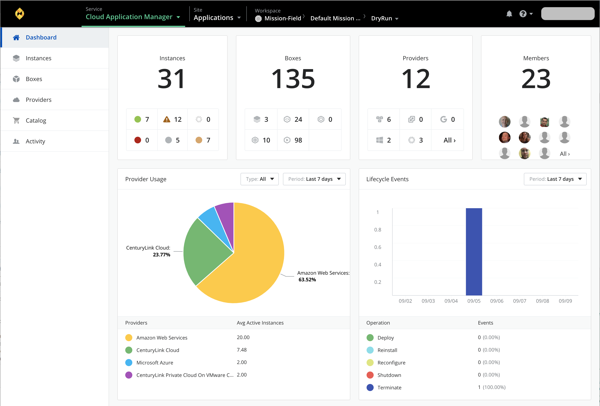
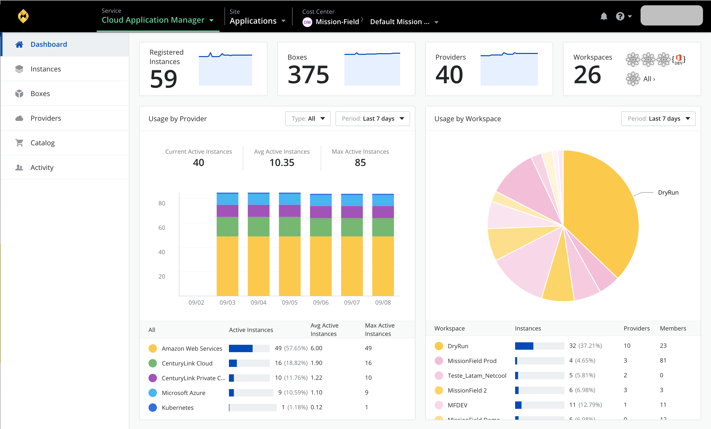
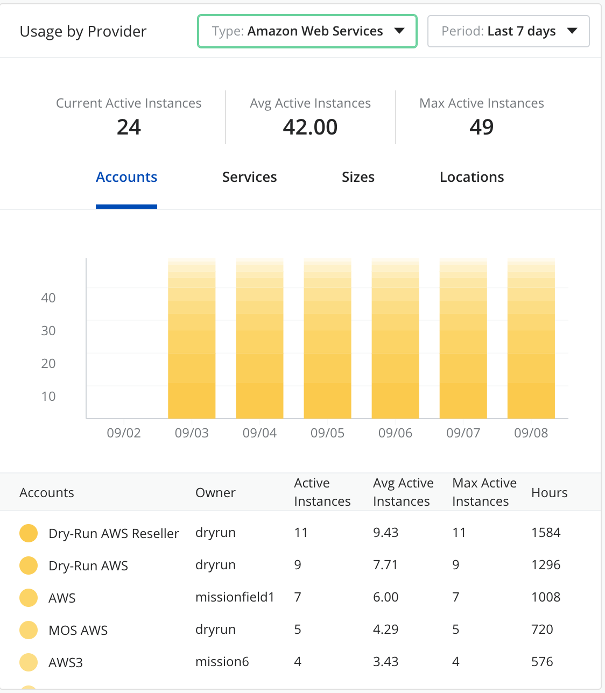
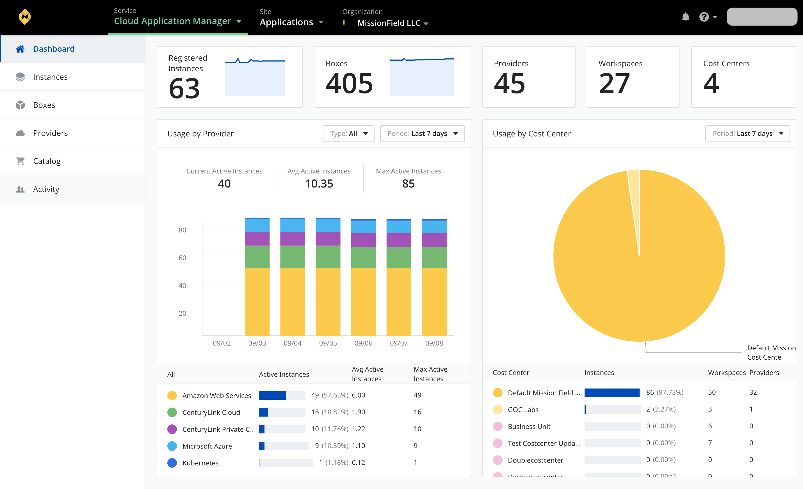

{{{
"title": "Get Control and Insights with Dashboard ",
"date": "10-30-2018",
"author": "Arya Roudi",
"keywords":["cam dashboard", "dashboard", "dashboard report"],
"attachments": [],
"contentIsHTML": false
}}}

**In this article:**

* [Overview](#overview)
* [Audience](#audience)
* [Prerequisites](#prerequisites)
* [Manage Details](#manage-details)
* [Manage Administrators](#manage-administrators)
* [Manage Clouds](#manage-clouds)
* [Manage Tags](#manage-tags)
* [Manage Webhooks](#manage-webhooks)
* [Manage Authentication](#manage-authentication)
* [Manage Theme](#manage-theme)
* [Contacting Cloud Application Manager Support](#contacting-cloud-application-manager-support)

### Overview

The Dashboard shows cloud costs and resource usage in public and private clouds. It includes public clouds like AWS, Google Cloud, Azure and private clouds like VMware vCenter, VMware vCloud Director, and SoftLayer. It also helps you make budget-friendly decisions and curb costs through cost center budgeting.

Depending on the scope, different views and different data can be shown.

### Audience

All users with Cloud Application Manager organization administrator access.

### Prerequisites

* Access to Cloud Application Manager, Management site.
* The user must be an Administrator of the organization in Cloud Application Manager.
* The user should be at the organization level scope to access the Settings option in the left side menu.

### Workspace scope

In the workspace scope, the information shown is related to the use of resources made by the owner and/or shared users.

At the top, there are three boxes that contain the following information :

* **Instances** - Total number of instances in this workspace and split by status.
* **Boxes** - Total number of boxes in the workspace and their types.
* **Providers** - Total number of providers defined in the workspace and divided by type.

At the bottom, there are two charts which describe the use of providers and the lifecycle events. Both can be filtered by a date range. In regards to the lifecycle events, these can also be filtered by provider type.

### Cost Center scope

In this scope, the information showed is focused on cost and provider usage.
At the top, there are five boxes with the information described below:
                                                          
* **Monthly Quota** - This box contains the total cost per month and the relative cost by quota.
* **Instances** - Total number of instances inside of the cost center with the line chart of the last month.
* **Boxes** - Total number of boxes and the line chart of the last month.
* **Providers** - Total number defined in the cost center with the line chart of the last month.
* **Workspaces** - Total number of workspaces in this cost center.

At the bottom, as well as it happens with the workspace scope, there are two charts, one with the provider usage and the other with the cost by workspace. Both can be filtered by date range. And the last one, can also be filtered by provider type. 
If you filter by provider type, the chart shows the information organized by account, services, sizes or locations.

In the provider usage chart, the information described at the top, is the total cost spent, the instances that are alive, the prices by instance, and by day. The bars describe the cost of the usage by day and by provider.

### Organization scope

In this scope, the information showed is focused in cost and provider usage in every cost center.
At the top, there are six boxes with the information described above:
                                                          
* **Current Total Spend** - This box contains the total cost per month.
* **Instances** - Total number of instances inside of the organization with the line chart of the last month.
* **Boxes** - Total number of boxes and the line chart of the last month.
* **Providers** - Total number defined in the organization with the line chart of the last month.
* **Workspaces** - Total number of workspaces in this organization.
* **Cost Centers** - Total number of cost centers in the organization.

At the bottom, there are two charts. One of them with the same information and behavior that the provider usage chart of the cost center scope, and the second one with the cost by cost center.

### Contacting Cloud Application Manager Support

We’re sorry you’re having an issue in [Cloud Application Manager](https://www.ctl.io/cloud-application-manager/). Please review the [troubleshooting tips](../Troubleshooting/troubleshooting-tips.md), or contact [Cloud Application Manager support](mailto:incident@CenturyLink.com) with details and screenshots where possible.

For issues related to API calls, send the request body along with details related to the issue.

In the case of a box error, share the box in the workspace that your organization and Cloud Application Manager can access and attach the logs.
* Linux: SSH and locate the log at /var/log/elasticbox/elasticbox-agent.log
* Windows: RDP into the instance to locate the log at ProgramDataElasticBoxLogselasticbox-agent.log
