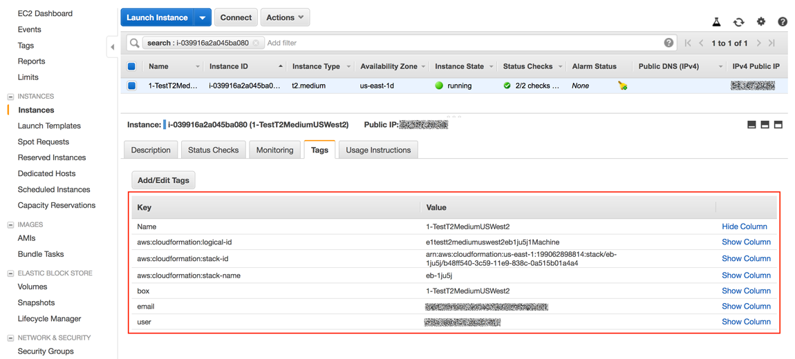
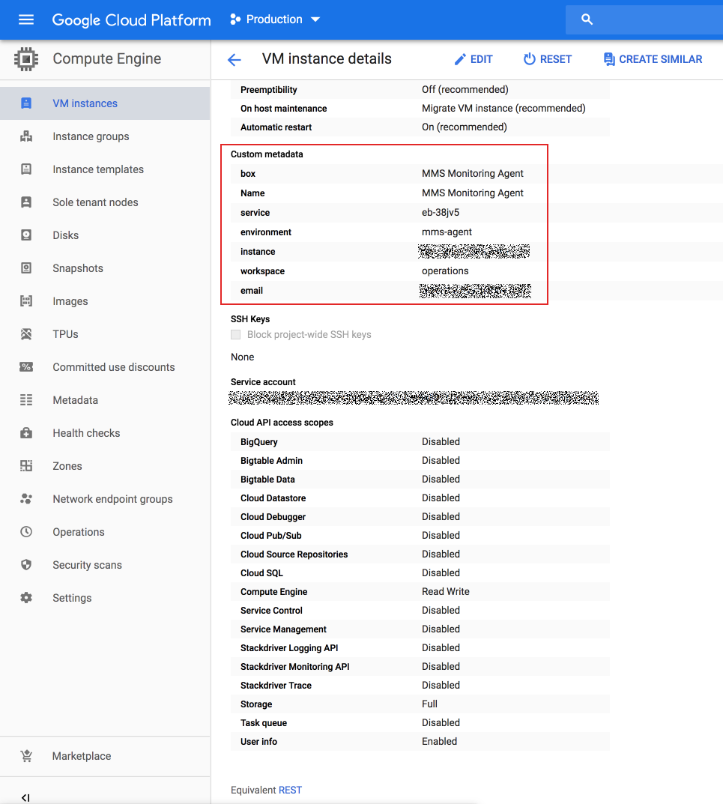
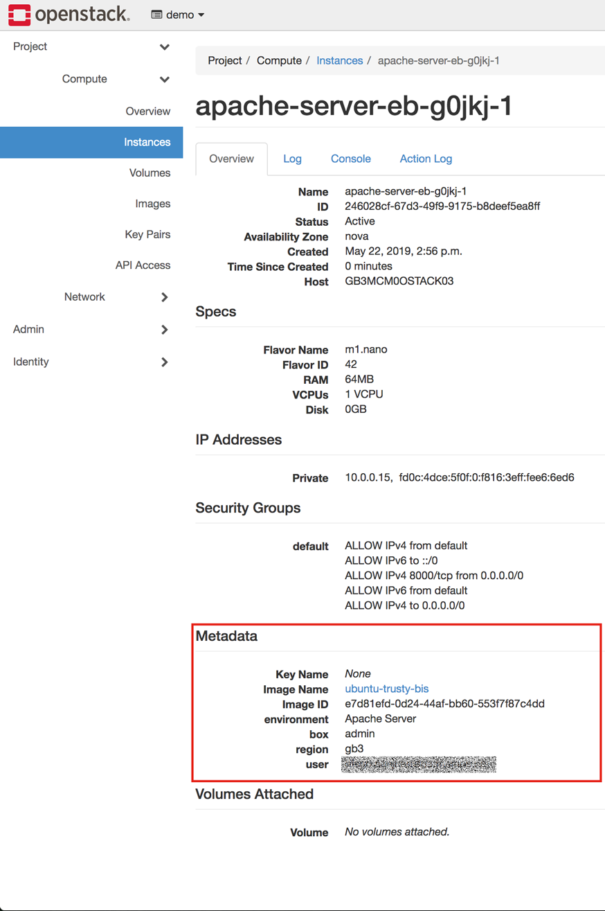
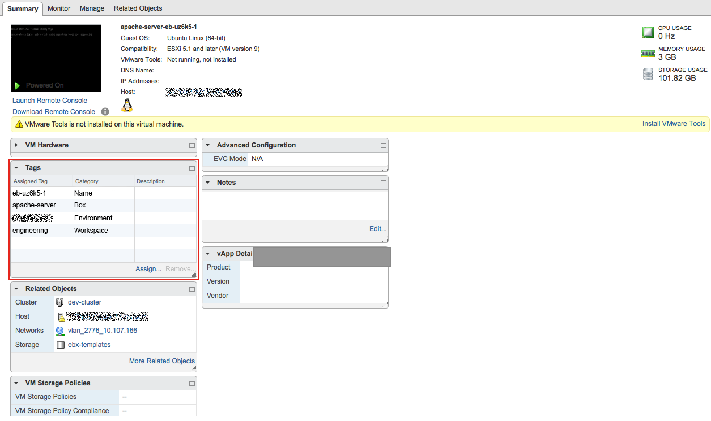
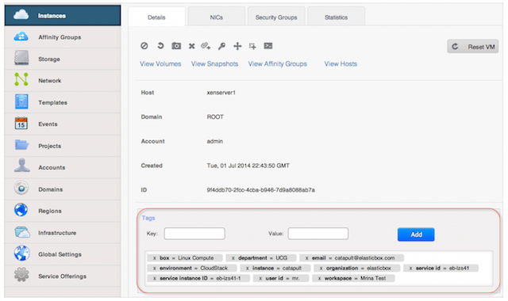

{{{
"title": "Tag Instances",
"date": "10-30-2017",
"author": "",
"keywords": ["tags", "settings", "organization tag", "organization tag"]
"attachments": [],
"contentIsHTML": false
}}}

### Tag Instances
Tags give information about an instance deployed through Cloud Application Manager. They let you report on provider resources consumed by Cloud Application Manager users. They inform what box, provider, user, workspace, and such from Cloud Application Manager were involved in deploying an instance.

As an Cloud Application Manager administrator, you get to apply 10 tags for your organization. From the [Settings](admin-overview.md), once you can add preset or custom tags, they’re applied to the provider when a user launches an instance to any public or private cloud such as AWS, vSphere, Google Cloud, Azure, OpenStack, and CloudStack. They are applied on instances launched in Linux, Windows, CloudFormation, and RDS services.

You can use tags to report on usage metrics from the provider’s interface. Tags help you understand how Cloud Application Manager resources are spread across your organization. Use them to identify usage patterns and optimize resources for your teams and users.

Cloud Application Manager supports tagging in the Enterprise Edition (SaaS & Virtual Appliance) for AWS, Google Cloud, OpenStack, CloudStack, and vSphere.

In the Settings for your organization, you can add tags under Settings > Tags.

### In this article
* Preset or Custom Tags
* Applying Tags for Your Organization
* Reporting on Cloud Application Manager Tags
   * AWS
   * Google Cloud
   * OpenStack
   * vSphere
   * CloudStack

### Preset or Custom Tags
A tag consists of a key and a value. You can tag with a custom or preset value.

* **Custom** - Enter any value that’s meaningful to categorize instances, like department name.
* **Preset** - Choose from preset values such as box name, environment, and so on. Preset values give specific information about an instance. Choose a value from this table.

| Preset Value | Description |
|--------------|-------------|
| Box name | Name of the box deployed. |
| Environment | Environment name the user gave in the [deployment profile](../Deploying Anywhere/deploying-managing-instances.md) when deploying the instance. |
| Instance ID | ID assigned by Cloud Application Manager, for example, i-extwmf. |
| Provider name | Provider defined in Cloud Application Manager to which the instance was deployed. |
| Service instance ID | Unique ID for every machine created for the instance, for example eb-ek73d-1, eb-ek73d-2. |
| Service ID | ID for the type of service deployed from the provider, for example eb-ek73d. |
| User email | Email of the user who deployed the instance. |
| User ID | A unique ID to identify the Cloud Application Manager user. |
| Workspace ID | Unique workspace ID where the instance was deployed. |
| Workspace name | Name of the workspace the instance was deployed from. |

### Applying Tags for Your Organization
Only Cloud Application Manager users in the administrator role can apply tags. Follow these steps to apply one.

**Steps**
1. [Log in to Cloud Application Manager.](//www.ctl.io/cloud-application-manager/)

2. From the menu drop-down on the top right, select **Organizations > Your Org Name**

3. Click **Settings and scroll to the Tags section**.

4. Click **Add** and enter a key and value for the tag.
   * To enter a preset value, click the Custom Value drop-down to select one.
   * To enter a custom value, simply type in the Custom Value field.
   * **Note:** The maximum length is 125 characters for the key and 250 characters for the value. Tags that contain unicode non-ASCII characters (ex: +=\*&!@#) are ignored. Such tags are not applied to the instance in Google Cloud and OpenStack.

5. When done, click **Save** to add the tag.

**Note:** At this time, you can’t modify an existing tag, but you can remove and create another in its place. To remove a tag, go the Settings and under Tags, click (x) and the tick mark against it.

### Reporting on Cloud Application Manager Tags
One of the chief benefits of tagging is that you can report and analyze how Cloud Application Manager resources are consumed throughout your organization. Currently, the reporting capabilities depend on what your cloud provider natively supports.

Refer to the following sections to view or manage the tags applied on a box instance launched in a specific cloud provider.

### AWS
In addition to preset and custom tags, Cloud Application Manager tags instances with CloudFormation labels. Tags currently don’t apply to Elastic Block Store, and Virtual Private Cloud instances. To report on tagged instances deployed in AWS, see [this article](https://docs.aws.amazon.com/AWSEC2/latest/UserGuide/usage-reports.html#usage-reports-prereqs).

**Steps**
1. [Log in to the AWS console](https://console.aws.amazon.com/) as your IAM user.

2. Select the region where your instance is deployed.

3. Click **Services > EC2 > Instances.**

4. Select an instance and click the **Tags** tab to manage the applied tags.
   

### Google Cloud

**Steps**
1. [Log in to the Google Cloud Console](https://console.developers.google.com/).

2. Under projects, select the project where Cloud Application Manager instances are deployed.

3. Under Compute Engine, click **VM instances** and manage the tags applied under Custom metadata.
   

### OpenStack

**Steps**
1. Log in to your OpenStack dashboard.

2. Select the project to which Cloud Application Manager instances are deployed.

3. Under **Instances**, select the instance whose tags you want to view. The tags are listed under Meta.
   

### vSphere

**Steps**
1. Log in to your VMware vSphere thin client for vCenter 5.0 or later.

2. Locate the virtual machine launched through Cloud Application Manager in vSphere. Use the Service ID of the instance in Cloud Application Manager to find it.

3. Under **Custom Fields**, the tags applied to the instance are listed.
   

### CloudStack

**Steps**
1. Log in to your CloudStack management console.

2. Under Instances, select the instance launched through Cloud Application Manager. Use its Cloud Application Manager Service ID to find it.

3. In the instance Details tab, scroll down to see the tags applied.
   

### Contacting Cloud Application Manager Support

We’re sorry you’re having an issue in [Cloud Application Manager](https://www.ctl.io/cloud-application-manager/). Please review the [troubleshooting tips](../Troubleshooting/troubleshooting-tips.md), or contact [Cloud Application Manager support](mailto:incident@CenturyLink.com) with details and screenshots where possible.

For issues related to API calls, send the request body along with details related to the issue.

In the case of a box error, share the box in the workspace that your organization and Cloud Application Manager can access and attach the logs.
* Linux: SSH and locate the log at /var/log/elasticbox/elasticbox-agent.log
* Windows: RDP into the instance to locate the log at ProgramDataElasticBoxLogselasticbox-agent.log
