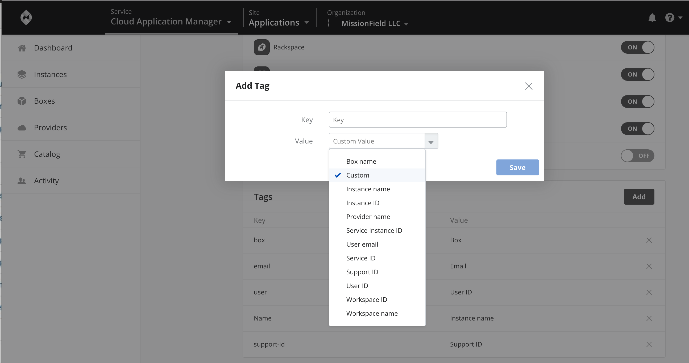

{{{
"title": "Tag Instances",
"date": "05-22-2019",
"author": "Arya Roudi and Sergio Quintana",
"keywords": ["cloud application manager", "cam", "tags", "settings", "organization", "organization tag", "reporting"],
"attachments": [],
"contentIsHTML": false
}}}

**In this article:**

* [Overview](#overview)
* [Audience](#audience)
* [Prerequisites](#prerequisites)
* [Preset or custom Tags](#preset-or-custom-tags)
* [Applying Tags for your Organization](#applying-tags-for-your-organization)
* [Reporting on Cloud Application Manager Tags](#reporting-on-cloud-application-manager-tags)
* [Reporting on AWS](#reporting-on-aws)
* [Reporting on Google Cloud](#reporting-on-google-cloud)
* [Reporting on OpenStack](#reporting-on-openstack)
* [Reporting on vSphere](#reporting-on-vsphere)
* [Reporting on CloudStack](#reporting-on-cloudstack)
* [Contacting Cloud Application Manager Support](#contacting-cloud-application-manager-support)

### Overview

Tags give information about an instance deployed through Cloud Application Manager. They let you report on provider resources consumed by Cloud Application Manager users, as well as inform what box, provider, user, workspace, and such from Cloud Application Manager were involved in deploying an instance.

As an Cloud Application Manager administrator, you can get to apply 10 tags for your organization. From [Settings](admin-overview.md) you can add preset or custom tags, and they will be applied to the associated provider when a user launches an instance to any public or private cloud such as AWS, vSphere, Google Cloud, Azure, OpenStack, or CloudStack. They are also applied on instances launched in Linux, Windows, CloudFormation, and RDS services.

Tags can be used to report on usage metrics from the provider’s interface. They help you understand how Cloud Application Manager resources are spread across your organization. Use them to identify usage patterns and optimize resources for your teams and users.

Cloud Application Manager supports tagging in the Enterprise Edition (SaaS & Virtual Appliance) for AWS, Google Cloud, OpenStack, CloudStack, and vSphere.

You can add tags from **Tags** section inside your organization's settings.

### Audience

All users with Cloud Application Manager organization administrator access.

### Prerequisites

* Access to Cloud Application Manager, [Management site](https://account.cam.ctl.io/#/settings).

* The user must be an Administrator of the organization in Cloud Application Manager.

* The user should be at the organization level scope to access the **Settings** option on the left side menu. Accessing that option is also possible through the pencil button of an organization element in the Context Switcher.

### Preset or custom Tags

A tag consists of a key and a value. You can add a tag with a custom or preset value.

* **Custom** - Enter any value that’s meaningful to categorize instances, like department name.
* **Preset** - Choose from preset values such as box name, environment, etc. Preset values give specific information about an instance. Choose a value from this table.

| Preset Value | Description |
|--------------|-------------|
| Box name | Name of the box deployed. |
| Instance name | Name the user gave to an instance when deploying it. |
| Instance ID | ID assigned by Cloud Application Manager, for example, i-extwmf. |
| Provider name | Provider defined in Cloud Application Manager to which the instance was deployed. |
| Service instance ID | Unique ID for every machine created for the instance, for example eb-ek73d-1, eb-ek73d-2. |
| User email | Email of the user who deployed the instance. |
| Service ID | ID for the type of service deployed from the provider, for example eb-ek73d. |
| Support ID | This ID relates an instance in case you ask for support regarding it. There might be more than one ID in case the instance is associated with more than one machine. |
| User ID | A unique ID to identify the Cloud Application Manager user. |
| Workspace ID | Unique workspace ID where the instance was deployed. |
| Workspace name | Name of the workspace the instance was deployed from. |

### Applying Tags for your Organization

Only Cloud Application Manager users in the administrator role can apply tags. Follow these steps to apply one.

**Steps**

1. [Log in to Cloud Application Manager.](//www.ctl.io/cloud-application-manager/)

2. From the menu drop-down on the top right, select **Organizations > Your Org Name**

3. Click **Settings and scroll to the Tags section**.

4. Click **Add** and enter a key and value for the tag.
   * To enter a preset value, click the Value drop-down to select one.
   * To enter a custom value, simply type in the Custom Value field.
   * **Note:** The maximum length is 125 characters for the key and 250 characters for the value. Tags that contain unicode non-ASCII characters (ex: +=\*&!@#) are ignored. Such tags are not applied to the instance in Google Cloud and OpenStack.

5. When done, click **Save** to add the tag.

**Note:** Edition of tags is not currently supported. But you can remove a tag and create another in its place. To delete a tag, go to **Settings** and under Tags, click the X button next to the name of the tag you want to remove.

### Reporting on Cloud Application Manager Tags

One of the main benefits of tagging is that you can report and analyze how Cloud Application Manager resources are consumed throughout your organization. Currently, the reporting capabilities depend on what your cloud provider natively supports.

It is also interesting to comment that [Analytics](../Analytics/CloudApplicationManagerAnalyticsUI.md) site within Cloud Application Manager can also benefit from tagging.

Refer to the following sections to view or manage the tags applied on a box instance launched in a specific cloud provider.

### Reporting on AWS

In addition to preset and custom tags, Cloud Application Manager tags instances with CloudFormation labels. Tags currently don’t apply to Elastic Block Store and Virtual Private Cloud instances. To report on tagged instances deployed in AWS read [this article](https://docs.aws.amazon.com/AWSEC2/latest/UserGuide/usage-reports.html#usage-reports-prereqs).

**Steps**

1. [Log in to the AWS console](https://console.aws.amazon.com/) as your IAM user.

2. Select the region where your instance is deployed.

3. Click **Services > EC2 > Instances.**

4. Select an instance and click the **Tags** tab to manage the applied tags.

   

### Reporting on Google Cloud

**Steps**

1. [Log in to the Google Cloud Console](https://console.developers.google.com/).

2. Under projects, select the project where Cloud Application Manager instances are deployed.

3. Under Compute Engine, click **VM instances** and manage the tags applied under Custom metadata.
   

### Reporting on OpenStack

**Steps**

1. Log in to your OpenStack dashboard.

2. Select the project to which Cloud Application Manager instances are deployed.

3. Under **Instances**, select the instance whose tags you want to view. The tags are listed under Metadata.

   

### Reporting on vSphere

**Steps**

1. Log in to your VMware vSphere thin client for vCenter 5.0 or later.

2. Locate the virtual machine launched through Cloud Application Manager in vSphere. Use the Service ID of the instance in Cloud Application Manager to find it.

3. Tags applied to the instance will be listed under **Tags**.

   

### Reporting on CloudStack

**Steps**

1. Log in to your CloudStack management console.

2. Under Instances, select the instance launched through Cloud Application Manager. Use its Cloud Application Manager Service ID to find it.

3. In the instance Details tab, scroll down to see the tags applied.
   

### Contacting Cloud Application Manager Support

Customers can contact the CenturyLink Global Operations Support center (support desk) directly for getting help with Cloud Application Manager as well as any other supported product that they’ve subscribed to.  Below are three ways to get help.

**Contact:**

1. **Phone:** 888-638-6771

2. **Email:** incident@centurylink.com

3. **Create Ticket in Cloud Application Manager:** Directly within the platform, users can “Create Ticket” by clicking on the “?” symbol in upper right corner near the users log-in profile icon.  This takes users directly to the Managed Servicers Portal where they can open, track and review status of issues that have been raised with the support desk.  Additionally, this is how a TAM can be engaged as well.

**Instructions:**

1. Provide your name
2. CAM account name
3. A brief description of your request or issue for case recording purposes

The support desk will escalate the information to the Primary TAM and transfer the call if desired.
