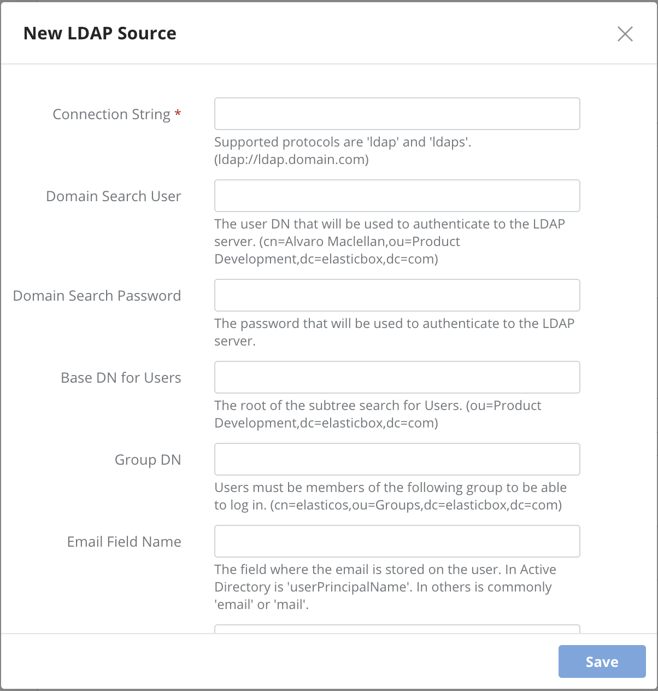
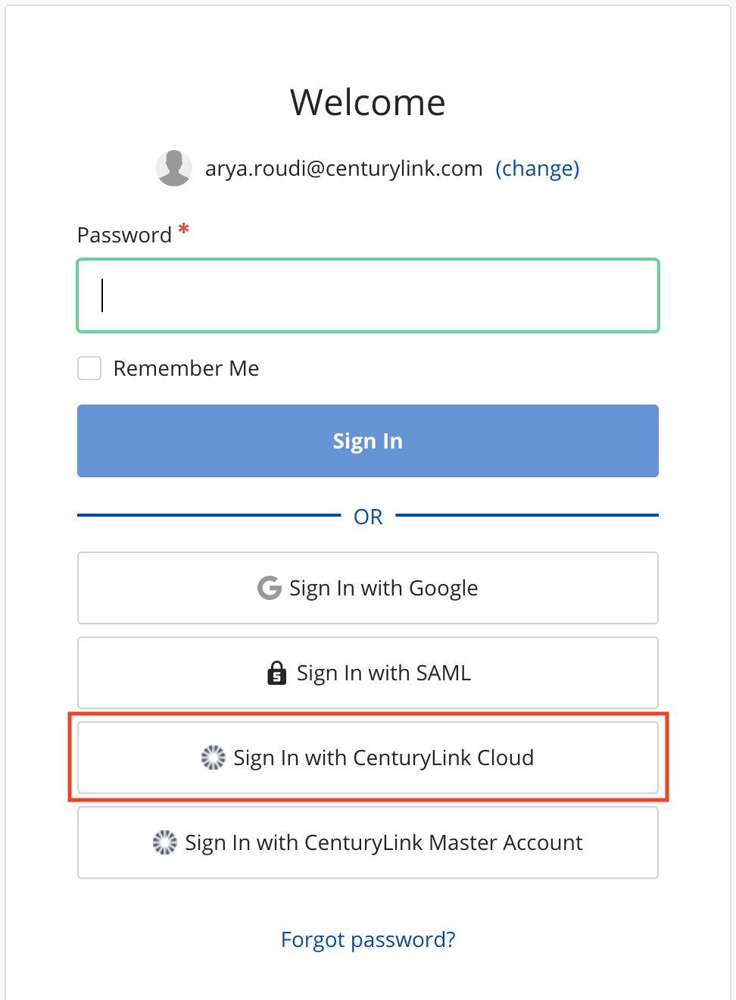

{{{
"title": "Enable User Authentication",
"date": "09-14-2018",
"author": "Guillermo Sanchez",
"keywords": ["cam", "authentication", "sso", "oauth", "google", "github", "saml", "ldap", "clc"],
"attachments": [],
"contentIsHTML": false
}}}

### Enable User Authentication

**In this article:**

* [Overview](#overview)
* [Single sign-on with Google, GitHub, or username, password](#single-sign-on-with-google-github-or-username-password)
* [Single Sign-On with SAML](#single-sign-on-with-saml)
* [Single Sign-On with LDAP](#single-sign-on-with-ldap)
* [Contacting Cloud Application Manager Support](#contacting-cloud-application-manager-support)

### Overview

In Cloud Application Manager, enterprise organization users can sign in using any of the single sign-on authentication options you enable in the [Settings page](admin-overview.md).

### Single sign-on with Google, GitHub, or username, password

To allow users to sign in with a Cloud Application Manager **username and password**, turn on that option under Authentication in the admin console.

Do the same and turn on **Google** or **GitHub** to let users sign in with those credentials without having to create an account exclusively for Cloud Application Manager. When they sign in, Cloud Application Manager provisions an account based on their Google or GitHub username.

### Single Sign-On with SAML

SAML SSO allows users to authenticate only once in an Identity Provider (IdP), and then, access to multiple applications that act as Service Providers (SP).

Cloud Application Manager can be configured to act as a SP, and delegate the user management and authentication to a third party IdP.

When users log in with SAML into Cloud Application Manager, the user is redirected to the SAML IdP site, who will authenticate to the user, asking credentials if is not logged yet, and then sending back to CAM.

#### Setting up a SAML IdP

Enable SAML in Cloud Application Manager to let users log in using credentials managed by a SAML identity provider.

1. Sign in to Cloud Application Manager as the [default administrator](admin-access.md).

2. From the user menu drop-down on the top right, select **Admin Console**.

3. Under Authentication, enable SAML by turning it on.

4. Set up SAML IdP with the SP settings. This settings can be obtained clicking on "SP Metadata" download link:

   

   Some of the common settings to configure in your SAML IdP are:

   * **Single Sign On URL.** Service Provider endpoint that will be used to interchange messages during authentication. This value can be found on AssertionConsumerService XML element on SP metadata file.
   * **Service Provider Entity ID.** This value must match with the entityID property on SP metadata file.

5. Finally it's needed to download the IdP Metadata file and upload on CAM admin console.

Take into consideration that currently this is our valid **Attribute mapping list**:

* **EMAIL**: 'email', 'Email', 'User.Email'.
* **FIRST NAME**: 'firstname', 'FirstName', 'User.FirstName'.
* **LAST NAME**: 'lastname', 'LastName', 'User.LastName'.

### Single Sign-On with LDAP

Enable LDAP in Cloud Application Manager to let users log in using credentials managed in OpenLDAP or Windows Active Directory.

Add LDAP sources in Cloud Application Manager to match the structure of LDAP in your organization. For example, if there are several LDAP servers that replicate the service, you may want to add an LDAP source for each. If users are spread across multiple organizational units, you may want an LDAP source for each unit. Or, to limit access to users in specific groups, you may want to add an LDAP source for each group.

When users sign in to Cloud Application Manager with their LDAP credentials, we don’t store their passwords. The login session passes on their credentials to each LDAP source defined in Cloud Application Manager. The LDAP server looks the user up by their username or Use Principal Name (UPN), typically in the **yourname@example.com** format. The server responds with an authorized or unauthorized request. If authorized, we grant the user access in Cloud Application Manager. Else, we deny access.

#### Setting Up LDAP in Cloud Application Manager

##### Steps

1. Sign in to Cloud Application Manager as an [administrator](admin-access.md).
2. Navigate to the **Settings** page in the Management site.
3. Under **Authentication**, enable LDAP by turning it on.
4. For each LDAP source, provide information to connect and the conditions to search users and sync groups. This information is filled in the following dialog:

   

   * **Connection String:** Required. The LDAP connection URI. This is of the form: schema://host[:port]. It comprises:
   schema: ‘ldap’ or ‘ladps’ for SSL connections. host: LDAP server hostname as a fully qualified domain name or valid IP address, such as ‘ldap.domain.com’ or ‘172.0.1.12’. port: Optional. We use the default protocol port if not provided.

   * **Domain Search User:** The username to authenticate to the LDAP server. Example: `cn=Alvaro Maclellan,ou=Product Development,dc=elasticbox,dc=com`.

   * **Domain Search Password:** Password for the username to authenticate to the LDAP server.

            NOTE: If search user and search password fields are not provided and the LDAP server does not support public queries, the connection and LDAP group sync will not work. The users will not be able to sign up in Cloud Application Manager.

   * **Base DN for Users:** The subtree to use when running queries against the LDAP server to look up users. For example, `ou=Product Development,dc=elasticbox,dc=com`. If empty, we start the lookup at the root level.

   * **Group DN:** This value is used in addition to the base DN when searching users. The user must be member of the group indicated. Example: `cn=elasticos,ou=Groups,dc=elasticbox,dc=com`. Add a new LDAP source to specify another group.

   * **Email Field Name:** The field where the email is stored on the user. In Active Directory is ‘userPrincipalName’. In others is commonly ‘email’ or ‘mail’.

   * **Base DN for Groups:** The subtree to use when running queries against the LDAP server for sync groups (see section [below](#syncing-with-ldap-groups)). For example, `ou=Groups,dc=elasticbox,dc=com`. If empty, we start the lookup at the root level. If you only want one group, specifying the DN of that one in the Base DN will just get that one.

   * **Group Object Filter:** The filter that all groups must satisfy. It must be a valid query. Nodes must fulfill both this and `'(|(objectClass=groupOfNames)(objectClass=group)(objectClass=groupOfUniqueNames)(objectClass=posixGroup))'`.

5. Click **Save** to keep the information.

#### Syncing with LDAP Groups

LDAP group members get automatic access to team workspaces in Cloud Application Manager when you enable sharing with those groups. Through the Cloud Application Manager web or API interface, you can directly add LDAP groups as members of a workspace instead of searching and adding them one by one.

This gives your developers, operations engineers, or IT admins access to the same deployment assets to do their part in automating with necessary access levels. Follow these steps to sync with LDAP groups.

##### Steps

1. Sign in to Cloud Application Manager as an [administrator](admin-access.md).

2. Navigate to the **Settings** page in the Management site.

3. Under **Authentication**, make sure LDAP is on and set up with at least one source with the conditions to sync groups.

4. Turn on **LDAP Group Sync**.
   

5. Click **Sync** to start syncing.
   **Note:** By default, we sync every 24 hours to get the latest group updates. To sync at any other time, click **Sync**. If a group member is deleted or moved out, they no longer have access to Cloud Application Manager workspaces and won’t be able to log in. To show or hide synchronized groups details, click on **Show Groups** or **Hide Groups**.

#### Giving LDAP Accounts Admin Access

As good practice, you should give an LDAP user in your organization administrative access to Cloud Application Manager and set aside the default administrator account to use in case of emergency. After you set up LDAP, give the LDAP user admin access as follows.

##### Steps

1. Sign in to Cloud Application Manager as the LDAP user with the corresponding LDAP credentials. This registers the user in Cloud Application Manager with a personal workspace.

2. Log out and log back in as the default administrator.

3. Make the LDAP user an [administrator](admin-access.md). From here on, use that LDAP user account to manage Cloud Application Manager.

### Single Sign-On with CenturyLink Cloud

If you enable CenturyLink Cloud authentication method, any user with CenturyLink Cloud credentials may log in to Cloud Application Manager using these credentials.

##### Steps

1. Sign in to Cloud Application Manager as an [administrator](admin-access.md).

2. Navigate to the **Settings** page in the Management site.

3. Under **Authentication**, enable **CenturyLink Cloud** by turning it on.

4. Any user who wants to log in into the organization will see a new button to sign in with his CenturyLink Cloud credentials.

    

5. When clicking the button, a new dialog appears asking for the CenturyLink Cloud credentials.

    

    The username provided will be linked to the user account, so any subsequent attempt to sing in using CenturyLink Cloud credentials, the username field will be pre-filled for that particular user.

When CenturyLink Cloud authentication method is enabled, you can also see and edit the corresponding linked CenturyLink Cloud username in the **My Account** dialog:

### Contacting Cloud Application Manager Support

We’re sorry you’re having an issue in [Cloud Application Manager](https://www.ctl.io/cloud-application-manager/). Please review the [troubleshooting tips](../Troubleshooting/troubleshooting-tips.md), or contact [Cloud Application Manager support](mailto:incident@CenturyLink.com) with details and screenshots where possible.

For issues related to API calls, send the request body along with details related to the issue.

In the case of a box error, share the box in the workspace that your organization and Cloud Application Manager can access and attach the logs.
* Linux: SSH and locate the log at /var/log/elasticbox/elasticbox-agent.log
* Windows: RDP into the instance to locate the log at ProgramDataElasticBoxLogselasticbox-agent.log
