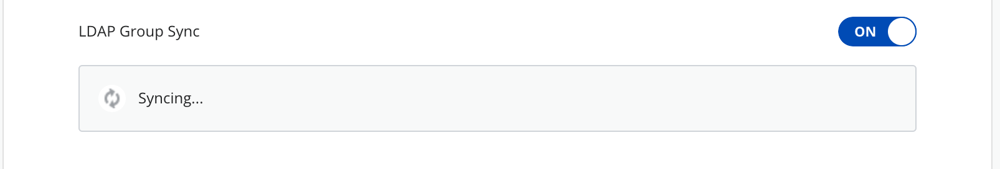
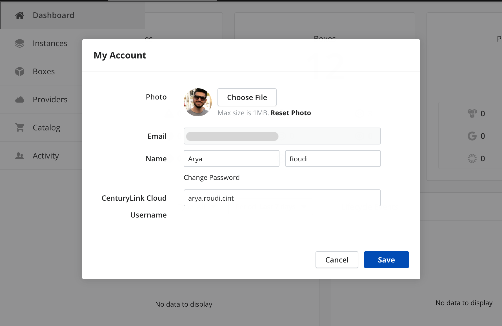
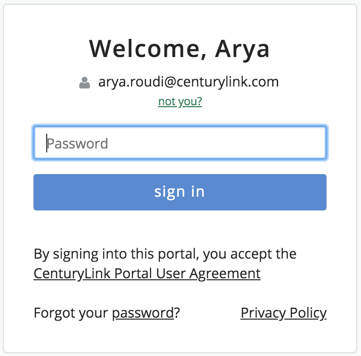
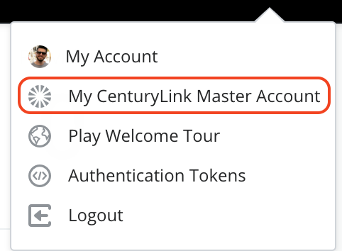

{{{
"title": "Enable User Authentication",
"date": "05-23-2019",
"author": "Guillermo Sánchez and Sergio Quintana",
"keywords": ["cam", "cloud application manager", "organization", "settings", "authentication", "sso", "oauth", "google", "github", "saml", "ldap", "clc", "lumen", "master account"],
"attachments": [],
"contentIsHTML": false
}}}

**In this article:**

* [Overview](#overview)
* [Audience](#audience)
* [Prerequisites](#prerequisites)
* [Single sign-on with Google, GitHub, or username and password](#single-sign-on-with-google-github-or-username-and-password)
* [Single Sign-On with SAML](#single-sign-on-with-saml)
* [Setting up a SAML IdP](#setting-up-a-saml-idp)
* [Working with SAML Groups](#working-with-saml-groups)
* [Single Sign-On with LDAP](#single-sign-on-with-ldap)
* [Setting Up LDAP in Cloud Application Manager](#setting-up-ldap-in-cloud-application-manager)
* [Syncing with LDAP Groups](#syncing-with-ldap-groups)
* [Giving LDAP Accounts Admin Access](#giving-ldap-accounts-admin-access)
* [Single Sign-On with Lumen Cloud](#single-sign-on-with-lumen-cloud)
* [Single Sign-On with Lumen Master Account](#single-sign-on-with-lumen-master-account)
* [Contacting Cloud Application Manager Support](#contacting-cloud-application-manager-support)

### Overview

In Cloud Application Manager, enterprise organization users can sign in using any of the single sign-on authentication options you enable in the [Settings page](admin-overview.md).

### Audience

All users with Cloud Application Manager organization administrator access.

### Prerequisites

* Access to Cloud Application Manager, [Management site](https://account.cam.ctl.io/#/settings).
  
* The user must be an Administrator of the organization in Cloud Application Manager.
  
* The user should be at the organization level scope to access the **Settings** option on the left side menu. Accessing that option is also possible through the pencil button of an organization element in the Context Switcher.

### Single sign-on with Google, GitHub, or username and password

To allow users to sign in with a Cloud Application Manager **username and password**, turn on that option under Authentication in the **Settings** page in the [Management site](https://account.cam.ctl.io/#/settings).

Turn on **Google** or **GitHub** to let users sign in with those credentials without having to create an account exclusively for Cloud Application Manager. When they sign in, an account based on their Google or GitHub username is provisioned.

### Single Sign-On with SAML

SAML SSO allows users to authenticate only once in an Identity Provider (IdP), and then, access to multiple applications that act as Service Providers (SP).

Cloud Application Manager can be configured to act as a SP, and delegate the user management and authentication to a third party IdP.

When users log in with SAML into Cloud Application Manager they are redirected to the SAML IdP site, who will authenticate them asking for their credentials if they are not logged yet, and then sending them back to CAM.

### Setting up a SAML IdP

Enable SAML in Cloud Application Manager to let users log in using credentials managed by a SAML identity provider.

1. Sign in to Cloud Application Manager as an [administrator](admin-access.md).
2. Navigate to the **Settings** page in the [Management site](https://account.cam.ctl.io/#/settings).
3. Under **Authentication**, enable SAML by turning it on.
4. Set up SAML IdP with the SP settings. This settings can be obtained clicking on "SP Metadata" download link:

   

   Some of the common settings to configure in your SAML IdP are:

   * **Single Sign On URL.** Service Provider endpoint that will be used to interchange messages during authentication. This value can be found on AssertionConsumerService XML element in the SP metadata file.
   * **Service Provider Entity ID.** This value must match the entityID property on SP metadata file.
   * **Service Provider X.509 Cert.** This optional value can be set to enable signing or encryption (as well as verifying signatures and decryption). This will enable SAML encryption in any message interchanged with the Service Provider.

5. Finally, the **IdP Metadata** file needs to be downloaded from the IdP and uploaded into the **Settings** page in the [Management site](https://account.cam.ctl.io/#/settings).

Take into consideration that currently this is our valid **Attribute mapping list**:

* **EMAIL**: 'email', 'Email', 'User.Email'.
* **FIRST NAME**: 'firstname', 'FirstName', 'User.FirstName'.
* **LAST NAME**: 'lastname', 'LastName', 'User.LastName'.
* **GROUPS** (optional): 'Groups'

### Working with SAML Groups

When SAML is being used in your organization and you are retrieving SAML groups information, you can add SAML groups as members of a workspace, cost-center or administrators of your organization through the Cloud Application Manager web or API interface, instead of searching and adding them one by one. All SAML group members will then get automatic access to the corresponding team workspace, cost-center or organization, and thus, to all resources pertaining to that scope.

This gives your developers, operations engineers, or IT admins access to the same deployment assets to do their part in automating with the necessary access levels.

### Single Sign-On with LDAP

Enable LDAP in Cloud Application Manager to let users log in using credentials managed in OpenLDAP or Windows Active Directory.

Add LDAP sources in Cloud Application Manager to match the structure of LDAP in your organization. For example, if there are several LDAP servers that replicate the service, you may want to add an LDAP source for each. If users are spread across multiple organizational units, you may want an LDAP source for each unit; or you may want to add an LDAP source for each group to limit access to users in specific groups.

When users sign in to Cloud Application Manager with their LDAP credentials, we don’t store their passwords. The login session passes on their credentials to each LDAP source defined in Cloud Application Manager. The LDAP server looks the user up by their username or Use Principal Name (UPN), typically in the **yourname@example.com** format. The server responds with an authorized or unauthorized request. If authorized, we grant the user access in Cloud Application Manager. Else, we deny access.

### Setting Up LDAP in Cloud Application Manager

#### Steps

1. Sign in to Cloud Application Manager as an [administrator](admin-access.md).
2. Navigate to the **Settings** page in the [Management site](https://account.cam.ctl.io/#/settings).
3. Under **Authentication**, enable LDAP by turning it on.
4. For each LDAP source, provide information to connect and the conditions to search users and sync groups. This information is filled in the following dialog:

   

   * **Connection String:** Required. The LDAP connection URI. This is of the form: schema://host[:port]. It comprises:
   schema: ‘ldap’ or ‘ladps’ for SSL connections. host: LDAP server hostname as a fully qualified domain name or valid IP address, such as ‘ldap.domain.com’ or ‘172.0.1.12’. port: Optional. We use the default protocol port if not provided.

   * **Domain Search User:** The username to authenticate to the LDAP server. Example: `cn=Alvaro Maclellan,ou=Product Development,dc=elasticbox,dc=com`.

   * **Domain Search Password:** Password for the username to authenticate to the LDAP server.

            NOTE: If search user and search password fields are not provided and the LDAP server does not support public queries, the connection and LDAP group sync will not work. Users will not be able to sign up in Cloud Application Manager.

   * **Base DN for Users:** The subtree to use when running queries against the LDAP server to look up users. For example, `ou=Product Development,dc=elasticbox,dc=com`. If empty, we start the lookup at the root level.

   * **Group DN:** This value is used in addition to the base DN when searching users. The user must be member of the group indicated. Example: `cn=elasticos,ou=Groups,dc=elasticbox,dc=com`. Add a new LDAP source to specify another group.

   * **Email Field Name:** The field where the email is stored on the user. In Active Directory is ‘userPrincipalName’. In others is commonly ‘email’ or ‘mail’.

   * **Base DN for Groups:** The subtree to use when running queries against the LDAP server for sync groups (see section [below](#syncing-with-ldap-groups)). For example, `ou=Groups,dc=elasticbox,dc=com`. If empty, we start the lookup at the root level. If you only want one group, specifying the DN of that one in the Base DN will just get that one.

   * **Group Object Filter:** The filter that all groups must satisfy. It must be a valid query. Nodes must fulfill both this and `'(|(objectClass=groupOfNames)(objectClass=group)(objectClass=groupOfUniqueNames)(objectClass=posixGroup))'`.

5. Click **Save** to keep the information.

### Syncing with LDAP Groups

LDAP group members get automatic access to team workspaces in Cloud Application Manager when you enable sharing with those groups. Through the Cloud Application Manager web or API interface, you can directly add LDAP groups as members of a workspace instead of searching and adding them one by one.

This gives your developers, operations engineers, or IT admins access to the same deployment assets to do their part in automating with necessary access levels. Follow these steps to sync with LDAP groups:

#### Steps

1. Sign in to Cloud Application Manager as an [administrator](admin-access.md).

2. Navigate to the **Settings** page in the [Management site](https://account.cam.ctl.io/#/settings).

3. Under **Authentication**, make sure LDAP is on and set up with at least one source with the conditions to sync groups.

4. Turn on **LDAP Group Sync**.

   

5. Click **Sync** to start syncing.
   **Note:** By default, we sync every 24 hours to get the latest group updates. To sync at any other time, click **Sync**. If a group member is deleted or moved out, they no longer have access to Cloud Application Manager workspaces and won’t be able to log in. To show or hide synchronized groups details click on **Show Groups** or **Hide Groups**.

### Giving LDAP Accounts Admin Access

It is a good practice to give an LDAP user in your organization administrative access to Cloud Application Manager, and set aside the default administrator account to use in case of emergency. After you set up LDAP, give the LDAP user admin access as follows:

#### Steps

1. Sign in to Cloud Application Manager as the LDAP user with the corresponding LDAP credentials. This registers the user in Cloud Application Manager with a personal workspace.

2. Log out and log back in as the default administrator.

3. Make the LDAP user an [administrator](admin-access.md). From here on, use that LDAP user account to manage Cloud Application Manager.

### Single Sign-On with Lumen Cloud

If you enable Lumen Cloud authentication method any user with Lumen Cloud credentials may log in to Cloud Application Manager using these credentials.

#### Steps

1. Sign in to Cloud Application Manager as an [administrator](admin-access.md).

2. Navigate to the **Settings** page in the [Management site](https://account.cam.ctl.io/#/settings).

3. Under **Authentication**, enable **Lumen Cloud** by turning it on.

4. Any user who wants to log in into the organization will see a new button to sign in with his Lumen Cloud credentials.

    

5. When clicking the button, a new dialog appears asking for the Lumen Cloud credentials.

    

    Provided username will be linked to the user account, so this field will be pre-filled for that particular user for any subsequent attempt to sign in using Lumen Cloud credentials.

When Lumen Cloud authentication method is enabled, you can also see and edit the corresponding linked Lumen Cloud username in the **My Account** dialog:

### Single Sign-On with Lumen Master Account

If Lumen Master Account authentication method is enabled, any user with Lumen Master Account credentials may log in to Cloud Application Manager using his Lumen Master Account. This will also let users with additional Lumen products supporting this authentication method to use Single Sign-On method within Cloud Application Manager and these other additional products.

#### Steps

1. Sign in to Cloud Application Manager as an [administrator](admin-access.md).

2. Navigate to the **Settings** page in the [Management site](https://account.cam.ctl.io/#/settings).

3. Under **Authentication**, **Lumen Master Account** should be enabled.

4. Any user who wants to log in into the organization will see a new button to sign in with his Lumen Master Account credentials.

    

5. When clicking the button, the user will be redirected to the Lumen Master Account page asking for credentials.

    

    The username provided will be linked to the user account if not already. You can also link your Cloud Application Manager account from the Lumen Master Account user interface directly, from the Account Linking section.

When Lumen Master Account authentication method has been used, you can also see the link to "My Lumen Master Account" page in the **user** menu dropdown:

For more information about Lumen Master Account please refer to [Enhanced Security: Master Account](../../General/Authentication/lumen-master-account-registration.md)

### Contacting Cloud Application Manager Support

Customers can contact the Lumen Global Operations Support center (support desk) directly for getting help with Cloud Application Manager as well as any other supported product that they’ve subscribed to.  Below are three ways to get help.

**Contact:**

1. **Phone:** 888-638-6771

2. **Email:** incident@centurylink.com

3. **Create Ticket in Cloud Application Manager:** Directly within the platform, users can “Create Ticket” by clicking on the “?” symbol in upper right corner near the users log-in profile icon.  This takes users directly to the Managed Servicers Portal where they can open, track and review status of issues that have been raised with the support desk.  Additionally, this is how a TAM can be engaged as well.

**Instructions:**

1. Provide your name
2. CAM account name
3. A brief description of your request or issue for case recording purposes

The support desk will escalate the information to the Primary TAM and transfer the call if desired.
