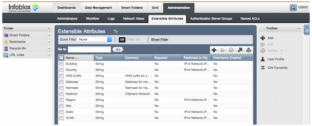
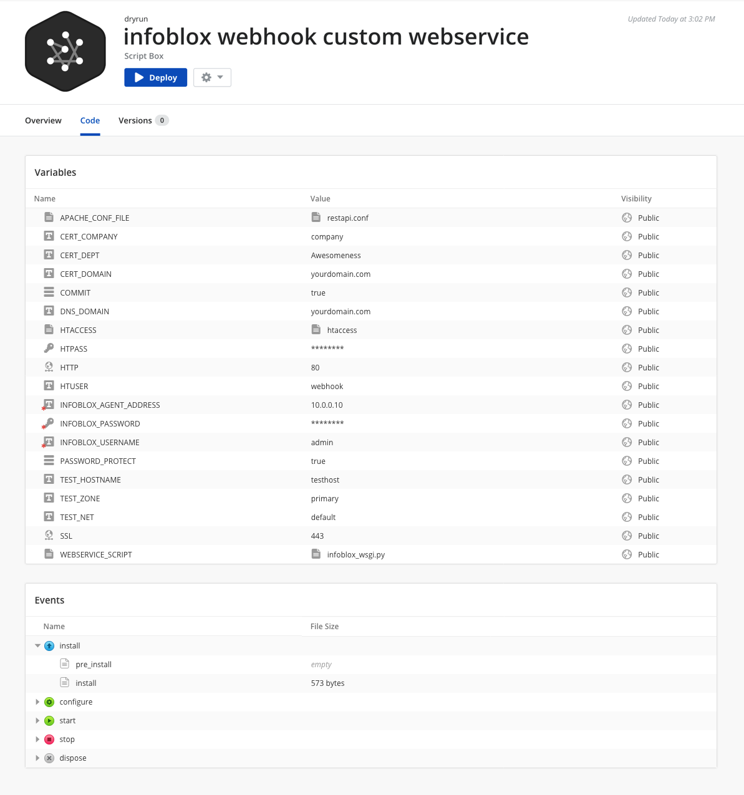
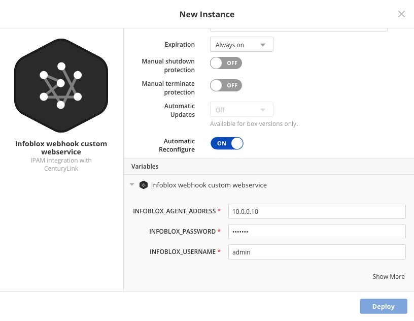
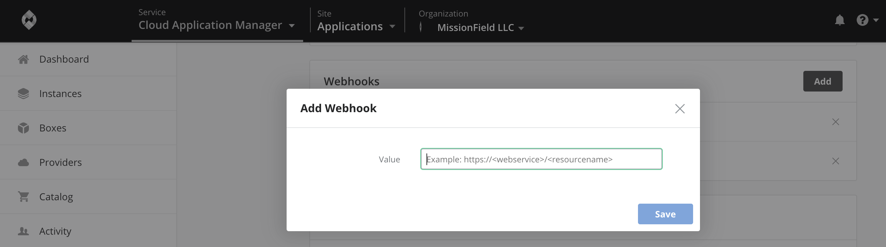

{{{
"title": "Integrate Network Management Solutions with Webhooks",
"date": "05-22-2019",
"author": "Arya Roudi and Sergio Quintana",
"keywords":["cam", "cloud application manager", "organization", "settings", "webhooks", "manage webhooks", "ipam", "dns", "dhcp", "cmdb"],
"attachments": [],
"contentIsHTML": false
}}}

**In this article:**

- [Overview](#overview)
- [Audience](#audience)
- [Prerequisites](#prerequisites)
- [Integrating with Infoblox](#integrating-with-infoblox)
- [Contacting Cloud Application Manager Support](#contacting-cloud-application-manager-support)

### Overview

Cloud Application Manager integrates with IPAM, DNS, DHCP, and CMDB network management solutions over webhooks. Webhooks are available in the Enterprise Edition.

A webhook requires a custom web service to connect to your network management solution. You can build this custom web service as a box. We will show how this works using Infoblox as an example.

Say you deploy an instance to vCenter from Cloud Application Manager. Cloud Application Manager calls the custom Infoblox web service over the webhook and provides the instance IP configuration. The web service passes it to Infoblox. Once the web service gets the IP and domain name from Infoblox, it returns the information to Cloud Application Manager, which assigns the IP configuration to the instance.

### Audience

All users with Cloud Application Manager organization administrator access.

### Prerequisites

* Access to Cloud Application Manager, [Management site](https://account.cam.ctl.io/#/settings).

* The user must be an Administrator of the organization in Cloud Application Manager.

* The user should be at the organization level scope to access the **Settings** option on the left side menu. Accessing that option is also possible through the pencil button of an organization element in the Context Switcher.

### Integrating with Infoblox

In this example, Infoblox provides a static IP and domain name for every instance you deploy through Cloud Application Manager in vCenter.

**Before You Begin**

* Set up a custom specification in vCenter for Linux and Windows if deploying to both platforms.

* Install Infoblox and set it up as follows:

   1. Create a network for every vCenter network to which you deploy from Cloud Application Manager. This has the CIDR range of IP addresses Infoblox can assign. Under Data Management > Toolbar, click **Add** and **Add Network**.

   2. Add global extensible attributes for the vCenter networks. Under Administration > Extensible Attributes, add these four:

   

   * **Network** - Name of the vCenter network.
   * **Gateway** - Address of the vCenter network gateway node.
   * **Netmask** - Subnet address for the vCenter network.
   * **DNS Suffix** - Domain name suffix that registers and resolves the DNS name.

   3. Add the four global extensible attributes to each network. Edit each network. Under Extensible Attributes, add the attributes and specify values.
      

      When you deploy, Cloud Application Manager maps the network you select in the deployment policy to these Infoblox network attributes to derive the right IP configuration.

**Steps**

1. Create a custom Infoblox web service. We define the web service in a box. [Contact us](mailto:incident@CenturyLink.com) to share the box with you.

   

   **Install script**

   This box installs Python, Python dependencies, and the Apache web server.

   ```
   #!/bin/bash

   yum -y install httpd mod_wsgi python-virtualenv
   curl -k https://bootstrap.pypa.io/get-pip.py | python

   pip install --upgrade bottle
   pip install --upgrade requests
   ```

   **Configure script**

   The box configures Apache using the virtual.conf file variable. To create the web service endpoint, it runs the webhook.py script from a file variable.

   ```
   #!/bin/bash

   mkdir -p /var/www/webhook

   curl -k \{{ VIRTUAL_CONF }} -o /etc/httpd/conf.d/default.conf
   curl -k \{{ WEBHOOK_PY }} | elasticbox config -o /var/www/webhook/webhook.py
   ```

   Here’s the Python script to create the web service endpoint:

   ```
   #!/usr/bin/python
   # -*- coding: utf-8 -*-

   Cloud Application Manager Confidential
   Copyright (c) 2013 All Rights Reserved, Cloud Application Manager Inc.

   '''
   NOTICE:  All information contained herein is, and remains the property
   of Cloud Application Manager. The intellectual and technical concepts contained herein are
   proprietary and may be covered by U.S. and Foreign Patents, patents in process,
   and are protected by trade secret or copyright law. Dissemination of this
   information or reproduction of this material is strictly forbidden unless prior
   written permission is obtained from Cloud Application Manager
   '''

   import json
   import bottle
   import requests

   from bottle import route, run, request

   def allocate_address_with_infoblox(network, name):
       net_url = \
           'https:///wapi/v1.4/network?_return_fields=extattrs&*Network=%s'
       ip_url = \
           'https:///wapi/v1.4/%s?_function=next_available_ip&num=1'
       a_record_url = 'https:///wapi/v1.4/record:a'
       ptr_record_url = \
           'https:///wapi/v1.4/record:ptr'

       auth = ('', '')

       networks = requests.get(net_url % network, auth=auth,
                               verify=False).json()

       if len(networks) > 0:
           address = requests.post(ip_url % networks[0]['_ref'],
                                   auth=auth, verify=False).json()['ips'
                   ][0]

           dns_suffix = networks[0]['extattrs']['Suffix']['value']
           name = '{0}.{1}'.format(dns_suffix, name)

           a_record = {'ipv4addr': address, 'name': name,
                       'view': 'default'}
           ptr_record = {'ipv4addr': address, 'ptrdname': name,
                         'view': 'default'}

           a_response = requests.post(a_record_url, auth=auth,
                                      data=json.dumps(a_record),
                                      verify=False)
           ptr_response = requests.post(ptr_record_url, auth=auth,
                   data=json.dumps(ptr_record), verify=False)

           return {
               'ipv4_address': address,
               'subnet_mask': networks[0]['extattrs']['Netmask']['value'],
               'default_gateway': networks[0]['extattrs']['Gateway'
                       ]['value'],
               'preferred_nameserver': '8.8.8.8',
               }

   def search(items, name):
       for item in items:
           if item['name'] == name:
               return item['value']

       return ''

   @route('/requestIP', method='POST')
   def requestIP():
       body = json.load(request.body)
       machine = body['machine']
       service = body['service']
       instance = body['instance']

       variables = []

       if 'vsphere' in machine['schema']:
           if instance['operation'] == 'terminate':
               print 'Deallocate IP address'
               return {}

           is_infoblox = True
           variables = instance['variables']
           for variable in instance['variables']:
               if variable['name'] == 'IPV4_ADDRESS' and variable['value'] \
                   != '':
                   is_infoblox = False

           if is_infoblox:
               network = allocate_address_with_infoblox(service['profile'
                       ]['network'], machine['name'])
               if network:
                   machine['customization'] = \
                       {'instance_networks': [network]}
           else:
               nameservers = find(variables, 'NAME_SERVERS')
               preferred_nameserver = nameservers.split(',')[0]
               alternate_nameserver = nameservers.split(',')[1]

               machine['customization'] = {
                   'ipv4_address': find(variables, 'IPV4_ADDRESS'),
                   'subnet_mask': find(variables, 'SUBNET_MASK'),
                   'default_gateway': find(variables, 'DEFAULT_GATEWAY'),
                   'preferred_nameserver': preferred_nameserver,
                   'alternate_nameserver': alternate_nameserver,
                   'dns_suffixes': find(variables, 'DNS_SUFFIXES'
                           ).split(','),
                   }

       return machine

   @route('/test//', method='GET')
   def testIP(network, name):
       return allocate_address_with_infoblox(network, name)

   application = bottle.default_app()
   ```

2. Deploy the custom Infoblox web service box. We provide values for the address, password, and user. These are admin credentials to access Infoblox.

   

3. Add the custom Infoblox web service endpoint as a webhook. Under [Admin Settings](admin-overview.md) > Webhooks, enter the endpoint of the deployed webservice as a webhook like this: http://endpoint_of_webservice_instance/requestIP

   

4. To see the Infoblox integration in action, we deploy an instance from Cloud Application Manager to vCenter.
In the deployment policy, we select a custom specification. This acts as a holder for the network information Cloud Application Manager gets from InfoBlox. vCenter overrides the values of the custom specification with the values from Infoblox.

### Contacting Cloud Application Manager Support

We’re sorry you’re having an issue in [Cloud Application Manager](https://www.ctl.io/cloud-application-manager/). Please review the [troubleshooting tips](../Troubleshooting/troubleshooting-tips.md), or contact [Cloud Application Manager support](mailto:incident@CenturyLink.com) with details and screenshots where possible.

For issues related to API calls, send the request body along with details related to the issue.

In the case of a box error, share the box in the workspace that your organization and Cloud Application Manager can access and attach the logs.

* Linux: SSH and locate the log at /var/log/elasticbox/elasticbox-agent.log
* Windows: RDP into the instance to locate the log at ProgramDataElasticBoxLogselasticbox-agent.log
