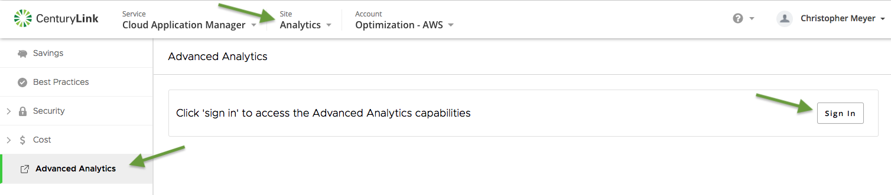

{{{
  "title": "Lumen Cloud Application Manager Advanced Analytics Access",
  "date": "12-14-2018",
  "author": "Ben Swoboda",
  "attachments": [],
  "contentIsHTML": false
}}}

### Overview
This document describes how to access the Advanced Analytics capabilities within CAM.  

### Prerequisites
* Access into Cloud Application Manager with a valid email address
* Access to a workspace with a Lumen optimized AWS account added as a 'Provider'
* Web browser pop-ups are allowed from 'analytics.cam.ctl.io'

### Steps
*  Log into [Cloud Application Manager](https://cam.ctl.io)
*  From the 'Sites' menu select 'Analytics'
*  From the Analytics site's navigation menu choose 'Advanced Analytics'
*  Click 'Sign In'

Please submit a support ticket if you experience any challenges with gaining access.

For any account your user has been associated with you will be able to view the same data described above, plus additional functionality including but not limited to the following, with a variety of filters
