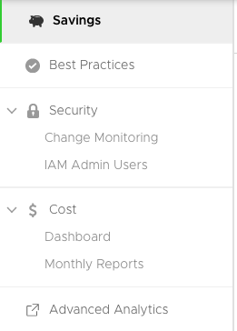
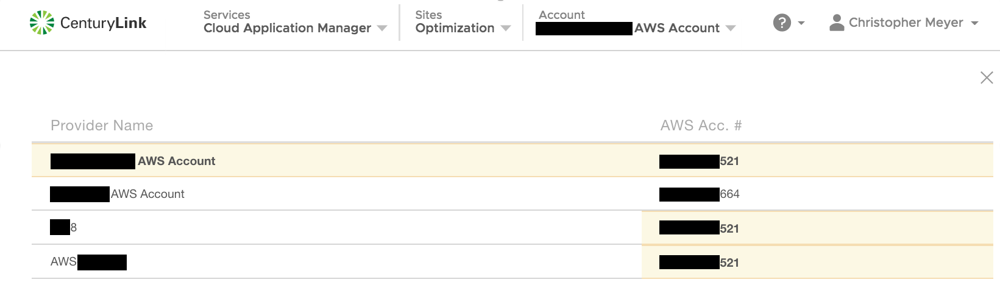

{{{
  "title": "CenturyLink Cloud Optimization Introduction",
  "date": "12-13-18",
  "author": "Ben Swoboda",
  "attachments": [],
  "contentIsHTML": false
}}}

### Overview
In Cloud Application Manager's [Analytics Site](https://analytics.cam.ctl.io) users can view cost savings recommendations, best practices evaluations and cross capability environment configuration reporting. Additionally, users gain direct access to **Advanced Analytics**.

This document describes how to gain access to Analytics and provides a breakdown of the different components that are available: Savings, Best Practices, Security, Cost, and Advanced Analytics.

### Prerequisites
One of the following use cases must have occurred successfully:
* The provider is enabled for [Managed Services](https://www.ctl.io/knowledge-base/cloud-application-manager/managed-services/#1)
* The provider is enabled for [Cloud Optimization](https://www.ctl.io/cloud-application-manager/cloud-optimization)
* The provider is no Optimized or Managed, but enabled for Analytics. (See below)

#### Opting To Use Analytics for a Provider that is Not Optimized or Managed.

Switching the flag to ON at the time you start the provider means CenturyLink will read your Provider's charges in our calculation of Platform Advisory Support. A CAM administrator will have access to pricing details in that Management Site of CAM.  It will give you access to:

* All the reporting described in this document
* An assigned TAM that will cover your Provider environment in addition to the CAM tools and features like Application Lifecycle Management and Analytics.

Switching the flag to OFF at the time you start the provider means Platform Advisory Support only covers your ALM instance fees.

You may switch a provider from OFF to ON after it is created, but to switch from ON to OFF please submit a support ticket.

### The Analytics Site

##### Logging into the Analytics UI

After logging into Cloud Application Manager you can navigate to the Analytics UI by clicking on the **Analytics** site as shown above.  

##### Accounts

After logging in, the user will be able to choose from a list of accounts, for which they have [workspace access](../Core Concepts/workspaces-and-collaboration/workspaces-and-collaboration.md) and that has a valid cloud provider account. After choosing the targeted accounts analytics data will be displayed.

If a provider account is duplicated in one or more workspaces they will be highlighted accordingly.

#### Adding provider to CAM
In order to view a cloud providers analytics data a user must have administrator access to a [shared workspace](../Core Concepts/workspaces-and-collaboration/workspaces-and-collaboration.md) where a valid cloud provider has been added. You can speak to your company's Cloud Application Manager Organization Administrator to guve you access to a shared workspace that has already had the target cloud provider account added as a 'provider' or you can add valid credentials to the providers in your a workspace you can share. It is recommended not to use personal workspaces.  

##### Savings
Here your linked account will detail opportunities for you to reduce your cloud spend due to resources that are idle, unused or mis-provisioned.  

##### Best Practices
This section evaluates your cloud provider account against over 300 checks to ensure proper utilization of your infrastructure in the categories of cost, security, availability and usage.

##### Security

**Change Monitoring**

The Change Monitoring report allows you to track changes that occur within your AWS account. Affected instances are identified by change type, identifier, region, and time of change. You can expand the change record for even more details.

**IAM Admin Users**

Lists the IAM Admin users within the account. Each user is identified by name, last access, create date, and password last used date. The user detail can be expanded to reveal the specific ARN, the User ID, and the groups to which users belong.

##### Cost

 Financial data provided for budgeting and management purposes and may vary from invoice. For a more accurate representation of your actual billing usage history, see the [Usage History](../Cloud Optimization/partner-cloud-integration-detailed-billing-report.md) report.

**Dashboard**

A visual representation of the current month-to-date cost estimate, the breakdown of that estimate by service, and a rough summary of the last three months total.

**Monthly Reports**

Historical, monthly statistics for each month the account has been available for analytics. The Month To Date (or End of Month) cost, Average Daily Cost, Highest Cost Day, and Lowest Cost Day are all shown. In addition, a table presents a breadown of the month's costs either by service or by day.

##### Advanced Analytics

Learn how to [gain access](AdvancedAnalyticsAccess.md).

To gain the deepest insight CenturyLink can provide, follow steps described in the link above. Actual functionality is not limited to the following list.

**AWS**

* Cost Changes
* Spend Analysis for individual services by Usage Types
* Reservation Inventories for individual services
* Tag details, including tagging rules, tag mapping
* Inventories by service, including lists by a variety of general and service-specific categories.
* Security reports including Perimeter Assessments, Permissions for S3 and Ec2, S3 Encryption
* Security reports including Activity Monitoring for APIs, OS Logs, VPC Flow Logs, and AWS Config
* Security reports for VPC data including AWS service inventories, summaries and Traffic Analysis
* Custom reporting
* Advanced Filtering and Grouping

**Azure**

* Savings
* Best practices
* Cost dashboards and summaries
* Spend Analysis
* Inventories by service, including lists by a variety of general and service-specific categories (images, scale sets, snapshots)
* Security reports including Perimeter Assessments; lists of Security Groups, Virtual Networks, Public IP Addresses, Load Balancers, Application Gateways, and Subnets
* Activity Monitoring of Changes
* Utilization reports for right-sizing
