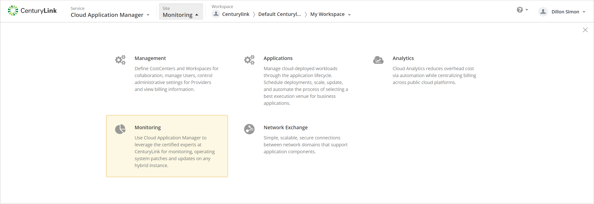

{{{
  "title": "CenturyLink Cloud Optimization Introduction",
  "date": "12-06-2018",
  "author": "Ben Swoboda",
  "attachments": [],
  "contentIsHTML": false
}}}

### Introduction
The Cloud Application Manager [Analytics UI](https://analytics.cam.ctl.io) is a location where users can view cost savings recommendations, best practices evaluations and cross capability environment configuration reporting for cloud providers that are being monitored as part of our [Cloud Optimization](https://www.ctl.io/cloud-application-manager/cloud-optimization) offering.   

### Overview
This document describes how to access the Analytics UI and provides a breakdown of the different views that are available in each of the main components of the UI which consists of Savings and Best Practices.

##### Savings
Here your linked account will detail opportunities for you to reduce your cloud spend due to resources that are idle, unused or mis-provisioned.  

##### Best Practices
This section evaluates your cloud provider account against over 300 checks to ensure proper utilization of your infrastructure in the categories of cost, security, availability and usage.   

##### Accounts

After logging in, the user will be able to choose from a list of accounts, for which they have [Administrator access](https://www.ctl.io/knowledge-base/cloud-application-manager/core-concepts/workspaces-and-collaboration/#workspaces) to a workspace and that has a valid cloud provider account. After choosing the targeted accounts analytics data will be displayed.

If a provider account is duplicated in one or more workspaces they will be highlighted accordingly.

##### Logging into the Analytics UI

After logging into Cloud Application Manager you can navigate to the Anlaytics UI by clicking on the **Analytics** site as shown above.  

#### Adding provider to CAM
In order to view a cloud providers analytics data a user must have [Access](https://www.ctl.io/knowledge-base/cloud-application-manager/core-concepts/workspaces-and-collaboration/#workspaces), to a [shared workspace](https://www.ctl.io/knowledge-base/cloud-application-manager/core-concepts/workspaces-and-collaboration/#sharing-boxes-instances-and-providers) where a valid on-boarded cloud provider has been added. If the administrator does not wish for users of CAM to be able to do anything except read data, they should provide Visitor access to the workspace. You can speak to your company's Cloud Application Manager Organization Admin to add you as an 'administrator' to a shared workspace that has already had the target cloud provider account added as a 'provider' or you can add valid credentials to the 'providers' in your personal workspace.  
