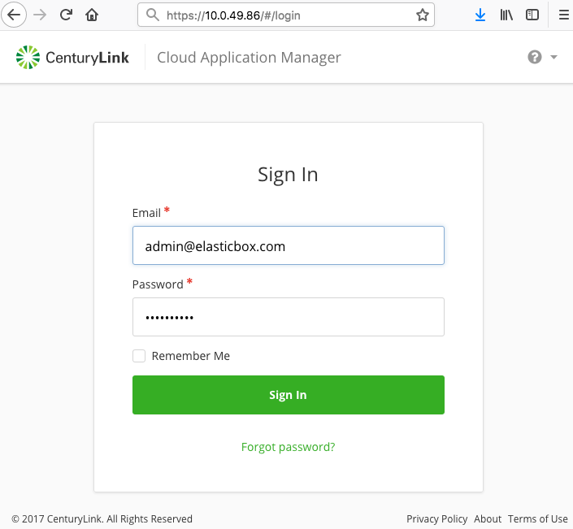
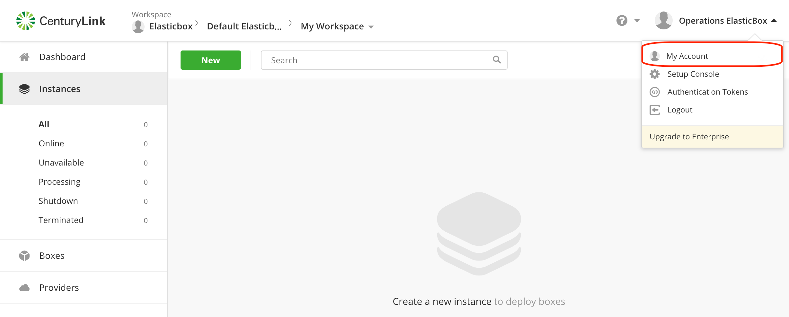
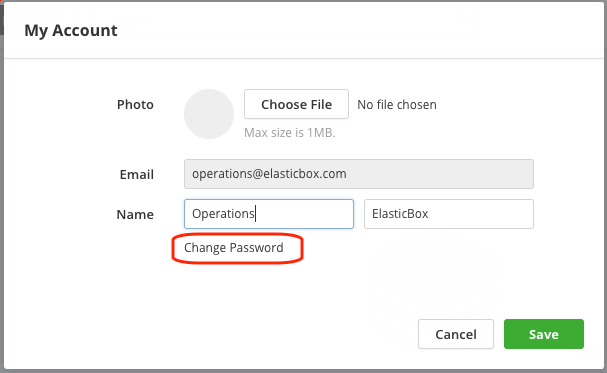
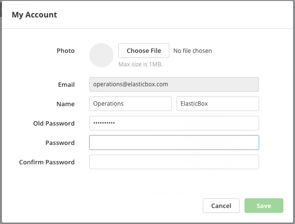
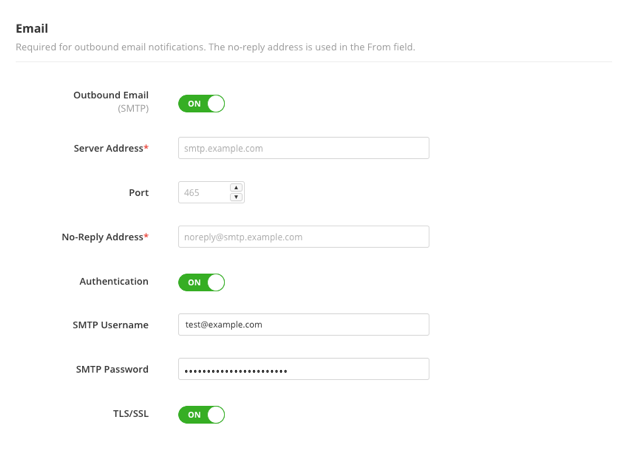

{{{
"title": "Setting Up Cloud Application Manager for Use",
"date": "09-01-2016",
"author": "",
"attachments": [],
"contentIsHTML": false
}}}

### Setting Up Cloud Application Manager for Use
Once you install the appliance, set it up for others in your organization to use. At the least, assign a friendly hostname or vanity URL to point users to Cloud Application Manager. Optionally, configure other settings such as add SSH keys to access the appliance, sync NTP system time, enable outbound email notifications, or switch to a new device to store appliance and Cloud Application Manager data.

**In this article:**
* Initial Cloud Application Manager Setup
* Changing the Cloud Application Manager Hostname
* Changing the Appliance Admin Account Password
* Adding your SSH Key (optional)
* Changing NTP Time Zone (optional]
* Enabling SMTP Outbound Email (optional)
* Switching Appliance Device Root Storage

### Initial Cloud Application Manager Setup

**Steps**

1. Log in to Cloud Application Manager on the appliance

   * Get the Cloud Application Manager IP address from the appliance VM console.
   

   Log in to Cloud Application Manager with the default appliance admin credentials:
   * username: **admin@elasticbox.com**
   * password: elasticbox123

   

2. Set up Cloud Application Manager.

   From the menu drop-down at the top right, click **Setup Console**. From this page, you can manage settings for the appliance.
   

   * Change the hostname to a friendly URL.
   * Optionally, change the default admin account password.
   * Optionally, add SSH keys to manage access to the appliance virtual machine.
   * Optionally, change the NTP time zone, which affects the timestamp in the appliance logs.
   * Optionally, enable outbound for notifications.
   * Optionally, switch the appliance device storage to increase storage or processing speed.

3. Create a new admin account for your enterprise

   Follow this step if using the Cloud Application Manager Enterprise Edition.
   Cloud Application Manager provides a default appliance admin account, which gives full access to manage the appliance and administer Cloud Application Manager settings for your organization. This is like a master key, so use it only in case of emergency. To administer the appliance and Cloud Application Manager on a regular basis, create and use a fresh admin account.

   Log out of Cloud Application Manager. Browse to the Cloud Application Manager IP address in the appliance VM console. Sign up for a new user account. This will serve as the new admin account.

   Log back in as the appliance admin using the credentials in step 1. Add your new user account as an administrator in the Admin Console. Going forward, use this admin account to manage the appliance and settings for your organization.

### Changing the Cloud Application Manager Hostname
Hostname is a friendly name for the Cloud Application Manager IP address for example, yourcompany.com:80 or name.example.com:443. The hostname should point to the IP address of the appliance virtual machine. To allow users to connect, also make sure your network firewall allows inbound traffic to the appliance IP address via TCP ports 80, 443, 5671, and 5672.

**Steps**

1. Browse to Cloud Application Manager with the IP address in the appliance console and log in as an admin.
2. From the menu drop-down at the top right, click **Setup Console**.
3. Under Hostname, specify a valid IP or hostname that resolves to a valid IP address. Make sure that it’s a fully qualified domain name that meets the following criteria:

   * Appliance can access it.
   * Deployed instances can access it.
   * Users in the network can browse to the Cloud Application Manager UI.

4. When done, scroll down and click **Save Settings**.

   **IMPORTANT:** When you change the hostname, any instances you launched previously can potentially become unavailable if the appliance obtains its IP address dynamically. To avoid this, set a static address for the appliance.

### Changing the Appliance Admin Account Password
Change the appliance admin account password to keep it secure.

### Adding Your SSH Key (Optional)
Allow SSH access to the appliance virtual machine for the appliance admin account. You can SSH into the appliance virtual machine only using the keys you add here. SSH access is helpful if you want to look at logs and such.

**Steps**
1. Browse to Cloud Application Manager with the IP address in the appliance console and log in as an admin.
2. From the menu drop-down at the top right, click **Setup Console**.
3. Under SSH Access, click **Add New Key**.
4. If you don’t have one already, generate a key using ssh-keygen -t rsa and paste in the public key.
5. When done, scroll down and click **Save Settings**.

### Changing NTP Time Zone (Optional)
This shows the network time protocol (NTP) setting on the appliance. By default, it’s set to the time zone of the host running the appliance. You can optionally change the NTP server and time zone. The appliance uses this to determine the timestamp in logs.

**Steps**
1. Browse to Cloud Application Manager with the IP address in the appliance console and log in as an admin.
2. From the menu drop-down at the top right, click **Setup Console**.
3. Under Time, specify these settings.
4. When done, scroll down and click **Save Settings**.

| Setting | Description |
|---------|-------------|
| Primary   NTP Server | URL or IP address of the primary NTP server. |
| Secondary   NTP Server | Optional. URL or IP address of the secondary NTP server. |
| Time Zone | Appliance host system time zone. |

### Enabling SMTP Outbound Email (Optional)
We recommend that you specify SMTP server settings to be able to auto send outbound email notifications in Cloud Application Manager. The no-reply address is used in the From field. Under Email, click **ON** to enable outbound email.

**Steps**
1. Browse to Cloud Application Manager with the IP address in the appliance console and log in as an admin.
2. From the menu drop-down at the top right, click **Setup Console**.
3. Under Email, specify these settings.
4. When done, click **Save Settings**.

| Setting | Description |
|---------|-------------|
| Server Address | Specify the hostname or IP address of the SMTP mail server, for example, smtp.example.com. |
| Port | Typically, you can specify 25 for SMTP and 465 for SMTPS. |
| No-Reply Address | Specify the email address to use in the sender address (or from) field of notification messages. |
| Authentication | Set to **ON** if your SMTP server requires authentication to send emails. |
| SMTP Username | Enter the full email address of a username, such as **username@example.com** used to authenticate with the SMTP server. |
| SMTP Password | Enter the password for the SMTP username. |
| TLS/SSL | Set to **ON** if emails are encrypted using TLS or SSL. |

### Switching Appliance Device Root Storage
When you install the appliance, the appliance VM by default gets 100 GB of virtual disk space. For more storage or faster performance, attach a new disk to the VM and make that the primary appliance storage. Do this before you start using Cloud Application Manager. Here are the steps.

**Steps**
1. In vSphere vCenter, power off the appliance VM and attach a second virtual disk with more CPU, RAM, and disk space. For more information, see the [vCenter 5.0](http://pubs.vmware.com/vsphere-50/topic/com.vmware.ICbase/PDF/vsphere-esxi-vcenter-server-50-storage-guide.pdf) and [vCenter 5.5](http://pubs.vmware.com/vsphere-55/topic/com.vmware.ICbase/PDF/vsphere-esxi-vcenter-server-55-storage-guide.pdf) help.
2. Power on the appliance VM. In the appliance Setup Console under Block Device, select the second disk as the primary appliance storage.
   

3. When done, click **Save Settings**.

When you switch the disk, the appliance reboots and becomes unavailable for a few minutes. In that time, it copies over existing data from the other disk like specific appliance settings, logs, the database, and the saved state of RabbitMQ. It also copies all the generated data to the second disk. When the appliance VM is back online, you can start using Cloud Application Manager.

### Contacting Cloud Application Manager Support

We’re sorry you’re having an issue in [Cloud Application Manager](https://www.ctl.io/cloud-application-manager/). Please review the [troubleshooting tips](../Troubleshooting/troubleshooting-tips.md), or contact [Cloud Application Manager support](mailto:incident@CenturyLink.com) with details and screenshots where possible.

For issues related to API calls, send the request body along with details related to the issue.

In the case of a box error, share the box in the workspace that your organization and Cloud Application Manager can access and attach the logs.
* Linux: SSH and locate the log at /var/log/elasticbox/elasticbox-agent.log
* Windows: RDP into the instance to locate the log at ProgramDataElasticBoxLogselasticbox-agent.log
