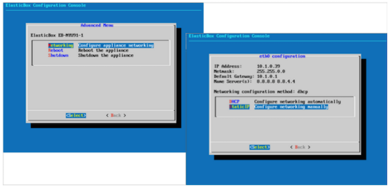

{{{
"title": "Configuring the Appliance Network Settings",
"date": "09-01-2016",
"author": "",
"attachments": [],
"contentIsHTML": false
}}}

### Configuring the Appliance Network Settings
Once up and running, configure how the appliance connects to the network. By default, it tries to get a dynamic IP address via DHCP. But we recommend that you set a static IP address with these steps so that Cloud Application Manager services are always available at the same address to users.

**Steps**
1. Locate the VM console where you installed the appliance in vCenter or OpenStack.
   

2. In the Advanced Menu, select **Networking > Static IP**.
   

3. Enter settings based on your network configuration to set up a static IP address for the appliance. When done, click **Apply**.
   

   * **IP Address** - Unique IPv4 address the appliance needs to connect to the network.
   * **Netmask** - Subnet mask or address of nearest local area network, for example, 255.255.255.0.
   * **Default Gateway** - Enter the subnet router’s IP address. This is similar to the IP address except for the last digit.
   * **Name Server** -  Enter the preferred and alternate DNS server addresses in each name server field.

4. Reboot the appliance to apply the configuration changes. In the appliance console, click **Advanced Menu > Reboot**.

### Contacting Cloud Application Manager Support

We’re sorry you’re having an issue in [Cloud Application Manager](https://www.ctl.io/cloud-application-manager/). Please review the [troubleshooting tips](../Troubleshooting/troubleshooting-tips.md), or contact [Cloud Application Manager support](mailto:incident@CenturyLink.com) with details and screenshots where possible.

For issues related to API calls, send the request body along with details related to the issue.

In the case of a box error, share the box in the workspace that your organization and Cloud Application Manager can access and attach the logs.
* Linux: SSH and locate the log at /var/log/elasticbox/elasticbox-agent.log
* Windows: RDP into the instance to locate the log at ProgramDataElasticBoxLogselasticbox-agent.log
