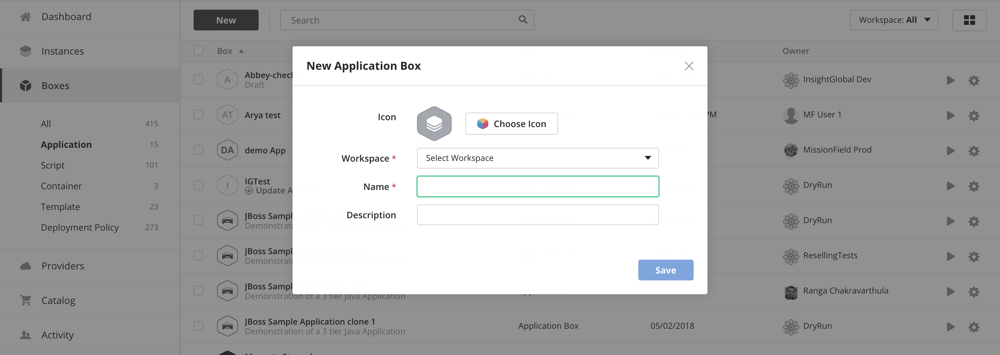

{{{ 
"title": "Application Boxes",
"date": "12-28-2018",
"author": "Julio Castanar",
"keywords": ["cam","alm","boxes", "box", "application box", "topology"],
"attachments": [],
"contentIsHTML": false
}}}

**In this article:**

* [Overview](#overview)
* [Audience](#audience)
* [Prerequisites](#prerequisites)
* [What are application boxes?](#what-are-application-boxes)
* [Creating application boxes](#creating-application-boxes)
* [Application box topology](#application-box-topology)
* [Contacting Cloud Application Manager Support](#contacting-cloud-application-manager-support)

### Overview

This article is meant to assist Cloud Application Manager customers who want to [create and manage boxes](../Core Concepts/boxes.md). 
It explains how to use the Application box which deploys several instances that an application executes. 
An application box defines a topology of [Script boxes](script-box.md), [Template boxes](template-box.md) and [Container boxes](docker-container-service.md).

### Audience

Cloud Application Manager Users using Application Lifecycle Management (ALM) features.

### Prerequisites

* Access to [Applications site](https://cam.ctl.io/#/boxes) (Application Lifecycle Management module) of Cloud Application Manager as an authorized user.

* A provider already configured in Cloud Application Manager. See [administering providers](../Administering Your Organization/admin-overview.md#Providers).

### What are application boxes?

To deploy most applications, you need several instances cooperating together. Application boxes are a way to define and reuse how several boxes will work together to run an application.

What differences *Application Boxes* from *Script Boxes* is that deploying one application box creates several instances, while deploying a Script Box creates one instance. You can think of an application box as a way to simplify deploying several instances.

An application box defines a topology. A topology is a list of boxes and all the information needed to deploy them. This way you can launch several instances to work together.

Next figure shows the topology of an Applicaction box and all the instances deployed with it.

Using applcation boxes makes deploying several instances fast and prevent errors. The instances deployed can be managed separately if needed, allowing you to adapt each running application as needed. Each box in the topology includes the information needed to deploy it as an instance.

### Creating application boxes

To create an application box just go to the boxes page and click new and select application box.

You only need to configure the name of the application box.

### Application box topology
Once the application box is created, contained topology is showed.
A topology is a description of the required boxes and how they will be deployed as instances. 
You can add new boxes from the code section page (see first figure above). 
For every box, you can define:

* The name of the resulting instance
* The version of the box
* The tags that the instance will have
* The requirements needed to be fulfilled by its policy box
* The value of each variable of the box

This is equivalent to the values you need to provide to deploy that box as an instance, except the policy box and requirements. When you deploy other types of boxes, you must select one policy box for an instance. The box includes a list of requirements that must appear as claims in the Policy box. For more information see [Claims and Requirements](../Automating Deployments/deploymentpolicy-box.md#claims-and-requirements)

In Application boxes, a policy box is automatically selected for each box in the topology. If you need different boxes of the topology to have different policies, you can simply add restrictions in the Requirements field.

For example, if you want to deploy an application across regions, you could add a requirement zone-a for some of the boxes and zone-b for others. That way different instances will be run with different policies, going to different regions.

After adding all the boxes to the topology, you can deploy the application box clicking on deploy and all the configuration will be deployed for you.

### Contacting Cloud Application Manager Support

We’re sorry you’re having an issue in [Cloud Application Manager](https://www.ctl.io/cloud-application-manager/). Please review the [troubleshooting tips](../Troubleshooting/troubleshooting-tips.md), or contact [Cloud Application Manager support](mailto:incident@CenturyLink.com) with details and screenshots where possible.

For issues related to API calls, send the request body along with details related to the issue.

In the case of a box error, share the box in the workspace that your organization and Cloud Application Manager can access and attach the logs.
* Linux: SSH and locate the log at /var/log/elasticbox/elasticbox-agent.log
* Windows: RDP into the instance to locate the log at \ProgramData\ElasticBox\Logs\elasticbox-agent.log
