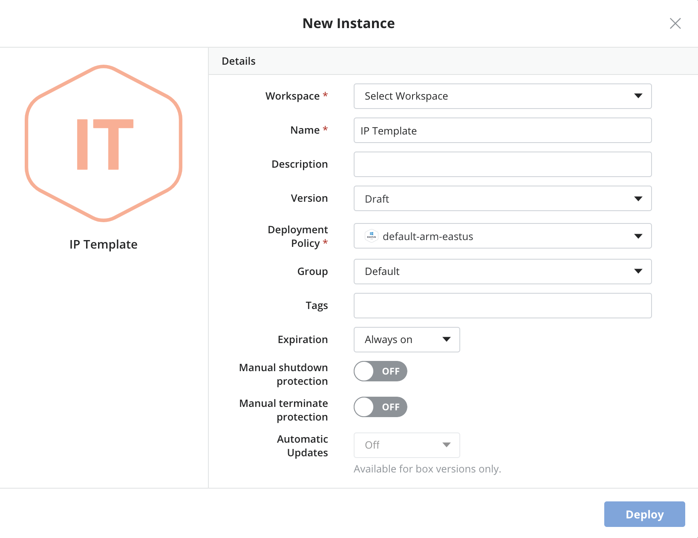

{{{ "title": "Template Boxes",
"date": "12-21-2018",
"author": "Cristina Torres, Amalia Garcia de Mirasierra",
"attachments": [],
"contentIsHTML": false,
"keywords": ["arm","azure resource manager", "template box", "cloud application manager", "deployment templates", "cam", "alm", "application lifecycle management"]
}}}
**In this article:**

* [Overview](#overview)
* [Audience](#audience)
* [Prerequisites](#prerequisites)
* [Create an Azure Resource Manager Template and Launch a Stack](#create-an-azure-resource-manager-template-and-launch-a-stack)
* [Update an Azure Resource Manager Stack in Real-Time](#update-an-azure-resource-manager-stack-in-real-time)
* [Connect to Other Azure Resource Manager Boxes over Bindings](#connect-to-other-azure-resource-manager-boxes-over-bindings)
* [Getting General Support](#getting-general-support)

### Overview

This article is meant to assist users of Cloud Application Manager willing to use Cloud Application Manager template boxes to create or edit Azure Resource Manager (ARM) templates.

### Audience

All users of Cloud Application Manager who wants to define and use ARM Template Boxes.

### Prerequisites

* An active *Cloud Application Manager* account
* An existing *Azure* subscription configured in a [Microsoft Azure](../Deploying Anywhere/using-microsoft-azure.md) provider.

### Create an Azure Resource Manager Template and Launch a Stack

The Azure Resource Manager Template box consists mainly of a template where you describe all the AWS resources you need to run your application. Cloud Application Manager parses the template and automatically shows input parameters under a section called Variables. This enables you to customize a template easily.

We use a sample Wordpress template to show how to create and launch a Azure Resource Manager template in Cloud Application Manager.

**Step 1. Create the template**

1. [Log in](https://www.ctl.io/cloud-application-manager/) to Cloud Application Manager.

2. Click **Boxes > New > Template > Azure Resource Manager Template**. Give the box a meaningful name to identify it in the box service catalog. Specify other [metadata](../Core Concepts/boxes.md).

     

3. In the box, select **New** in Template, under Code tab. In this walkthrough, we import a [sample WordPress template](https://s3.amazonaws.com/cloudformation-templates-us-east-1/WordPress_Single_Instance_With_RDS.template) from a URL. When we save, contents from the URL are ported over.

    

    Besides URL, you have a couple of other options to create a template:

    * **Blank Template**. Develop one from scratch. When you save, you have a blank template you can start authoring.
    * **File**. Upload an existing template. When you save, the contents of the file are available in the template. You can upload one up to 1MB in size.

    **Note:** When you import from a file or a URL, make sure its content is formatted in JSON and follows the Azure Resource Manager template conventions.

**Step 2. Author the template**

1. Start with a [sample Azure Resource Manager template](https://github.com/Azure/azure-quickstart-templates/) and click the pencil to modify.

     

     **Note**: For more information on creating templates, please refer to the official [documentation](https://docs.microsoft.com/en-us/azure/azure-resource-manager/resource-group-authoring-templates).

2. Customize parameters. Although optional, if you have them in the template, they’re automatically shown under Variables. You can customize several parameters as in this example.

     

     Variables in Azure Resource Manager boxes:

    * Bindings have a special use and are explained later in this walkthrough.

    * Variables imported from a template are always required at deploy time even if you don’t flag them as such in the box. Since they must contain values at launch time, you can set a default value when creating them or supply them at deploy time.

    * The text variable can be parametrized through Jinja, for example to use binding information. See more documentation about this [here](syntax-for-variables.md).

    * At this time, [box type variables](parameterizing-boxes-with-variables.md) are not supported.

    * The file variable is a useful way to include a script that you want to execute in your stack. When you add a file, Cloud Application Manager stores it on a secure server and declares the file variable as a parameter with a URL value in the parameters section of the template. To execute the file, you can add a script in the user data section of the template. Or depending on your resource type, reference it from the resource properties section. One example for using a file is to store it in the S3 bucket that you launch as part of the stack.

**Note:** As you’re authoring, it’s important to check that the template is valid. While Cloud Application Manager validates the correctness of the JSON format and the template syntax correctness, we can’t know whether resources specified are available in your AWS account or whether property values of a resource are valid. For that level of checking, it’s best to test launch the Azure Resource Manager box instance from Cloud Application Manager and refine the template in real-time.

**Step 3. Launch the Azure Resource Manager stack**

1. On the box page, click **Deploy**.

2. For Deployment Policy, select an ARM Deployment Policy Box added in Cloud Application Manager to indicate the location and the availability zone to launch the stack.

    

3. Optionally, add tags for bindings, [auto schedule the instance](../Deploying Anywhere/deploying-managing-instances.md), and set [auto updates](../Core Concepts/boxes.md).

4. Under Variables, set values for each parameter based on the **AllowedValues** property in the template parameters section.

5. Click **Deploy** to launch the stack.

    **Note:** When launched successfully, website URL is available in the instance lifecycle editor. Click **Lifecycle Editor** on the instance page and look under WebsiteURL.

    

### Update an Azure Resource Manager Stack in Real-Time

In the LCE, you can update the template and variables to change your current deployment.

Cloud Application Manager will check the different resources and update the ones that need it in your instance Resource Group to match your new template.

Please, check with Azure documentation to know which live updates are allowed and which resources will be destroyed and redeployed.

### Connect to Other Azure Resource Manager Boxes over Bindings

Large Azure Resource Manager deployments are challenging to manage in a single template. To simplify, break the template into smaller, manageable ARM boxes and connect them with [bindings](managing-multi-tier-applications.md). Then use [text expressions](parameterizing-boxes-with-variables.md) to call the bindings. When you do, they’re added to the parameter section of the template. At deploy time, the Azure Resource Manager service calls the binding to connect and pass values between boxes.

To illustrate, we create a second Azure Resource Manager box to scale the WordPress blog instance automatically when past its load limit. In the following steps, we add a binding and call it to connect the WordPress box to the autoscaling box.

**Steps**

1. Go to an Azure Resource Manager box.

2. Add a binding to the Azure Resource Manager box.

     

     ### Getting General Support

     Customers can contact the CenturyLink Global Operations Support center (support desk) directly for getting help with Cloud Application Manager as well as any other supported product that they’ve subscribed to.  Below are three ways to get help.

     #### Contact:

     1. **Phone:** 888-638-6771

     2. **Email:** incident@centurylink.com

     3. **Create Ticket in Cloud Application Manager:** Directly within the platform, users can “Create Ticket” by clicking on the “?” symbol in upper right corner near the users log-in profile icon.  This takes users directly to the Managed Servicers Portal where they can open, track and review status of issues that have been raised with the support desk.  Additionally, this is how a TAM can be engaged as well.

     #### Instructions:

     1. Provide your name
     2. Cloud Application Manager account name
     3. A brief description of your request or issue for case recording purposes

     The support desk will escalate the information to the Primary TAM and transfer the call if desired.
