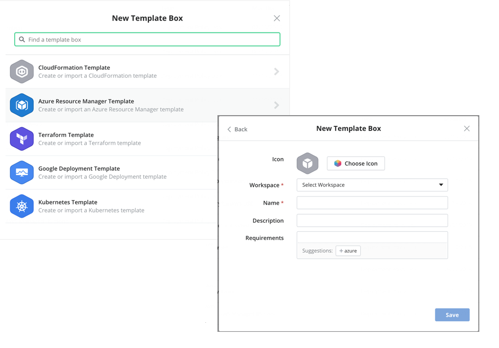
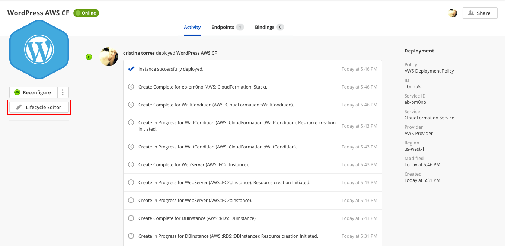
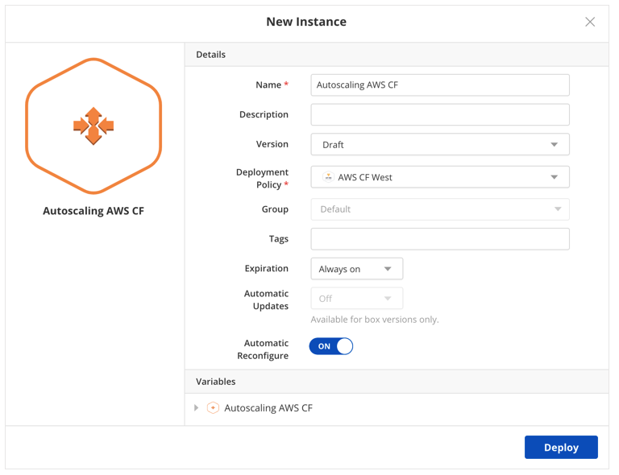
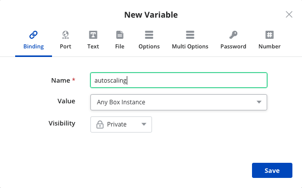

{{{ "title": "CloudFormation Template Boxes",
"date": "12-21-2018",
"author": "Cristina Torres, Amalia Garcia de Mirasierra",
"attachments": [],
"contentIsHTML": false,
"keywords": ["aws","cloudformation", "template box", "cloud application manager", "cf templates", "cam", "alm", "application lifecycle management"]
}}}
**In this article:**

* [Overview](#overview)
* [Audience](#audience)
* [Prerequisites](#prerequisites)
* [Create a CloudFormation Template and Launch a Stack](#create-a-cloudformation-template-and-launch-a-stack)
* [Update a CloudFormation stack in real-time](#update-a-cloudformation-stack-in-real-time)
* [Connect to other CloudFormation boxes over bindings](#connect-to-other-cloudformation-boxes-over-bindings)
* [Getting General Support](#getting-general-support)

### Overview

This article is meant to assist users of Cloud Application Manager willing to use Template Boxes to create or edit AWS CloudFormation templates.

### Audience

All users of Cloud Application Manager who wants to define and use AWS Template Boxes.

### Prerequisites

* An active *Cloud Application Manager* account
* An existing *AWS* account configured in an [*AWS*](../Deploying Anywhere/using-your-aws-account.md) provider.

#### Create a CloudFormation Template and Launch a Stack

The CloudFormation box consists mainly of a template where you describe all the AWS resources you need to run your application. Cloud Application Manager parses the template and automatically shows input parameters under a section called Variables. This enables you to customize a template easily.

We use a sample Wordpress template to show how to create and launch a CloudFormation template in Cloud Application Manager.

**Step 1. Create the template**

1. [Log in](https://www.ctl.io/cloud-application-manager/) to Cloud Application Manager.

2. Click **Boxes > New > Template > CloudFormation Template**. Give the box a meaningful name to identify it in the box service catalog. Specify other [metadata](../Core Concepts/boxes.md).

     

3. In the box, select **New** in Template, under Code tab. In this walkthrough, we import a [sample WordPress template](https://s3.amazonaws.com/cloudformation-templates-us-east-1/WordPress_Single_Instance_With_RDS.template) from a URL. When we save, contents from the URL are ported over.

    

    Besides URL, you have a couple of other options to create a template:

    * **Blank Template**. Develop one from scratch. When you save, you have a blank template you can start authoring.
    * **File**. Upload an existing template. When you save, the contents of the file are available in the template. You can upload one up to 1MB in size.

    **Note:** When you import from a file or a URL, make sure its content is formatted in JSON and follows the CloudFormation template conventions.

**Step 2. Author the template**

1. Start with a [sample AWS CloudFormation template](https://aws.amazon.com/cloudformation/aws-cloudformation-templates/) and click the pencil to modify. Here we use the sample WordPress template.

     

	 **Note:** CloudFormation templates have their own taxonomy you must follow. Although a template typically has several sections, only Resources is required. For information and examples on how to declare each section, see [Template Anatomy](https://docs.aws.amazon.com/AWSCloudFormation/latest/UserGuide/template-anatomy.html) and [Template Reference](https://docs.aws.amazon.com/AWSCloudFormation/latest/UserGuide/template-reference.html).

2. Customize input parameters. Although optional, if you have them in the template, they’re automatically shown under Variables. You can customize several parameters as in this example.

     

   Other example is:

     

	 You can customize further by adding parameters under Variables. In this example, we added an Options variable to set the database engine version at deploy time. When we save the variable, notice how it’s automatically added as a parameter to the template in the correct JSON format.

	 

	 Variables in CloudFormation boxes:

    * The template accepts only String, Number, or CommaDelimitedList types. So any variables you add to the box are converted to one of these types. Text, file, password, URL, and email variables are treated as string parameters. Number and port variables are treated as number parameters.

    * Bindings have a special use and are explained later in this walkthrough.

    * Variables imported from a template are always required at deploy time even if you don’t flag them as such in the box. Since they must contain values at launch time, you can set a default value when creating them or supply them at deploy time.

    * At this time, [box type variables](parameterizing-boxes-with-variables.md) are not supported.

    * The file variable is a useful way to include a script that you want to execute in your stack. When you add a file, Cloud Application Manager stores it on a secure server and declares the file variable as a parameter with a URL value in the parameters section of the template. To execute the file, you can add a script in the user data section of the template. Or depending on your resource type, reference it from the resource properties section. One example for using a file is to store it in the S3 bucket that you launch as part of the stack.

**Note:** As you’re authoring, it’s important to check that the template is valid. While Cloud Application Manager validates the correctness of the JSON format and the template syntax correctness, we can’t know whether resources specified are available in your AWS account or whether property values of a resource are valid. For that level of checking, it’s best to test launch the CloudFormation box instance from Cloud Application Manager and refine the template in real-time.

**Step 3. Launch the CloudFormation stack**

1. On the box page, click **Deploy**.

2. For Deployment Policy, select an AWS CloudFormation Deployment Policy added in Cloud Application Manager to indicate the location and the availability zone to launch the stack.

    

3. Optionally, add tags for bindings, [auto schedule the instance](../Deploying Anywhere/deploying-managing-instances.md), and set [auto updates](../Core Concepts/boxes.md).

4. Under Variables, set values for each parameter based on the **AllowedValues** property in the template parameters section.

5. Click **Deploy** to launch the stack.

    **Note:** When launched successfully, website URL is available in the instance lifecycle editor. Click **Lifecycle Editor** on the instance page and look under WebsiteURL.

	

#### Update a CloudFormation Stack in Real-Time

Once live, you can continue to make changes to your CloudFormation template from the instance lifecycle editor and test in real-time. Follow these steps.

**Steps**

1. [Log in](//www.ctl.io/cloud-application-manager/) to Cloud Application Manager.

2. Click Instances and select the CloudFormation instance you want to update. In this example, we’ll select the WordPress instance launched earlier.

3. On the instance page, click **Lifecycle Editor**.

    

4. Update the template and test launch the stack. You can change any section of the template or rewrite it entirely. When ready to update the stack in AWS, click **Reconfigure**. In this example, we increased the RDS database size by changing the value of the DBAllocatedStorage parameter.

    

5. (Optional) Push updates back to the CloudFormation box. When you’re satisfied changing and testing the template in the instance, you can push it back to the CloudFormation box as a version. To do this, click **New** under Versions tabs. This allows you or others in the future to choose a version that best suits your deployment.

    

#### Connect to Other CloudFormation Boxes over Bindings

Large CloudFormation deployments are challenging to manage in a single template. To simplify, break the template into smaller, manageable CloudFormation boxes and connect them with [bindings](managing-multi-tier-applications.md). Then use [text expressions](parameterizing-boxes-with-variables.md) to call the bindings. When you do, they’re added to the parameter section of the template. At deploy time, the CloudFormation service calls the binding to connect and pass values between boxes.

To illustrate, we create a second CloudFormation box to scale the WordPress blog instance automatically when past its load limit. In the following steps, we add a binding and call it to connect the WordPress box to the autoscaling box.

**Steps**

1. Create a CloudFormation box using the [AWS autoscaling template](https://s3-us-west-2.amazonaws.com/cloudformation-templates-us-west-2/AutoScalingMultiAZWithNotifications.template) and deploy it.

    

2. Go to the WordPress box and add a binding to the Autoscaling box.

	 

3. When the WordPress box is deployed, the autoscalebinding variable must be matched with the Autoscaling Instance.

    

4. The relationship created by the binding is showed in the grid view.

    

If some value of the binding is used in the WordPress box configuration, a text expression variable type must be created.

Under Variables, click **New** and select the text expression variable type. Enter this connection string: `\{{ autoscalebinding.address }}`

The expression can contain any string value or variables from templates. It can also contain system variables like instance, username, addresses. In general, follow this syntax: `\{{ binding_name.variable_name }}`

### Getting General Support

Customers can contact the CenturyLink Global Operations Support center (support desk) directly for getting help with Cloud Application Manager as well as any other supported product that they’ve subscribed to.  Below are three ways to get help.

#### Contact:

1. **Phone:** 888-638-6771

2. **Email:** incident@centurylink.com

3. **Create Ticket in Cloud Application Manager:** Directly within the platform, users can “Create Ticket” by clicking on the “?” symbol in upper right corner near the users log-in profile icon.  This takes users directly to the Managed Servicers Portal where they can open, track and review status of issues that have been raised with the support desk.  Additionally, this is how a TAM can be engaged as well.

#### Instructions:

1. Provide your name
2. Cloud Application Manager account name
3. A brief description of your request or issue for case recording purposes

The support desk will escalate the information to the Primary TAM and transfer the call if desired.
