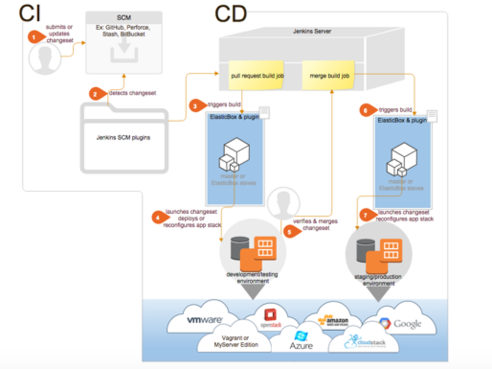

{{{
"title": "Overview of the Jenkins Cloud Application Manager Plugin",
"date": "05-16-2019",
"author": "Julio Castanar",
"keywords": ["cam","cloud application manager", "Jenkins", "plugin", "CI/CD", "continuous integration and deployment" ],
"attachments": [],
"contentIsHTML": false
}}}

**In this article:**

* [Overview](#overview)
* [Audience](#audience)
* [Prerequisites](#prerequisites)
* [Supported CI/CD scenarios](#supported-cicd-scenarios)
* [Next steps in CI/CD with Cloud Application Manager and Jenkins](#next-steps-in-cicd-with-cloud-application-manager-and-jenkins)
* [Contacting Cloud Application Manager Support](#contacting-cloud-application-manager-support)

### Overview

Here is a typical continuous integration and deployment (CI/CD) workflow that starts with developers checking in code and goes a full circle to launch changes in development, testing, staging, and production. See how Cloud Application Manager automates the workflow in every step of the way.

1. Developers submit changes to repository. 
2. Jenkins server has SCM, GitHub (or other repository), Jenkins Cloud Application Manager and other plugins installed. 
3. Pull request changes event in repository triggers build job execution.
4. Jenkins Cloud Application Manager plugin deploys to your app from boxes to any cloud or infrastructure
5. Next jobs in Jenkins project test the deployment environment, verify and finally merge changes
6. Now merge event triggers build release job execution
7. Jenkins Cloud Application Manager plugin deploys to your new release and reconfigures your app

### Audience

If you use Jenkins to continuously test and integrate code changes in development, staging, or production, and you also use Cloud Application manager, you’d want to use the [Jenkins Cloud Application Manager plugin](https://wiki.jenkins-ci.org/display/JENKINS/ElasticBox+CI) to fully automate touchless deployments.

### Prerequisites

* You must have a Cloud Application Manager Account
* You must install in your Jenkins server the [Jenkins Cloud Application Manager plugin](https://wiki.jenkins-ci.org/display/JENKINS/ElasticBox+CI)

### Supported CI/CD scenarios

* **Deploy with zero clicks involved.** After you set up Jenkins with source control management (SCM) plugins, the Cloud Application Manager plugin, and build jobs set up to use it, any code change pushed to the repository automatically trigger Jenkins to test in development or merge them into staging and production environments. The plugin deploys to your apps from boxes to any cloud or infrastructure.

* **Deploy complex multi-tier apps and manage their lifecycle.** Launch multi-tier app stacks from Cloud Application Manager through a single Jenkins build job using flexible binding references. Trigger lifecycle actions on the apps automatically by adding them to build jobs.

* **Orchestrate large-scale deployments without downtime.** Automate deployments at scale with autoscaling and load balancing in AWS or Azure. Make sure your apps are always available and protected from failures, data loss, and downtime as you continuously integrate and deploy in production.

* **Launch slaves on demand.** Configure slaves to automatically execute build jobs concurrently. Slaves help to speed up builds, build in a specific OS, runtime stack, or build changesets for small or large dev teams.

Without the plugin, normally you’d have to manually set up slaves, provision each environment like testing, staging, production with a cloud provider or your own infrastructure, and then you have to configure applications to deploy in those environments. Besides laborious manual setup, you’d have to make sure applications deploy consistently. You can solve all these challenges with the Cloud Application Manager Jenkins plugin.

### Next steps in CI/CD with Cloud Application Manager and Jenkins

* [Setting Up Jenkins with Cloud Application Manager](../Integrating with Jenkins/jenkins-cloud-application-manager-setup.md)
* [Launching Slaves via Cloud Application Manager](../Integrating with Jenkins/jenkins-cloud-application-manager-slaves.md)
* [Setting Up CI/CD with Cloud Application Manager and Jenkins](../Integrating with Jenkins/setting-up-ci-cd.md)
* [Jenkins CI/CD Tutorial](../Tutorials/jenkins-ci-cd-tutorial.md)

### Contacting Cloud Application Manager Support

We’re sorry you’re having an issue in [Cloud Application Manager](https://www.ctl.io/cloud-application-manager/). Please review the [troubleshooting tips](../Troubleshooting/troubleshooting-tips.md), or contact [Cloud Application Manager support](mailto:incident@CenturyLink.com) with details and screenshots where possible.

For issues related to API calls, send the request body along with details related to the issue.

In the case of a box error, share the box in the workspace that your organization and Cloud Application Manager can access and attach the logs.
* Linux: SSH and locate the log at /var/log/elasticbox/elasticbox-agent.log
* Windows: RDP into the instance to locate the log at ProgramDataElasticBoxLogselasticbox-agent.log
