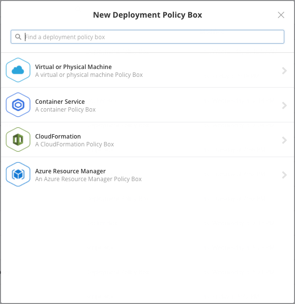
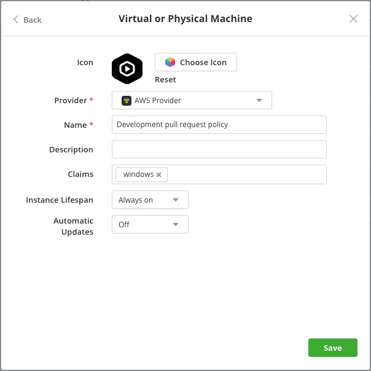
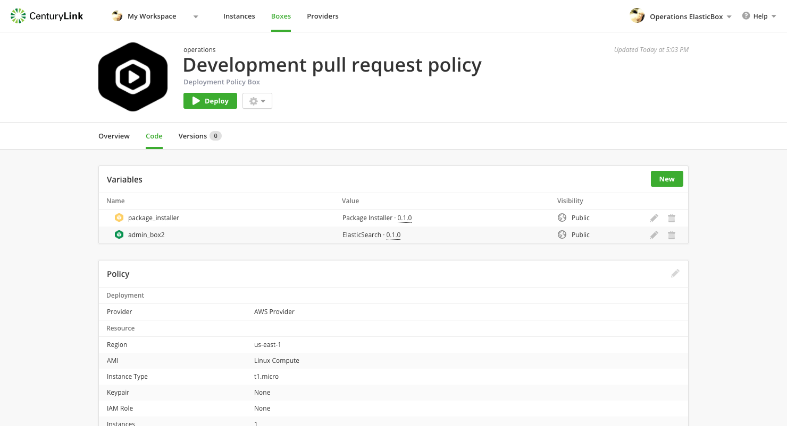
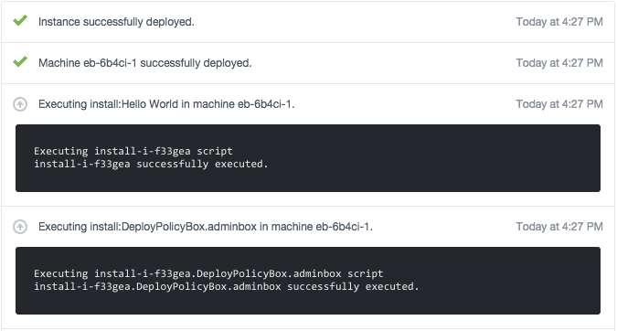

{{{ "title": "Deployment Policy Boxes",
"date": "09-01-2016",
"author": "",
"attachments": [],
"contentIsHTML": false
}}}

Give access to cloud provider infrastructure using a deployment policy box. Policies help allocate cloud resources securely rather than giving access to the entire cloud provider. As IT operations, you have control over what and how much resources deployments consume. Customize policies to support specific deployment scenarios. For example, you may want to provide a small instance type of a certain Linux distribution in a policy to launch development environments.

**In this article:**

* Create a deployment policy
* Give access to the policy
* Control box deployments with admin boxes

### Create a Deployment Policy

On the Boxes page, click **New** > **Deployment Policy**. Here select a type of deployment policy box.

The next step is to select a cloud provider added in Cloud Application Manager and optionally add [claim tags](../Core Concepts/boxes.md). Save to continue.

Click **Edit** to customize the policy. Select the resource, network, and other deployment settings from the cloud provider. See the provider help for details.

* [Google Cloud](../Deploying Anywhere/using-google-cloud.md)
* [Amazon Web Services](../Deploying Anywhere/using-your-aws-account.md)
* [VMware vCenter](../Deploying Anywhere/using-the-vmware-vcenter-private-datacenter.md)
* [Azure](../Deploying Anywhere/using-azure.md)
* [OpenStack](../Deploying Anywhere/using-openstack-cloud.md)
* [Rackspace Cloud](../Deploying Anywhere/using-rackspace-cloud.md)
* [CloudStack](../Deploying Anywhere/using-cloudstack.md)
* [SoftLayer](../Deploying Anywhere/using-softlayer.md)

### Give Access to the Policy

Once you set up the policy, give team workspaces and individuals access to cloud resources for their box deployments. Click on the pencil of the **Collaborators** in the **Overwiew** tab of the deployment policy box, search the users and give them view, edit, or owner access.

* Is Owner. Rename or delete the policy metadata and edit the policy settings if you have edit access to the provider registered in Cloud Application Manager.
* Can Edit. Change the policy box metadata and edit the policy settings if you have edit access to the provider.
* Can View. Consume the policy to deploy boxes.

### Control Box Deployments with Admin Boxes

Any script box attached to a deployment policy is an admin box. The admin box allows enterprise IT operations teams to run common admin tasks in deployments to comply with company policies and best practices. Such common admin tasks can include installing monitoring agents, registering virtual machines in a database, or setting up public keys on all machines before making them available to users.

**Admin box use cases**

Admin boxes are useful in these deployment scenarios:

* **Install a monitoring agent**. An admin box can locally install a monitoring agent like Nagios or New Relic that can monitor virtual machine activities and send data back to a central monitoring service.
* **Set the hostname**. An admin box can set the hostname of every virtual machine deployed to a provider’s environment.
* **Register virtual machines on a server**. For every virtual machine deployed, an admin box, for example, can register it to a Chef Master server and then release it when the machine terminates.
* **Install certificates**. An admin can install certificates locally on every virtual machine in production as a simple example.

### Creating and Executing an Admin Box

To create an admin box, open a deployment policy and add a script box under Variables. Typically, you want to add a script box that matches the policy OS type. In a Windows policy for example, add a script box that runs on Windows. A policy can have as many admin boxes as needed.

When a box launches on a deployment policy containing an admin box, Cloud Application Manager wraps it like a child box in the admin box deployment. In each main event type such as install, configure, start, stop, the admin box runs first followed by events of the box launched. To execute admin box events before others within each event sub category like pre-install, install, move the commands to the admin box pre-install, pre-configure, and pre-start events.

### Contacting Cloud Application Manager Support

We’re sorry you’re having an issue in [Cloud Application Manager](https://www.ctl.io/cloud-application-manager/). Please review the [troubleshooting tips](../Troubleshooting/troubleshooting-tips.md), or contact [Cloud Application Manager support](mailto:incident@CenturyLink.com) with details and screenshots where possible.

For issues related to API calls, send the request body along with details related to the issue.

In the case of a box error, share the box in the workspace that your organization and Cloud Application Manager can access and attach the logs.
* Linux: SSH and locate the log at /var/log/elasticbox/elasticbox-agent.log
* Windows: RDP into the instance to locate the log at ProgramDataElasticBoxLogselasticbox-agent.log
