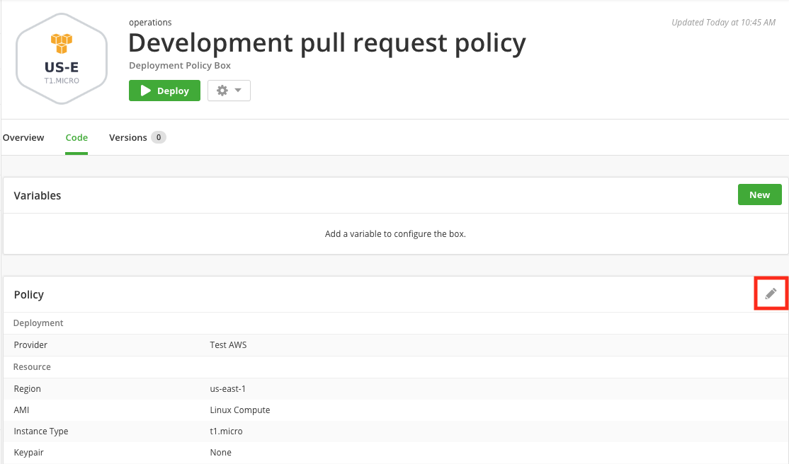

{{{ "title": "Deployment Policy Boxes",
"date": "09-19-2018",
"author": "",
"date": "12-28-2018",
"author": "Julio Castanar",
"keywords": ["cam", "deployment-policy", "provider", "policy-box", "share access", "admin-box", "event type"],
"attachments": [],
"contentIsHTML": false
}}}

### Table of Contents

* [Table of Contents](#table-of-contents)
* [Overview](#overview)
* [Audience](#audience)
* [Prerequisites](#prerequisites)
* [Deployment Policy Boxes](#deployment-policy-boxes)
* [Give Access to the Policy](#give-access-to-the-policy)
* [Control Box Deployments with Admin Boxes](#control-box-deployments-with-admin-boxes)
* [Creating and Executing an Admin Box](#creating-and-executing-an-admin-box)
* [Contacting Cloud Application Manager Support](#contacting-cloud-application-manager-support)

### Overview

This article is meant to describe Cloud Application Manager Policy Boxes, as well as usage instructions and managing.

### Audience

Cloud Application Manager customers.

### Prerequisites

* Access to [Applications site](https://cam.ctl.io/#/boxes) (Application Lifecycle Management module) of Cloud Application Manager as an authorized user of an active Cloud Application Manager account.

### Deployment Policy Boxes

Give access to cloud provider infrastructure using a **deployment policy box**. Policies help allocate cloud resources securely rather than giving access to the entire cloud provider. As IT operations, you have control over what and how much resources deployments consume.  
Customize policies to support specific deployment scenarios. For example, you may want to provide a small instance type of a certain Linux distribution in a policy to launch development environments.

#### Create a Deployment Policy

1. [Log in](https://cam.ctl.io/login) to Cloud Application Manager Application site.

2. On the Boxes page, click **New** > **Deployment Policy**. Select here a type of deployment policy box.

    

    Then select a cloud provider added before in Cloud Application Manager, give the box a meaningful name to identify it among your boxes and optionally specify other [metadata](../Core Concepts/boxes.md#box-metadata) such as claims. Click save to continue.

    

3. In the recently created Deployment Policy Box, under **Code** tab, select **Edit** in **Policy** section to customize the policy.  
    

    Select the resource, network, region, and other deployment settings from the cloud provider.  
    See the provider help for more details:

    * [CenturyLink Cloud](../Deploying Anywhere/using-centurylink-cloud.md)
    * [CenturyLink DCC](../Deploying Anywhere/using-dcc.md)
    * [CenturyLink Private Cloud on VMware Cloud Foundation](../Deploying Anywhere/using-private-cloud-on-vmware-cloud-foundation.md)
    * [Amazon Web Services](../Deploying Anywhere/using-your-aws-account.md)
    * Amazon Web Services GovCloud (Same documentation as [Amazon Web Services](../Deploying Anywhere/using-your-aws-account.md))
    * [CloudStack](../Deploying Anywhere/using-cloudstack.md)
    * Dimension Data
    * [Google Cloud](../Deploying Anywhere/using-google-cloud.md)
    * [Microsoft Azure](../Deploying Anywhere/using-azure.md)
    * [OpenStack Cloud](../Deploying Anywhere/using-openstack-cloud.md)
    * [Rackspace Cloud](../Deploying Anywhere/using-rackspace-cloud.md)
    * [SoftLayer](../Deploying Anywhere/using-softlayer.md)
    * [vCloud Air and vCloud Director](../Deploying Anywhere/orchestrating-vcloud-air-vcloud-director-deployments.md)
    * [VMware vCenter](../Deploying Anywhere/using-the-vmware-vcenter-private-datacenter.md)

    **Note:** If you’re deploying to public cloud providers like AWS or Google Compute, you’ll most likely be charged by the cloud provider for the virtual infrastructure you provision. Familiarize yourself with their pricing model as Cloud Application Manager assumes no responsibility for costs incurred.

    **Note:** Instance Protection Flags will prevent the instance to be manually shut-down or terminated if enabled. They will be inherited in any instance deployed through this Deployment Policy box. [More information about Instance Protection flags](../Deploying Anywhere/deploying-managing-instances.md)

### Give Access to the Policy

Once you set up the policy, give team workspaces and individuals access to cloud resources for their box deployments. Team workspaces and individuals that already had access to the workspace where the Deployment Policy Box was created, automatically have access to it too.  
Give access to other individuals or team workspaces by clicking on the pencil of the **Collaborators** panel in the **Overview** tab of the deployment policy box, search the users and give them **view**, **edit**, or **owner** access.

| Share Access | Description |
|--------------|-------------|
| **Is Owner** | Rename or delete the policy metadata and edit the policy settings if you have edit access to the provider registered in Cloud Application Manager. |
| **Can Edit** | Change the policy box metadata and edit the policy settings if you have edit access to the provider. |
| **Can View** | Consume the policy to deploy boxes. |

For more information about sharing, see [sharing boxes, instances and providers](../Core Concepts/workspaces-and-collaboration.md#sharing-boxes-instances-and-providers).

### Control Box Deployments with Admin Boxes

Any script box attached to a deployment policy is an **admin box**. The admin box allows enterprise IT operations teams to run common admin tasks in deployments to comply with company policies and best practices. Such common admin tasks can include installing monitoring agents, registering virtual machines in a database, or setting up public keys on all machines before making them available to users.

#### Admin box use cases

Admin boxes are useful in these deployment scenarios:

* **Install a monitoring agent**. An admin box can locally install a monitoring agent like Nagios or New Relic that can monitor virtual machine activities and send data back to a central monitoring service.
* **Set the hostname**. An admin box can set the hostname of every virtual machine deployed to a provider’s environment.
* **Register virtual machines on a server**. For every virtual machine deployed, an admin box, for example, can register it to a Chef Master server and then release it when the machine terminates.
* **Install certificates**. An admin can install certificates locally on every virtual machine in production as a simple example.

### Creating and Executing an Admin Box

To create an admin box, open a deployment policy and add a script box under Variables section.  
Typically, you want to add a script box that matches the policy OS type. In a Windows policy for example, add a script box that runs on Windows.  
A policy can have as many admin boxes as needed.

When a box launches on a deployment policy containing an admin box, Cloud Application Manager wraps it like a child box in the admin box deployment.  
In each main **event type** such as **install**, **configure**, **start**, **stop**, the admin box runs first followed by events of the box launched.  
To execute admin box events before others within each event subcategory like pre-install, install, move the commands to the admin box **pre-install**, **pre-configure**, and **pre-start** events.

### Contacting Cloud Application Manager Support

We’re sorry you’re having an issue in [Cloud Application Manager](https://www.ctl.io/cloud-application-manager/). Please review the [troubleshooting tips](../Troubleshooting/troubleshooting-tips.md), or contact [Cloud Application Manager support](mailto:incident@CenturyLink.com) with details and screenshots where possible.

For issues related to API calls, send the request body along with details related to the issue.

In the case of a box error, share the box in the workspace that your organization and Cloud Application Manager can access and attach the logs.
* Linux: SSH and locate the log at /var/log/elasticbox/elasticbox-agent.log
* Windows: RDP into the instance to locate the log at \ProgramData\ElasticBox\Logs\elasticbox-agent.log
