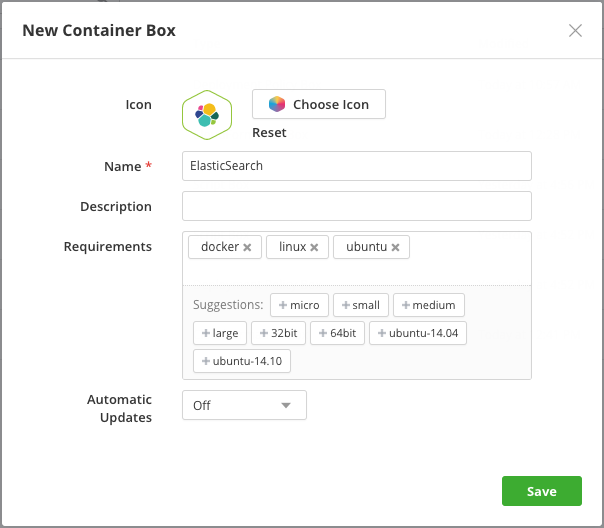
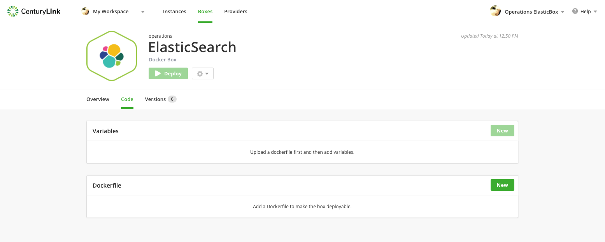
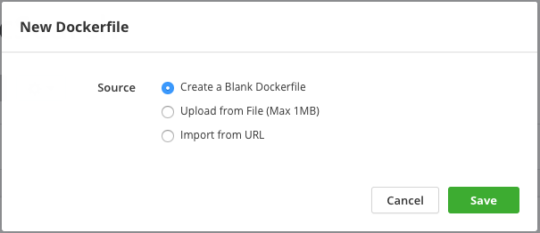
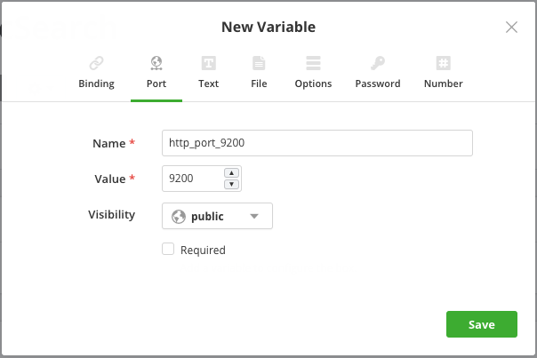
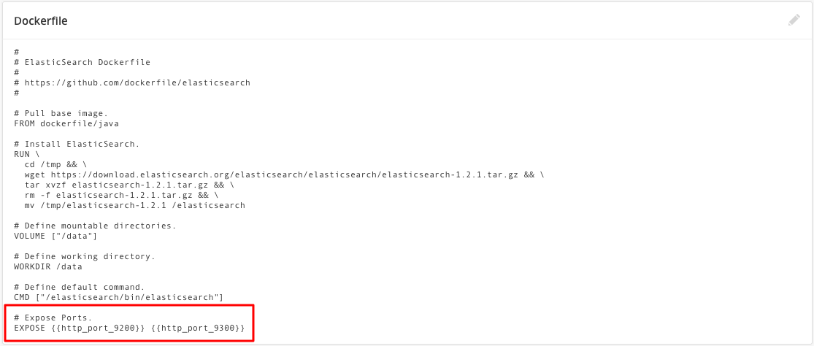
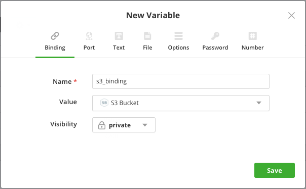
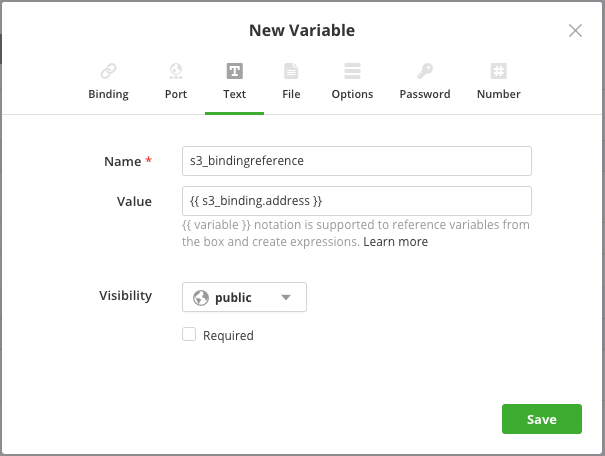
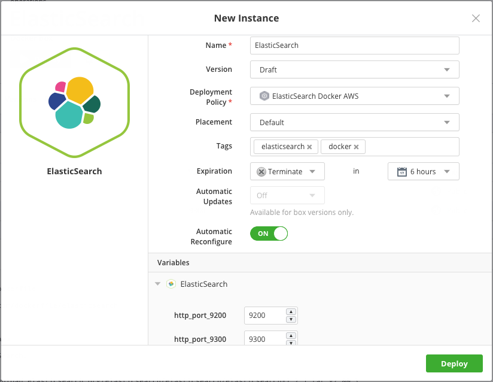
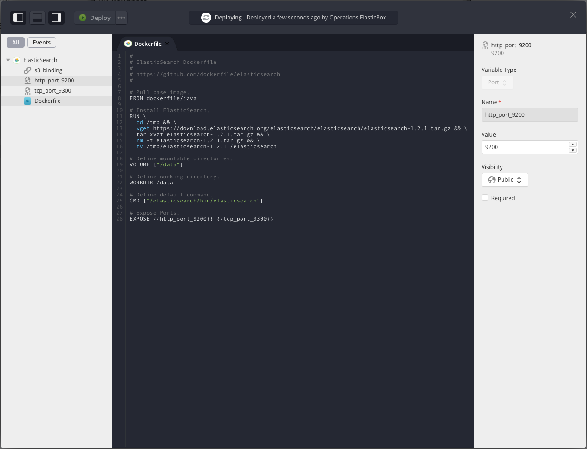

{{{
"title": "Deploying to Docker Containers from Cloud Application Manager",
"date": "09-01-2016",
"author": "",
"attachments": [],
"date": "12-28-2018",
"author": "Julio Castanar",
"keywords": ["cam","alm","boxes", "box", "container", "docker", "dockerfile", "binding", "port", 
    "lifecycle editor", "add", "cmd", "expose", "build", "run", "kill", "remove"],
"contentIsHTML": false
}}}

**In this article:**
* [Overview](#overview)
* [Audience](#audience)
* [Prerequisites](#prerequisites)
* [How Docker Works in Cloud Application Manager](#how-docker-works-in-cloud-application-manager)
* [Configuring and Deploying Docker Containers](#configuring-and-deploying-docker-containers)
* [Managing the Lifecycle of Docker Containers](#managing-the-lifecycle-of-docker-containers)
* [Contacting Cloud Application Manager Support](#contacting-cloud-application-manager-support)
  
### Overview

This article is meant to assist Cloud Application Manager customers who want to [create and manage boxes](../Core Concepts/boxes.md).<br/>
It explains how to use the Container boxes which enable you to define and deploy [Docker](https://docs.docker.com/engine/understanding-docker/) images in Linux environments. The advantage of deploying to Docker containers through Cloud Application Manager is to be able to consume Dockerfiles directly in boxes. Lately, you can bind together distributed, multi-tier applications that involve automation in boxes and Docker containers.

### Audience

Cloud Application Manager Users using Application Lifecycle Management (ALM) features.

### Prerequisites

* Access to [Applications site](https://cam.ctl.io/#/boxes) (Application Lifecycle Management module) of Cloud Application Manager as an authorized user.

* A provider already configured in Cloud Application Manager. See [administering providers](../Administering Your Organization/admin-overview.md#Providers).

### How Docker Works in Cloud Application Manager

Docker works in Cloud Application Manager through the Docker Container service box, a Linux box that understands Docker commands when deployed. In the box you model your application in a Dockerfile, which helps create the image of your application in a Docker container. Write Dockerfile commands not only in [Docker instructions](https://docs.docker.com/engine/reference/builder/), but also in Bash and PowerShell.

At deploy time, Cloud Application Manager executes the Docker box like any other box in the virtual environment. Cloud Application Manager treats the Docker container like a [box variable](./parameterizing-boxes-with-variables.md) and the Dockerfile as a [file variable](./parameterizing-boxes-with-variables.md) inside it. On the virtual machine, Cloud Application Manager first installs the Docker client from which we install the Docker container using the daemon BUILD command.

### Configuring and Deploying Docker Containers

See how deploying to Docker containers works in Cloud Application Manager using [ElasticSearch](https://www.elastic.co/products) as an example. ElasticSearch is a RESTful search engine that makes it easy to analyze, explore, and visualize data. To get started, we create a container box and then configure the application in a Dockerfile.

#### Create a Docker Container box

From the Boxes page, click **New** > **Container**. In the dialog, enter a name to identify it in the box service catalog. And optionally enter other [metadata](../Core Concepts/boxes.md#Box-#metadata). Then save to continue.



#### Create a Dockerfile

You now see a box layout where you can configure your application’s deployment with [variables](./parameterizing-boxes-with-variables.md) and the Dockerfile.



Let’s add a Dockerfile to construct the ElasticSearch image that will run in the Docker container. Under Dockerfile, click **New**. In the dialog, click **Create a Blank Dockerfile**. This creates an empty Dockerfile.



#### Edit a Dockerfile
Add instructions that install ElasticSearch.

```
#
# ElasticSearch Dockerfile
#
# https://github.com/dockerfile/elasticsearch
#

# Pull base image.
FROM dockerfile/java

# Install ElasticSearch.
RUN \
  cd /tmp && \
  wget https://download.elasticsearch.org/elasticsearch/elasticsearch/elasticsearch-1.2.1.tar.gz && \
  tar xvzf elasticsearch-1.2.1.tar.gz && \
  rm -f elasticsearch-1.2.1.tar.gz && \
  mv /tmp/elasticsearch-1.2.1 /elasticsearch

# Define mountable directories.
VOLUME ["/data"]

# Define working directory.
WORKDIR /data

# Define default command.
CMD ["/elasticsearch/bin/elasticsearch"]
```

Instructions in the Dockerfile are straightforward: On top of a Linux base image that has Java, we download ElasticSearch, mount a drive, and install ElasticSearch in that location.

#### Specify Ports for the Docker Container

To allow traffic to and from ElasticSearch in the Docker container on its host, we need to specify ports. To do that we add port variables. Under Variables, click **New**. Here we create one to allow HTTP traffic through port 9200 and another for ElasticSearch to communicate internally over port 9300.



As soon as we add the variables, Cloud Application Manager automatically generates an EXPOSE instruction for them in the Dockerfile. This tells the Docker container to listen on ports 9200 and 9300.



**Text, number, or options type variables** are handled at deploy time as [Docker environment variables](https://docs.docker.com/engine/reference/builder/). Use this syntax to refer to them in Dockerfiles: 

```
`\{{variable_name}}`
```

A **file variable** is handy to run additional commands using RUN or trigger an executable file using CMD. But first you must copy it from the Cloud Application Manager remote URL to the container’s filesystem at the path you specify using [ADD](https://docs.docker.com/engine/reference/builder/) in the Dockerfile: 

```
ADD `\{{file_variable_name}}` destination_path_in_container.
```

[**Bindings**](./parameterizing-boxes-with-variables.md) pass connections strings or deployment values to connect with other Docker containers or boxes. To bind to another Docker container or box, create a binding and pass binding references via text expression variables with this syntax: 
```
`\{{ binding_name.variable_name }}`
```

Here we connect to a box that deploys an S3 bucket using a binding. 



<u>Dockerfiles don’t allow scripts</u>, therefore we use a text expression to pass the binding reference.



#### Deploy the Docker Box

You can launch the Docker box in any environment including public, private clouds or a datacenter. Here we launch the ElasticSearch Docker box in AWS. In the ElasticSearch box page, click **Deploy**. Choose a deployment policy box that contains deployment settings for a cloud provider and optionally add tags, [auto schedule](../Deploying Anywhere/deploying-managing-instances.md) the container, and specify other [metadata](../Core Concepts/boxes.md#box-metadata).



Expand ElasticSearch to see all the variables from the docker box. See how you can change deployment values before deploying. Click **Deploy** to launch the box.

#### Limitations with Using Docker

Note these limitations when using Docker in Cloud Application Manager.

* A docker box can install one image per container on an instance.
* Dockerfile Docker commands don’t support arguments or flags. That said, you can pass arguments through the ENTRYPOINT command.
* When using the VOLUME command, you can store data in directories on the container, but can’t mount or map them to the host filesystem.
* Deploy Docker using these supported Linux distributions: Ubuntu 15.04, Ubuntu 14.10, Ubuntu 14.04, Ubuntu 13.10, Ubuntu 13.04, Ubuntu 12.10, CentOS, Red Hat Enterprise Linux 6.5 or later, Fedora.

### Managing the Lifecycle of Docker Containers

You can manage the [lifecycle](../Deploying Anywhere/deploying-managing-instances.md##handling-instance-lifecycle-states) of Docker containers like any other box. This means after deploying, you can change the Dockerfile configuration and relaunch it in the same instance using the instance [lifecycle editor](../Core Concepts/lifecycle-editor.md). Go to the instance page and click **Lifecycle Editor**.


In the editor, you can edit the Dockerfile, variables, and use the actions drop-down to relaunch changes in the instance. To process these actions on the container in the backend, we run Docker daemon commands such as BUILD, RUN, KILL, and REMOVE.



Here’s what happens when you reinstall or reconfigure:

* Reinstall recreates the container on the instance.
* Reconfigure launches a new container replacing the existing one.

### Contacting Cloud Application Manager Support

We’re sorry you’re having an issue in [Cloud Application Manager](https://www.ctl.io/cloud-application-manager/). Please review the [troubleshooting tips](../Troubleshooting/troubleshooting-tips.md), or contact [Cloud Application Manager support](mailto:incident@CenturyLink.com) with details and screenshots where possible.

For issues related to API calls, send the request body along with details related to the issue.

In the case of a box error, share the box in the workspace that your organization and Cloud Application Manager can access and attach the logs.
* Linux: SSH and locate the log at /var/log/elasticbox/elasticbox-agent.log
* Windows: RDP into the instance to locate the log at \ProgramData\ElasticBox\Logs\elasticbox-agent.log
