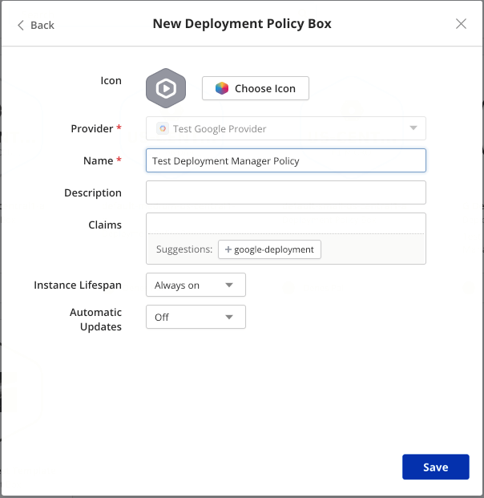
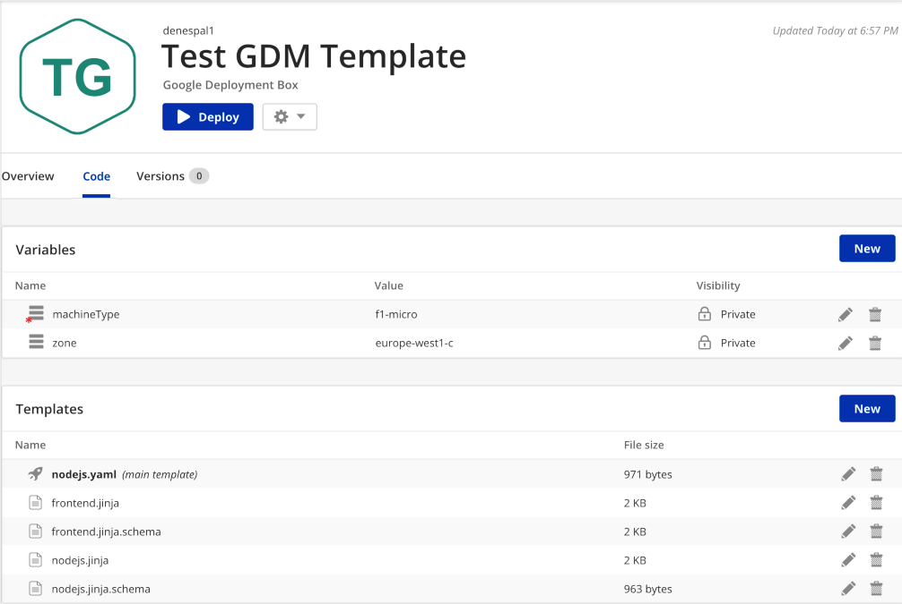
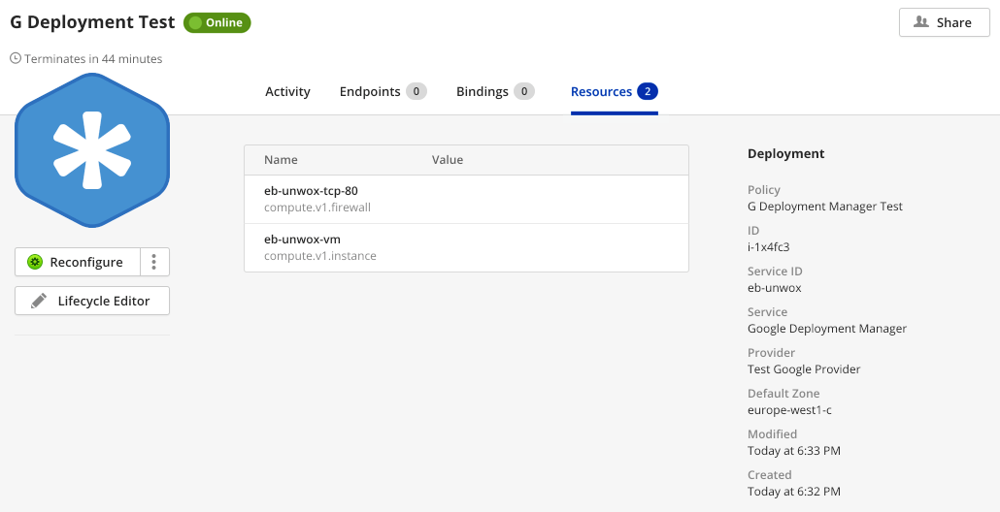

{{{ "title": "Using Google Deployment Manager with Cloud Application Manager",
"date": "11-29-2018",
"author": "Dénes Pál",
"attachments": [],
"contentIsHTML": false,
"keywords": ["google deployment manager", "template box", "cloud application manager", "deployment templates", "cam"]
}}}

**In this article:**

- [Overview](#overview)
- [Audience](#audience)
- [Prerequisites](#prerequisites)
- [Getting started with Google Deployment Templates on Cloud Application Manager](#getting-started-with-google-deployment-templates-on-cloud-application-manager)
- [Google Deployment Templates](#google-deployment-templates)
- [Getting General Support](#getting-general-support)

### Overview

With Google Deployment Manager you can automate the creation and management of Google Cloud Platform resources,
by writing flexible declarative template and configuration files.

### Audience

All Cloud Application Manager users using Google Compute providers.

### Prerequisites

* An active Cloud Application Manager account
* An existing [Google Compute Provider](../Deploying Anywhere/using-google-cloud.md) configured in Cloud Application Manager

### Getting started with Google Deployment Templates on Cloud Application Manager

#### Create or Refresh Provider

You need a Google Compute Provider already set up in Cloud Application Manager in order to use Deployment Manager
feature. Go to the Provider's page and Synchronize it first.

#### Create a Deployment Policy Box

Go to *Boxes -> New -> Deployment Policy* and select *Google Deployment*. Fill the usual parameters.
You will need to select a provider if you have more than one Google Compute Providers configured.



A **Default Zone** can be configured in the *Code* tab of the Policy Box. For your convenience, the value of
*Default Zone* property is automatically exposed to any Instances deployed with this Policy, as a `zone` variable.
Of course its value can be overridden as a Template variable.

#### Create a Template Box

Go to *Boxes -> New -> Template* and select *Google Deployment Template* as type. Fill the usual parameters.

For Google Deployment template boxes you can include multiple template files and variables.
If there are multiple template files for a Template Box, the first one on the top of the list is marked as the
**main template**. The main template can be changed by re-ordering the template files by dragging and moving
them with the mouse, or long-pressing and dragging on a touch screen.



At least one template file is required to **Deploy** a Template Box. *New Template* dialog can either
create a blank template,
upload a template file from disk,
or import template files from remote URL.

If the URL is a GitHub repository, the contents of that file or directory is automatically imported.
If a template file with the same name already exists, it won't get overwritten, but duplicate names will block
the deployment, so you need to delete old version template files manually.

Note that files from remote URLs can also be referenced from template files, and they get downloaded and parsed by
Google.

### Google Deployment Templates

Check the [Google Cloud Documentation](https://cloud.google.com/deployment-manager/docs/configuration/)
to learn more about Deployment Template files.

**Warning:** Please bear in mind that referencing resources with the same name from multiple Template Boxes and
Google Deployment Manager Templates in general are very dangerous and can lead to undesired consequences.

If you happen to reference resources with the same name in multiple Deployment Instances, for example having
a hard-coded name in a Deployment Template File and deploying it multiple times, the same resource is
going to be modified by multiple instances at a time, which will lead to undesired consequences and
a messed up state of resources. You can even accidentally delete a resource by terminating a deployed Instance,
while a different deployment still uses the very same resource. Other times the termination of the Instance
might get blocked, because it can not clean up a resource it has deployed,
if a different instance has already deleted it.

A good practice to avoid these scenarios is to prefix the name of each resource with the name of the deployment,
which happens to be the *service-id* in Cloud Application Manager.

```
resources:
- name: \{{ env['deployment'] }}-vm
  type: compute.v1.instance
  properties:
    zone: \{{ properties["zone"] }}
    machineType: projects/\{{ env["project"] }}/zones/\{{ properties["zone"] }}/machineTypes/\{{ properties["machineType"] }}
    disks:
      .....
```

#### Box Variables

Box variables are exposed as *properties* for the templates, and can be referenced like `\{{ properties["zone"] }}`.
The *zone* variable is automatically crated at deployment time unless the Box defines one, and has the value of
*Default Zone* property defined in the Deployment Policy.

Google also defines some useful environment variables automatically:

| Variable | Description |
| --- | --- |
| `env['deployment']` | name of the deployment |
| `env['project']` | project ID |
| `env['name']` | name declared in the upper-level configuration that is using this template |
| `properties['zone']` | *Default Zone* property of the Deployment Policy used |
| `env['project_number']` | project number |
| `env['current_time']` | UTC timestamp |
| `env['type']` | resource type declared in top-level configuration |
| `properties['variable_name']` | Box variables are exposed in *properties* |

Variables can be referenced like `\{{ properties["machineType"] }}` in **Jinja** template files.

Variables can be used only with *Jinja* and *Python* type template files.
**Yaml** template files have to be renamed to *jinja* to use variables with them.
If the main template file is a **.yaml*, it is automatically renamed as **.jinja* at deployment time.

#### Output Variables

The corresponding feature is called *Outputs* in
[Google's Documentation](https://cloud.google.com/deployment-manager/docs/configuration/expose-information-outputs).
Any Outputs defined in templates are going to end up as output variables in Cloud Application Manager.

```
outputs:
- name: internalIP
  value: $(ref.\{{name}}-vm.networkInterfaces[0].networkIP)
- name: ip
  value: $(ref.\{{name}}-vm.networkInterfaces[0].accessConfigs[0].natIP)
- name: port
  value: 80
```


#### Resources Deployed

The resources that have been created by the deployment are going to populate the *Resources* tab of the Instance,
and will be deleted when the instance is terminated.



### Getting General Support

Customers can contact the CenturyLink Global Operations Support center (support desk) directly for getting help with Cloud Application Manager as well as any other supported product that they’ve subscribed to.  Below are three ways to get help.

#### Contact:

1. **Phone:** 888-638-6771

2. **Email:** incident@centurylink.com

3. **Create Ticket in Cloud Application Manager:** Directly within the platform, users can “Create Ticket” by clicking on the “?” symbol in upper right corner near the users log-in profile icon.  This takes users directly to the Managed Servicers Portal where they can open, track and review status of issues that have been raised with the support desk.  Additionally, this is how a TAM can be engaged as well.

#### Instructions:

1. Provide your name
2. Cloud Application Manager account name
3. A brief description of your request or issue for case recording purposes

The support desk will escalate the information to the Primary TAM and transfer the call if desired.
